{/* Ported from MkDocs: assembly-guide.md */}

## Objectif

Assemblez le boîtier tout-en-un mis à jour du Deepthroat Trainer 2026 à partir du PCB préparé, du boîtier, de l’écran, du capteur, de la batterie, du faisceau de câbles, du velcro et des vis.

## Pièces et consommables requis

- PCB DTT
- Velcro à boucles DTT
- Boîtier DTT imprimé en 3D
- Écran
- Capteur
- Batterie
- Faisceau de câbles
- 4x vis `0408LTFB`
- Colle chaude

## Outils

- Pistolet à colle chaude
- Embout de tournevis T8
- Tournevis électrique ou similaire
- Chalumeau

## Préparer les composants

1. Confirmez que le kit complet est présent.

   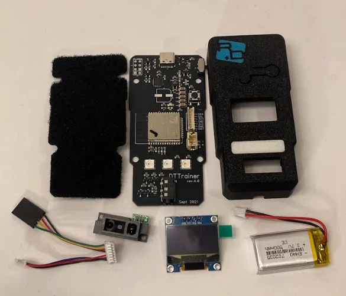

   _Kit d’assemblage DTT._

2. Confirmez que le PCB, le velcro à boucles et le boîtier sont prêts.

   Confirmez que le velcro à boucles DTT est installé sur le PCB avant de continuer.

   <PhotoGrid>
     <Photo caption="PCB brut et PCB avec velcro.">
       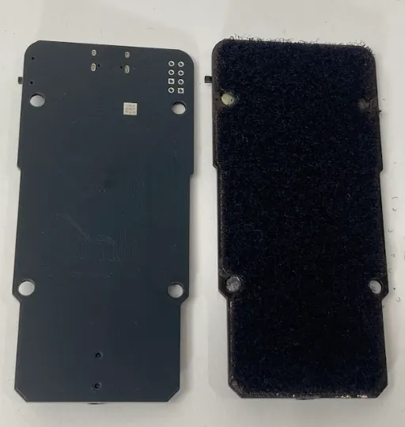
     </Photo>
     <Photo caption="PCB avec boîtier du Deepthroat Trainer.">
       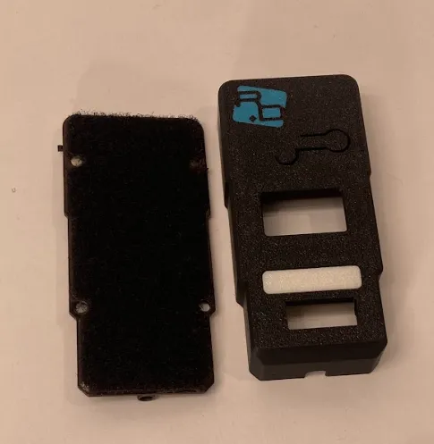
     </Photo>
   </PhotoGrid>

3. Inspectez l’intérieur du boîtier du Deepthroat Trainer.

   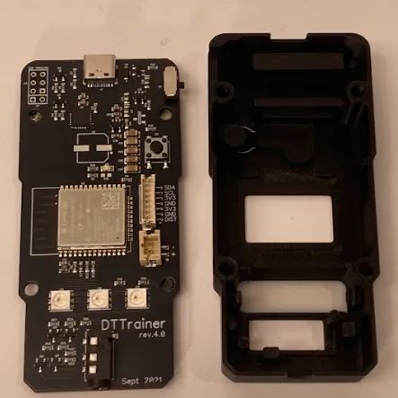

   _Intérieur du boîtier du Deepthroat Trainer._

4. Nettoyez et préparez les composants avant l’assemblage.

   Chauffez délicatement l’intérieur du boîtier 3D avec un chalumeau pour retirer les brins de filament. Flashez le PCB avant l’assemblage.

## Étapes d’assemblage

1. Installez l’écran.

   Retirez le film de l’écran. Pliez doucement la nappe vers l’intérieur. Alignez l’écran sur les repères de positionnement et collez-le avec de la colle chaude. Assurez-vous que la colle chaude ne bloque pas le bras du bouton.

   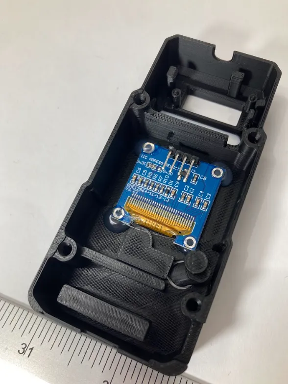

   _Écran installé dans le boîtier._

2. Installez le capteur.

   Utilisez un tournevis pour insérer délicatement le capteur dans le boîtier, en appuyant sur les vis argentées pour augmenter la force exercée sans casser le plastique. Assurez-vous que le capteur affleure le boîtier. Collez-le avec de la colle chaude.

   <PhotoGrid>
     <Photo caption="Appuyez sur les vis argentées pendant l’insertion du capteur.">
       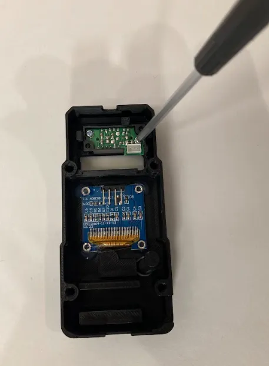
     </Photo>
     <Photo caption="Capteur installé au ras du boîtier.">
       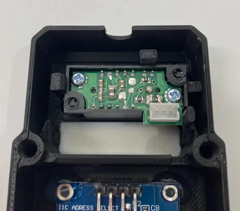
     </Photo>
   </PhotoGrid>

3. Installez la batterie.

   Insérez la batterie, côté écrit vers le bas. Appliquez un cordon de colle le long de la barre supérieure pour la maintenir en place.

   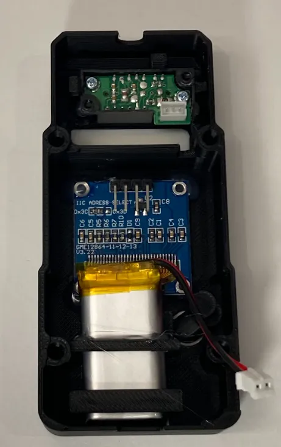

   _Batterie installée côté écrit vers le bas._

4. Connectez le faisceau de l’écran et du capteur.

   Faites glisser le connecteur noir du faisceau sur les broches de l’écran comme indiqué. Clipsez le connecteur blanc dans le capteur.

   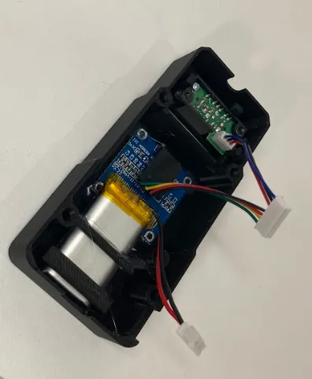

   _Broches de l’écran et capteur connectés au faisceau._

5. Connectez le faisceau au PCB.

   Clipsez les connecteurs du faisceau dans les connecteurs correspondants du PCB.

   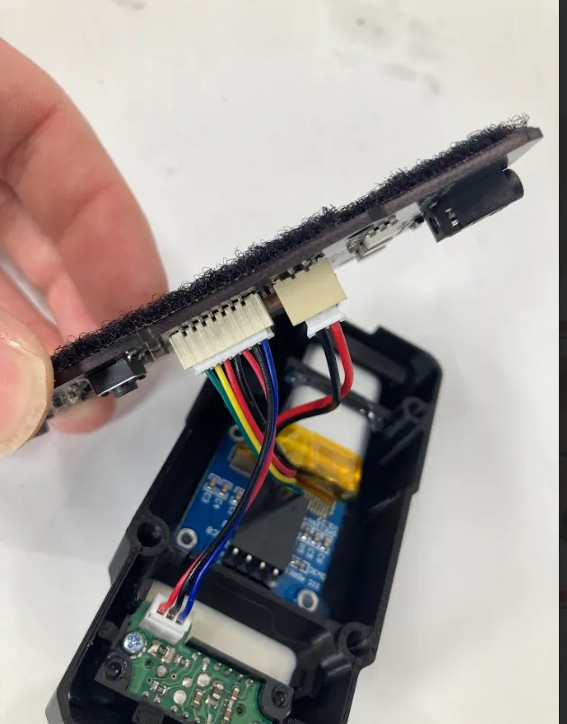

   _Faisceau connecté au PCB._

6. Acheminez les fils.

   Acheminez les fils autour de l’ergot comme indiqué et poussez-les plus profondément dans le boîtier, en évitant le bouton et les autres points de pincement.

   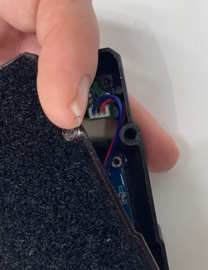

   _Fils acheminés autour de l’ergot._

7. Fixez le PCB au boîtier du Deepthroat Trainer.

   Utilisez le tournevis pour fixer le PCB au boîtier du Deepthroat Trainer.

   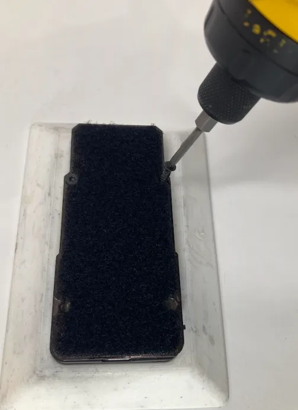

   _Fixez le PCB au boîtier du Deepthroat Trainer._

## Assemblage final

1. Vérifiez que l’écran est collé en place et que le bras du bouton n’est pas bloqué.
2. Vérifiez que le capteur affleure le boîtier et est collé en place.
3. Vérifiez que la batterie est fixée, côté écrit vers le bas.
4. Vérifiez que le faisceau est connecté à l’écran, au capteur et au PCB.
5. Vérifiez que les fils sont acheminés autour de l’ergot et éloignés du bouton et des points de pincement.
6. Vérifiez que le PCB est fixé au boîtier du Deepthroat Trainer avec les quatre vis `0408LTFB`.

## Liste de contrôle qualité

- [ ] Le PCB a été flashé avant l’assemblage.
- [ ] Les brins de filament intérieurs ont été retirés du boîtier imprimé en 3D.
- [ ] Le film de l’écran a été retiré.
- [ ] La nappe de l’écran a été doucement pliée vers l’intérieur.
- [ ] L’écran a été aligné sur les repères de positionnement.
- [ ] La colle chaude ne bloque pas le bras du bouton.
- [ ] Le capteur affleure le boîtier.
- [ ] Le capteur est collé en place.
- [ ] La batterie est installée côté écrit vers le bas.
- [ ] La batterie est fixée avec de la colle le long de la barre supérieure.
- [ ] Le connecteur noir du faisceau est placé sur les broches de l’écran.
- [ ] Le connecteur blanc est clipsé dans le capteur.
- [ ] Le faisceau est clipsé dans les connecteurs du PCB.
- [ ] Les fils sont acheminés autour de l’ergot.
- [ ] Les fils sont poussés plus profondément dans le boîtier et évitent le bouton et les points de pincement.
- [ ] Le PCB est fixé au boîtier du Deepthroat Trainer.
