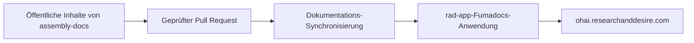

R+D Assembly verwaltet die öffentliche Dokumentation und die Anwendung, die sie rendert, in getrennten Repositories. Dadurch können Personen, die die Produkte montieren, an den Anleitungen mitwirken, ohne privaten Anwendungscode oder Bereitstellungskonfiguration offenzulegen.

## Veröffentlichungsablauf

Markdown, MDX, Produktnavigation und Montagebilder liegen in
`content/docs/` in diesem Repository. Eine erfolgreiche Änderung löst den
Dokumentationsimport-Workflow in `rad-app` aus. Dieser synchronisiert den
öffentlichen Inhaltsbaum mit der OHAI-Anwendung und veröffentlicht ihn mit
Fumadocs.

## Zuständigkeitsgrenzen

- Anleitungen zur Produktmontage, Bilder und Links zu montagerelevanten Quellen
  liegen in diesem Repository.
- Die manuell gepflegten Produkt-BOM-Daten verbleiben im jeweiligen
  Produkt-Repository unter `hardware/bom.csv`.
- Die Fumadocs-Shell, gemeinsame Komponenten, die Suche, Authentifizierungslinks
  und die Bereitstellungskonfiguration liegen in `rad-app`.
- Gerenderte BOM-Tabellen gehören ausschließlich zu R+D Assembly, nicht zu den
  Developer Docs.

## Mitwirken

Bearbeiten Sie die relevante Datei unter `content/docs/`, führen Sie
`node scripts/validate-content.mjs content` aus und fügen Sie Screenshots bei,
wenn eine Änderung das Layout oder die Bilddarstellung betrifft. Weitere
Informationen zum Review-Prozess finden Sie im
[Beitragsleitfaden](https://github.com/researchanddesire/assembly-docs/blob/main/CONTRIBUTING.md).

Der stillgelegte MkDocs-Aggregator ist weiterhin als
[historische Migrationsreferenz](./legacy-mkdocs-pipeline) verfügbar, veröffentlicht
die Produktionswebsite jedoch nicht mehr.
