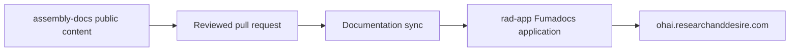

R+D Assembly keeps public documentation and the application that renders it in
separate repositories. This lets builders contribute to the instructions
without exposing private application code or deployment configuration.

## Publishing flow

Markdown, MDX, product navigation, and assembly images live under
`content/docs/` in this repository. A successful change dispatches the
documentation import workflow in `rad-app`, which synchronizes the public
content tree into the OHAI application and publishes it with Fumadocs.

## Ownership boundaries

- Product assembly instructions, images, and assembly-facing source links live
  in this repository.
- Human-owned product BOM data remains in each product repository's
  `hardware/bom.csv`.
- The Fumadocs shell, shared components, search, authentication links, and
  deployment configuration live in `rad-app`.
- Rendered BOM tables belong only on R+D Assembly, not in Developer Docs.

## Contributing

Edit the relevant file under `content/docs/`, run
`node scripts/validate-content.mjs content`, and include screenshots when a
change affects layout or imagery. See the repository
[contribution guide](https://github.com/researchanddesire/assembly-docs/blob/main/CONTRIBUTING.md)
for the review process.

The retired MkDocs aggregator remains available as a
[historical migration reference](./legacy-mkdocs-pipeline), but it no longer
publishes the production site.
