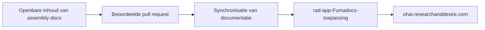

R+D Assembly beheert de openbare documentatie en de toepassing die deze
weergeeft in afzonderlijke repositories. Zo kunnen bouwers bijdragen aan de
instructies zonder private applicatiecode of uitrolconfiguratie bloot te
leggen.

## Publicatiestroom

Markdown, MDX, productnavigatie en assemblageafbeeldingen staan in
`content/docs/` in deze repository. Een geslaagde wijziging activeert de
documentatie-importworkflow in `rad-app`. Die synchroniseert de openbare
inhoudsstructuur met de OHAI-toepassing en publiceert deze met Fumadocs.

## Verantwoordelijkheidsgrenzen

- Instructies voor productassemblage, afbeeldingen en links naar bronnen voor
  assemblage staan in deze repository.
- De handmatig beheerde product-BOM-gegevens blijven in de repository van elk
  product, in `hardware/bom.csv`.
- De Fumadocs-shell, gedeelde componenten, zoekfunctie, links voor
  authenticatie en uitrolconfiguratie staan in `rad-app`.
- Gerenderde BOM-tabellen horen alleen thuis op R+D Assembly, niet in de
  Developer Docs.

## Bijdragen

Bewerk het relevante bestand onder `content/docs/`, voer
`node scripts/validate-content.mjs content` uit en voeg screenshots toe wanneer
een wijziging de lay-out of afbeeldingen beïnvloedt. Bekijk de
[bijdragengids](https://github.com/researchanddesire/assembly-docs/blob/main/CONTRIBUTING.md)
voor het beoordelingsproces.

De buiten gebruik gestelde MkDocs-aggregator blijft beschikbaar als
[historische migratiereferentie](./legacy-mkdocs-pipeline), maar publiceert de
productiesite niet meer.
