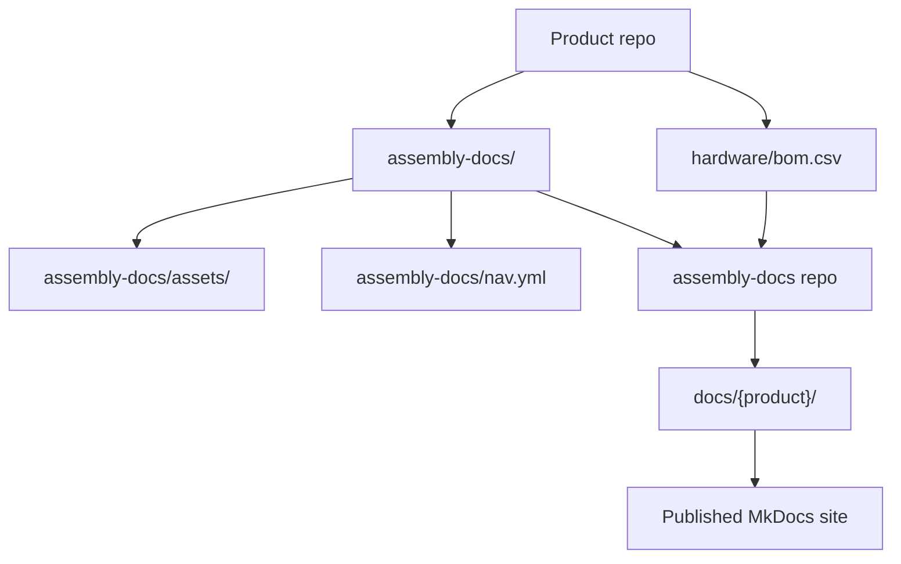
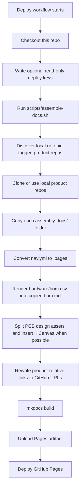
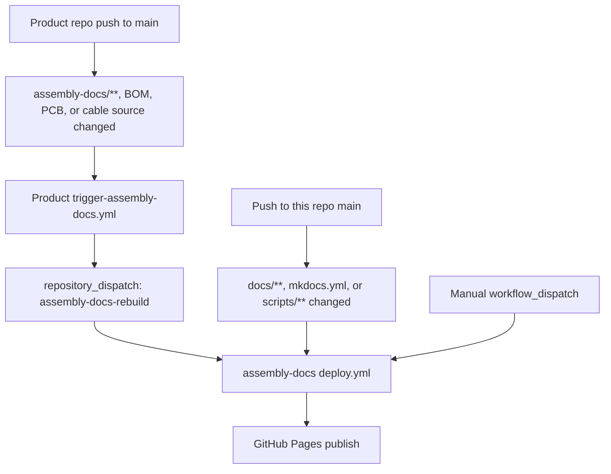
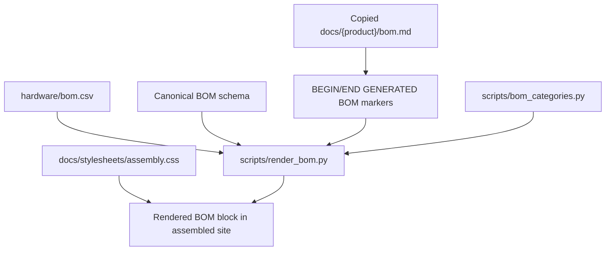
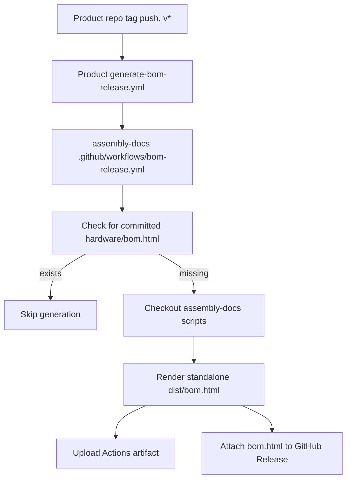

{/* Ported from MkDocs: how-this-site-works.md */}

<Warning title="Historische Pipeline">
  Auf dieser Seite bleibt die vorherige MkDocs-Assembly-Pipeline für die
  Migration erhalten Referenz. Fumadocs in der Rad-App und die überprüften
  bidirektionalen Inhalte werden jetzt synchronisiert Eigene Publikation.
</Warning>

Diese Seite ist ein Aggregator. Produktteams pflegen die Montagedokumentation in
jedes Produkt-Repository, und dieses Repository fügt diese Pakete zu einem zusammen
MkDocs-Materialseite.

Die wichtige Regel ist, dass der Inhalt der Produktbaugruppe Eigentum des Produkts ist
Repos. Dieses Repo besitzt die Site-Shell, die Build-Skripte, das gemeinsame Design und das
Automatisierung, die Produktdokumente in die veröffentlichte Website umwandelt.

## Quelllayout



Jedes Ohai-berechtigte Produkt-Repository trägt dazu bei:

- `assembly-docs/`: Markdown-Seiten für die Produktmontageanleitung.
- `assembly-docs/assets/`: Produktbilder und andere Seitenressourcen.
- `assembly-docs/site.yml`: Produkt-Slug, Titel, Lizenz und Navigationsreihenfolge.
- `assembly-docs/nav.yml`: Produktlokale Seitenreihenfolge und Abschnittstitel.
- `hardware/bom.csv`: Die im Besitz des Menschen befindlichen Stücklisten-Quelldaten.
- Hardware-Quellordner unter `hardware/cad/`, `hardware/pcb/`und
  `hardware/cables/`.
  – GitHub-Thema `ohai-assembly-docs` , nachdem Platzhalter ersetzt und lokal sind
  Montage-/Build-Prüfungen bestehen.

Dieses Repository trägt dazu bei:

- `mkdocs.yml`: MkDocs-Materialkonfiguration für die einheitliche Site.
- `docs/index.md`: Die Homepage der Website.
- `docs/how-this-site-works.md`: Produktübergreifende Site-Dokumentation.
- `scripts/assemble-docs.sh`: Der Hauptassembler.
- `scripts/render_bom.py`: Stücklisten-Renderer.
- `scripts/bom_categories.py`: Gemeinsame Stücklistenkategoriebezeichnung und Farbkarte.
- `docs/stylesheets/assembly.css`: Gemeinsam genutzte Assembly-Site-Stile.
- `.github/workflows/deploy.yml`: Workflow für Site-Assemblierung, Erstellung und Veröffentlichung.
- `.github/workflows/bom-release.yml`: Wiederverwendbarer eigenständiger Stücklistenfreigabe-Workflow.
- `templates/`: Workflows in Produkt-Repos kopiert.

## Build-Flow



Der Assembler stellt zuerst jedes Produkt bereit und ersetzt dann nur `docs/{product}/`
Danach wird das Produkt erfolgreich zusammengebaut. Diese Produktmappen werden zusammengestellt
Vermeiden Sie daher eine manuelle Bearbeitung. Produktdokumente im Quellprodukt ändern
Repo stattdessen.

Lokal können Sie den gleichen Montageprozess für nahegelegene Kassen ausführen:

```bash
pip install -r requirements.txt
ASSEMBLE_LOCAL="$HOME/Github" ./scripts/assemble-docs.sh
mkdocs serve
```

Ohne `ASSEMBLE_LOCAL`erkennt der Assembler nicht archivierte Dateien
`researchanddesire/*` -Repos mit dem Thema `ohai-assembly-docs` . In CI wird es verwendet
`ASSEMBLE_GITHUB_TOKEN` für private Erkennung/Klonen, wenn festgelegt, bevorzugt pro Repo
schreibgeschützte Bereitstellungsschlüssel, sofern vorhanden, und greift dann auf anonymes HTTPS zurück
öffentliche Repos.

## CI-Trigger

Der Hauptbereitstellungsworkflow befindet sich unter `.github/workflows/deploy.yml`.



Produkt-Repos sollten `templates/trigger-assembly-docs.yml` nach kopieren
`.github/workflows/trigger-assembly-docs.yml` und ersetzen Sie `<PRODUCT_REPO>` durch
ihren Repository-Namen. Dieser Workflow überwacht `assembly-docs/**`, Stücklisten-CSVs,
`hardware/pcb/**`und `hardware/cables/**`. Es benötigt einen `DOCS_DISPATCH_TOKEN`
Geheimnis mit der Erlaubnis, einen Repository-Versand an dieses Repo zu senden.

Der Bereitstellungsworkflow:

1. Schaut sich dieses Repo an.
2. Schreibt alle konfigurierten schreibgeschützten Bereitstellungsschlüssel in das temporäre Verzeichnis des Läufers.
3. Führt `scripts/assemble-docs.sh`aus, das themenmarkierte Produkte erkennt und
   Stadien jedes Produkt, bevor die veröffentlichte Ausgabe ersetzt wird.
4. Installiert die MkDocs-Abhängigkeiten von `requirements.txt`.
5. Führt `mkdocs build`aus.
6. Lädt das generierte `site/` -Verzeichnis als Seitenartefakt hoch.
7. Stellt das Artefakt auf GitHub-Seiten bereit.

## Stücklisten-Rendering

Die wahre Quelle der Stückliste ist immer das Produkt-Repository `hardware/bom.csv`.
Das Rendern ist in dieser CSV-Datei schreibgeschützt.



`scripts/render_bom.py` validiert den kanonischen 12-Spalten-Stücklistenkopf davor
rendert. Es ersetzt nur den Inhalt zwischen diesen Markierungen auf der kopierten Seite:

```html
{/* BEGIN GENERATED BOM */} {/* END GENERATED BOM */}
```

Wenn der `assembly-docs/bom.md` eines Produkts diese Markierungen nicht enthält, wird die Seite
bleibt unberührt. Wenn `hardware/bom.csv` nur eine Kopfzeile und keine Datenzeilen hat,
Der Renderer überspringt es, anstatt die Seite auszublenden.

Die gerenderte Stückliste gehört nur auf diese Assembly-Docs-Site. Entwicklerdokumente können
Dokumentieren Sie den Stücklisten-Workflow, sollten Sie die gerenderte Stücklistentabelle jedoch nicht einbetten.

## Kabelbäume

Die Quelldateien des Kabelbaums gehören zum Produkt-Repo `hardware/cables/`.
Von Wireviz generierte untergeordnete Stücklisten gehören zu Release-/Build-Artefakten wie z
`.bom.tsv` -Dateien.

Auf der Produktebene `hardware/bom.csv` werden Kabelbäume als Baugruppen der obersten Ebene aufgeführt.
Wenn ein Kabelbaum über eine Wireviz-Quelle verfügt, sollte die Produktstückliste `Source` auf die verweisen
Quellpfad relativ zum Beispiel `hardware/`
`cables/OSSM-Motor-Control-Harness.yml`. Link zu generierten Montagekabelseiten
Diagramme und untergeordnete Stücklistenartefakte, anstatt untergeordnete Kabelzeilen in die zu kopieren
Stückliste auf Produktebene.

## Stücklistenartefakte freigeben

Mit Tags versehene Produktversionen können auch ein eigenständiges `bom.html` -Artefakt generieren.



Produkt-Repos sollten `templates/generate-bom-release.yml` nach kopieren
`.github/workflows/generate-bom-release.yml` und legen Sie den Produktnamen, die Repo-URL,
und Lizenzzeichenfolge. Das Produkt-Repository wird durch den wiederverwendbaren Workflow ausgecheckt;
Nur die BOM-Rendering-Skripte werden aus diesem Repo abgerufen.

## Richtig beitragen

Verwenden Sie diese Faustregel: Bearbeiten Sie Inhalte dort, wo sie Eigentum sind.

| Ändern                                                                                              | Hier bearbeiten                                                   |
| --------------------------------------------------------------------------------------------------- | ----------------------------------------------------------------- |
| Produktmontageschritte, Produktbilder, Text der Produktstücklistenseite, PCB-Übersicht, Kabelseiten | Produkt-Repo `assembly-docs/`                                     |
| Produktstücklistendaten                                                                             | Produkt-Repo `hardware/bom.csv`                                   |
| Produktmontage-Navigationsbestellung                                                                | Produkt-Repo `assembly-docs/nav.yml`                              |
| Produktmetadaten für Ohai Discovery                                                                 | Produkt-Repo `assembly-docs/site.yml`                             |
| CAD-, PCB- und Kabelquellenartefakte                                                                | Produkt-Repo `hardware/cad/`, `hardware/pcb/`, `hardware/cables/` |
| Site-Homepage oder produktübergreifende Site-Dokumente                                              | Dieses Repo `docs/` außerhalb der Produktordner                   |
| Verhalten der Assembly-Pipeline                                                                     | Dieses Repo `scripts/`                                            |
| Geteiltes Site-Styling                                                                              | Dieses Repo `docs/stylesheets/assembly.css`                       |
| Bereitstellung von GitHub-Seiten                                                                    | Dieses Repo `.github/workflows/deploy.yml`                        |
| Auslöservorlage für die Produktneuerstellung                                                        | Dieses Repo `templates/trigger-assembly-docs.yml`                 |
| Vorlage zur Stücklistengenerierung freigeben                                                        | Dieses Repo `templates/generate-bom-release.yml`                  |

Tun:

- Nehmen Sie zunächst Änderungen am Produktinhalt im Produkt-Repository vor.
- Halten Sie `hardware/bom.csv` in menschlicher Hand und schemakonform.
- Fügen Sie `{/* BEGIN GENERATED BOM */}` und `{/* END GENERATED BOM */}` in a ein
  Produkt `assembly-docs/bom.md` , wenn diese Seite für generierten Inhalt bereit ist.
- Halten Sie `assembly-docs/site.yml` echt und platzhalterfrei, bevor Sie hinzufügen
  `ohai-assembly-docs` -Thema.
- Testen Sie Site-Änderungen lokal mit `ASSEMBLE_LOCAL="$HOME/Github" ./scripts/assemble-docs.sh`
  und `mkdocs serve`.
- Behandeln Sie `scripts/bom_categories.py` als einzige Quelle für Stücklistenkategoriebezeichnungen
  und Farben.
- Halten Sie die Ausgabe deterministisch: Es werden keine Zeitstempel oder instabile Reihenfolge generiert
  Dokumente.

Nicht:

- Von Hand bearbeitete Modelle wie `docs/dtt/`, `docs/lockbox/`, `docs/radr/`, `docs/ossm/`oder andere zusammengebaute Modelle
  Produktordner.
  – Fügen Sie `ohai-assembly-docs` zu Vorlagen-Repos oder Repos mit `PRODUCT_*`hinzu
  Platzhalter.
- Übertragen Sie generierte Stücklistenblöcke zurück in Produkt-Repos.
- Kopieren Sie die untergeordneten Kabelstücklistenzeilen von Wireviz in die Stückliste auf Produktebene.
  – Ändern Sie das Stücklistenschema in diesem Repo.
- Duplizieren Sie die Farbkarte der Stücklistenkategorie in CSS.
  – Fügen Sie gerenderte Baugruppen-Stücklistentabellen zu Entwicklerdokumenten hinzu.
  – Verlassen Sie sich auf ausschließlich lokale Assets oder absolute lokale Pfade in Produktdokumenten.

## Ein neues Produkt hinzufügen

1. Fügen Sie dem Produkt-Repository einen `assembly-docs/` -Ordner hinzu.
2. Fügen Sie `assembly-docs/site.yml` mit echtem `slug`, `title`, `license`und hinzu
   ganze Zahl `nav_order`.
3. Fügen Sie `assembly-docs/nav.yml` mit `site_name` und der Standardseitenreihenfolge hinzu.
4. Fügen Sie `index.md`, `pcb-overview.md`, `cable-harnesses.md`, `bom.md`und ein
   `assembly-guide.md`.
5. Legen Sie Seitenbilder und unterstützende Dateien unter `assembly-docs/assets/`ab.
6. Fügen Sie `hardware/bom.csv` zum kanonischen Stücklistenschema hinzu oder validieren Sie es.
7. Lassen Sie `hardware/cad/`, `hardware/pcb/`und `hardware/cables/` vorhanden.
8. Kopieren Sie die Trigger-Workflow-Vorlage in das Produkt-Repository.
9. Bestätigen Sie die lokale Montage und den `mkdocs build --strict` -Durchlauf.
10. Fügen Sie das Thema `ohai-assembly-docs` hinzu, um sich für die Site zu entscheiden.

Konfigurieren Sie für private Repos `ASSEMBLE_GITHUB_TOKEN` mit Lesezugriff auf
Produkt-Repos. Schreibgeschützte Bereitstellungsschlüssel pro Repo werden weiterhin unterstützt
Übergang. Sobald Repos öffentlich sind, reicht das anonyme HTTPS-Klonen aus.

## Fehlerbehebung

| Symptom                                     | Prüfen                                                                                                                                        |
| ------------------------------------------- | --------------------------------------------------------------------------------------------------------------------------------------------- |
| Produktseite wurde nicht aktualisiert       | Hat sich das Quellprodukt-Repository unter `assembly-docs/**`geändert und wurde der Trigger-Workflow erfolgreich versendet?                   |
| Stückliste wurde nicht gerendert            | Enthält `assembly-docs/bom.md` beide generierten Stücklistenmarkierungen? Verfügt `hardware/bom.csv` über Datenzeilen?                        |
| Stücklisten-Rendering fehlgeschlagen        | Entspricht `hardware/bom.csv` genau dem kanonischen 12-Spalten-Header?                                                                        |
| Bilder fehlen                               | Befinden sich Assets unter `assembly-docs/assets/`und sind Seitenlinks relativ zum Produktdokumentationspaket?                                |
| Produktbezogene Quelllinks sind defekt      | Überprüfen Sie `scripts/rewrite_product_links.py` und die Produkt-Repo-/Branch-Konfiguration in `scripts/assemble-docs.sh`.                   |
| KiCanvas wurde nicht angezeigt              | Bestätigen Sie, dass eine `*.kicad_pcb` -Datei unter `hardware/pcb/`des Produkt-Repositorys vorhanden ist.                                    |
| Produkt wurde durch Entdeckung übersprungen | Bestätigen Sie das Thema `ohai-assembly-docs` , den Nicht-Platzhalter `assembly-docs/site.yml`und die erforderlichen Assembly-/Hardwarepfade. |
