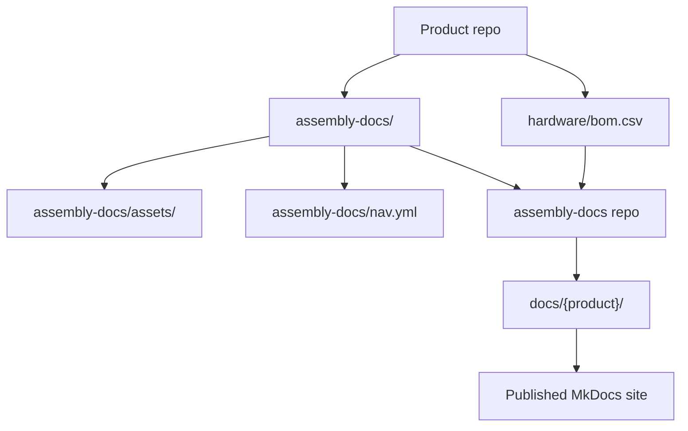
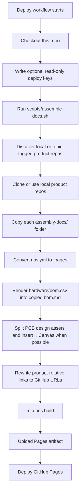
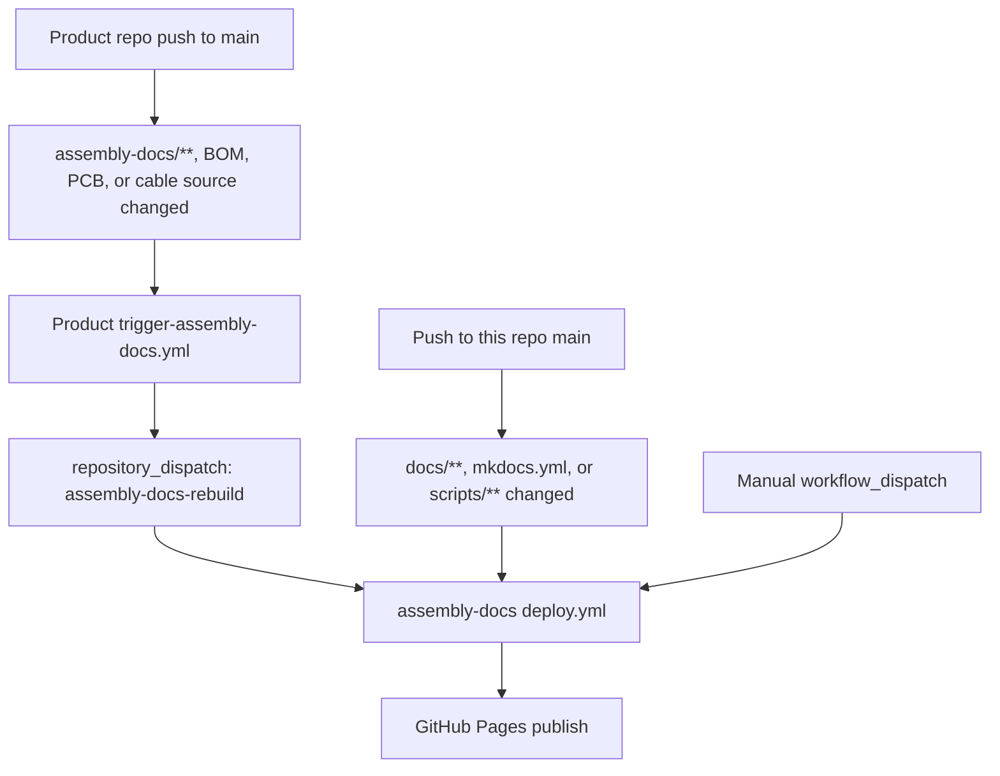
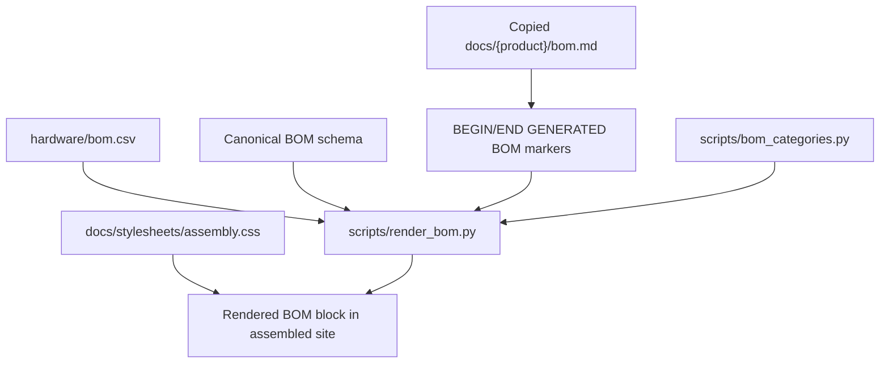
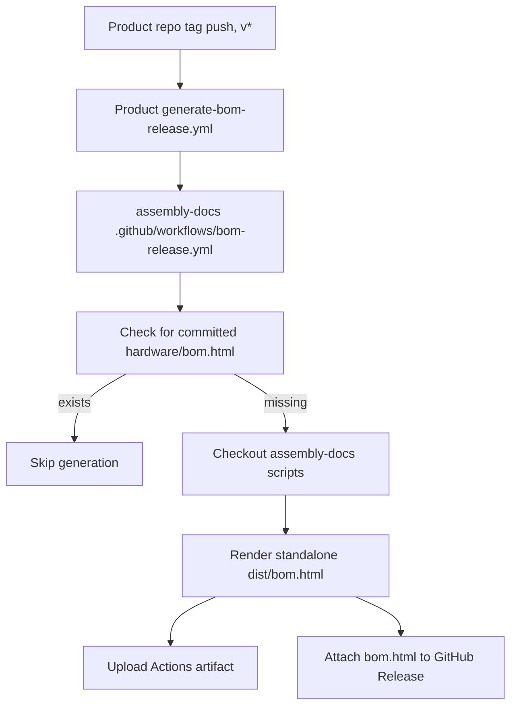

{/* Ported from MkDocs: how-this-site-works.md */}

<Warning title="Historische Pipeline">
  Diese Seite bewahrt die frühere MkDocs-Assembly-Pipeline als Migrationsreferenz. Fumadocs in
  rad-app und die geprüfte bidirektionale Inhaltssynchronisierung sind nun für die
  Veröffentlichung zuständig.
</Warning>

Diese Website ist ein Aggregator. Produktteams pflegen ihre Montagedokumentation in
den jeweiligen Produkt-Repositorys, und dieses Repository fügt diese Pakete zu einer
  einheitlichen MkDocs Material-Website zusammen.

Die wichtige Regel lautet: Die Inhalte der Produktmontage gehören den Produkt-
Repositorys. Dieses Repository besitzt die Site-Hülle, die Build-Skripte, das gemeinsame
Styling und die Automatisierung, die Produktdokumente in die veröffentlichte Website umwandelt.

## Quelllayout



Jedes für Ohai geeignete Produkt-Repository trägt Folgendes bei:

- `assembly-docs/`: Markdown-Seiten für die Montageanleitung des Produkts.
- `assembly-docs/assets/`: Produktbilder und andere Seitenressourcen.
- `assembly-docs/site.yml`: Produkt-Slug, Titel, Lizenz und Navigationsreihenfolge.
- `assembly-docs/nav.yml`: Lokale Seitenreihenfolge des Produkts und Abschnittstitel.
- `hardware/bom.csv`: Die vom Menschen gepflegten Quelldaten der Stückliste.
- Hardware-Quellordner unter `hardware/cad/`, `hardware/pcb/` und
  `hardware/cables/`.
- GitHub-Thema `ohai-assembly-docs`, nachdem Platzhalter ersetzt wurden und lokale
  Montage-/Build-Prüfungen erfolgreich sind.

Dieses Repository trägt Folgendes bei:

- `mkdocs.yml`: MkDocs Material-Konfiguration für die einheitliche Website.
- `docs/index.md`: Die Homepage der Website.
- `docs/how-this-site-works.md`: Produktübergreifende Site-Dokumentation.
- `scripts/assemble-docs.sh`: Der zentrale Assembler.
- `scripts/render_bom.py`: Renderer für Stücklisten.
- `scripts/bom_categories.py`: Gemeinsame Bezeichnungen und Farbzuordnung für Stücklistenkategorien.
- `docs/stylesheets/assembly.css`: Gemeinsame Styles der Assembly-Website.
- `.github/workflows/deploy.yml`: Workflow zum Zusammenstellen, Bauen und Veröffentlichen der Website.
- `.github/workflows/bom-release.yml`: Wiederverwendbarer Workflow für eigenständige Stücklisten-Releases.
- `templates/`: In Produkt-Repositorys kopierte Workflows.

## Build-Ablauf



Der Assembler erstellt zunächst für jedes Produkt eine Staging-Ausgabe und ersetzt erst dann
`docs/{product}/`, wenn die Assemblierung dieses Produkts erfolgreich war. Diese Produktordner sind
Ausgaben; bearbeiten Sie sie daher nicht manuell. Ändern Sie die Produktdokumentation stattdessen
im Quell-Repository des Produkts.

Lokal können Sie denselben Assemblierungsprozess gegen nahegelegene Checkouts ausführen:

```bash
pip install -r requirements.txt
ASSEMBLE_LOCAL="$HOME/Github" ./scripts/assemble-docs.sh
mkdocs serve
```

Ohne `ASSEMBLE_LOCAL` entdeckt der Assembler nicht archivierte
`researchanddesire/*`-Repositorys mit dem Thema `ohai-assembly-docs`. In CI verwendet er
`ASSEMBLE_GITHUB_TOKEN` zur privaten Erkennung und zum Klonen, sofern gesetzt, bevorzugt pro
Repository vorhandene schreibgeschützte Deploy-Schlüssel und greift dann für öffentliche
Repositorys auf anonymes HTTPS zurück.

## CI-Trigger

Der zentrale Deployment-Workflow befindet sich unter `.github/workflows/deploy.yml`.



Produkt-Repositorys sollten `templates/trigger-assembly-docs.yml` nach
`.github/workflows/trigger-assembly-docs.yml` kopieren und `<PRODUCT_REPO>` durch
ihren Repository-Namen ersetzen. Dieser Workflow überwacht `assembly-docs/**`, BOM-CSV-Dateien,
`hardware/pcb/**` und `hardware/cables/**`. Er benötigt ein `DOCS_DISPATCH_TOKEN`-
Secret mit der Berechtigung, einen Repository-Dispatch an dieses Repository zu senden.

Der Deployment-Workflow:

1. Checkt dieses Repository aus.
2. Schreibt alle konfigurierten schreibgeschützten Deploy-Schlüssel in das temporäre Verzeichnis des Runners.
3. Führt `scripts/assemble-docs.sh` aus, entdeckt themenmarkierte Produkte und
   erstellt für jedes Produkt eine Staging-Ausgabe, bevor die veröffentlichte Ausgabe ersetzt wird.
4. Installiert die MkDocs-Abhängigkeiten von `requirements.txt`.
5. Führt `mkdocs build` aus.
6. Lädt das generierte `site/`-Verzeichnis als Pages-Artefakt hoch.
7. Stellt das Artefakt auf GitHub Pages bereit.

## Stücklisten-Rendering

Die maßgebliche Quelle der Stückliste ist immer `hardware/bom.csv` im Produkt-Repository.
Das Rendering ist für diese CSV schreibgeschützt.



`scripts/render_bom.py` validiert den kanonischen 12-spaltigen Stücklistenkopf, bevor es
ihn rendert. Es ersetzt nur den Inhalt zwischen diesen Markierungen auf der kopierten Seite:

```html
{/* BEGIN GENERATED BOM */} {/* END GENERATED BOM */}
```

Wenn `assembly-docs/bom.md` eines Produkts diese Markierungen nicht enthält, bleibt die Seite
unverändert. Wenn `hardware/bom.csv` nur eine Kopfzeile und keine Datenzeilen enthält,
überspringt der Renderer sie, anstatt die Seite zu leeren.

Die gerenderte Stückliste gehört ausschließlich auf diese Assembly-Docs-Website. Entwicklerdokumente können
den Stücklisten-Workflow dokumentieren, sollten aber nicht die gerenderte Stücklistentabelle einbetten.

## Kabelbäume

Die Quelldateien der Kabelbäume gehören in `hardware/cables/` des Produkt-Repositorys.
Von Wireviz generierte untergeordnete Stücklisten gehören zu Release-/Build-Artefakten wie
`.bom.tsv`-Dateien.

Auf Produktebene listet `hardware/bom.csv` Kabelbäume als Baugruppen der obersten Ebene auf.
Wenn ein Kabelbaum eine Wireviz-Quelle besitzt, sollte `Source` in der Produktstückliste auf den
Quellpfad relativ zu `hardware/` verweisen, zum Beispiel
`cables/OSSM-Motor-Control-Harness.yml`. Assembly-Seiten für Kabel verknüpfen generierte
Diagramme und untergeordnete Stücklistenartefakte, statt untergeordnete Kabelzeilen in die
Stückliste auf Produktebene zu kopieren.

## Release-Stücklistenartefakte

Getaggte Produkt-Releases können auch ein eigenständiges `bom.html`-Artefakt generieren.



Produkt-Repositorys sollten `templates/generate-bom-release.yml` nach
`.github/workflows/generate-bom-release.yml` kopieren und Produktname, Repository-URL
und Lizenzzeichenfolge festlegen. Das Produkt-Repository wird vom wiederverwendbaren Workflow ausgecheckt;
nur die BOM-Rendering-Skripte werden aus diesem Repository abgerufen.

## Richtig beitragen

Verwenden Sie diese Faustregel: Bearbeiten Sie Inhalte dort, wo sie gepflegt werden.

| Ändern                                                                                              | Hier bearbeiten                                                   |
| --------------------------------------------------------------------------------------------------- | ----------------------------------------------------------------- |
| Produktmontageschritte, Produktbilder, Text der Produktstücklistenseite, PCB-Übersicht, Kabelseiten | Produkt-Repo `assembly-docs/`                                     |
| Produktstücklistendaten                                                                             | Produkt-Repo `hardware/bom.csv`                                   |
| Reihenfolge der Produktmontagenavigation                                                           | Produkt-Repo `assembly-docs/nav.yml`                              |
| Produktmetadaten für Ohai-Erkennung                                                                 | Produkt-Repo `assembly-docs/site.yml`                             |
| CAD-, PCB- und Kabelquellenartefakte                                                                | Produkt-Repo `hardware/cad/`, `hardware/pcb/`, `hardware/cables/` |
| Site-Homepage oder produktübergreifende Site-Dokumente                                              | Dieses Repo `docs/` außerhalb der Produktordner                   |
| Verhalten der Assembly-Pipeline                                                                     | Dieses Repo `scripts/`                                            |
| Geteiltes Site-Styling                                                                              | Dieses Repo `docs/stylesheets/assembly.css`                       |
| Bereitstellung von GitHub Pages                                                                    | Dieses Repo `.github/workflows/deploy.yml`                        |
| Auslöservorlage für den erneuten Produkt-Build                                                     | Dieses Repo `templates/trigger-assembly-docs.yml`                 |
| Vorlage zur Generierung von Release-Stücklisten                                                     | Dieses Repo `templates/generate-bom-release.yml`                  |

Das sollten Sie tun:

- Nehmen Sie zunächst Änderungen am Produktinhalt im Produkt-Repository vor.
- Halten Sie `hardware/bom.csv` in menschlicher Hand und schemakonform.
- Fügen Sie `{/* BEGIN GENERATED BOM */}` und `{/* END GENERATED BOM */}` in eine
  Produktseite `assembly-docs/bom.md` ein, wenn diese Seite für generierten Inhalt bereit ist.
- Halten Sie `assembly-docs/site.yml` echt und platzhalterfrei, bevor Sie das
  Thema `ohai-assembly-docs` hinzufügen.
- Testen Sie Site-Änderungen lokal mit `ASSEMBLE_LOCAL="$HOME/Github" ./scripts/assemble-docs.sh`
  und `mkdocs serve`.
- Behandeln Sie `scripts/bom_categories.py` als einzige Quelle für Stücklistenkategoriebezeichnungen
  und Farben.
- Halten Sie die Ausgabe deterministisch: Es dürfen keine Zeitstempel oder instabilen
  Reihenfolgen in generierten Dokumenten enthalten sein.

Das sollten Sie nicht tun:

- Bearbeiten Sie `docs/dtt/`, `docs/lockbox/`, `docs/radr/`, `docs/ossm/` oder andere
  generierte Produktordner nicht manuell.
- Fügen Sie `ohai-assembly-docs` nicht zu Vorlagen-Repositorys oder Repositorys mit
  `PRODUCT_*`-Platzhaltern hinzu.
- Committen Sie generierte Stücklistenblöcke nicht zurück in Produkt-Repositories.
- Kopieren Sie die untergeordneten Wireviz-Kabelstücklistenzeilen nicht in die Stückliste auf Produktebene.
- Ändern Sie das Stücklistenschema in diesem Repository nicht.
- Duplizieren Sie die Farbzuordnung der Stücklistenkategorien nicht in CSS.
- Fügen Sie gerenderte Baugruppen-Stücklistentabellen nicht in Entwicklerdokumente ein.
- Verwenden Sie keine ausschließlich lokalen Assets oder absoluten lokalen Pfade in Produktdokumenten.

## Neues Produkt hinzufügen

1. Fügen Sie dem Produkt-Repository einen `assembly-docs/`-Ordner hinzu.
2. Fügen Sie `assembly-docs/site.yml` mit echtem `slug`, `title`, `license` und einer
   ganzzahligen `nav_order` hinzu.
3. Fügen Sie `assembly-docs/nav.yml` mit `site_name` und der Standardseitenreihenfolge hinzu.
4. Fügen Sie `index.md`, `pcb-overview.md`, `cable-harnesses.md`, `bom.md` und
   `assembly-guide.md`.
5. Legen Sie Seitenbilder und unterstützende Dateien unter `assembly-docs/assets/` ab.
6. Fügen Sie `hardware/bom.csv` zum kanonischen Stücklistenschema hinzu oder validieren Sie es.
7. Stellen Sie sicher, dass `hardware/cad/`, `hardware/pcb/` und `hardware/cables/` vorhanden sind.
8. Kopieren Sie die Trigger-Workflow-Vorlage in das Produkt-Repository.
9. Bestätigen Sie, dass die lokale Assemblierung und `mkdocs build --strict` erfolgreich sind.
10. Fügen Sie das Thema `ohai-assembly-docs` hinzu, um das Produkt in die Website aufzunehmen.

Konfigurieren Sie für private Repositorys `ASSEMBLE_GITHUB_TOKEN` mit Lesezugriff auf die
Produkt-Repositorys. Schreibgeschützte Deploy-Schlüssel pro Repository werden während des
Übergangs weiterhin unterstützt. Sobald die Repositorys öffentlich sind, genügt anonymes HTTPS-Klonen.

## Fehlerbehebung

| Symptom                                     | Prüfen                                                                                                                                        |
| ------------------------------------------- | --------------------------------------------------------------------------------------------------------------------------------------------- |
| Produktseite wurde nicht aktualisiert       | Hat sich das Quell-Repository des Produkts unter `assembly-docs/**` geändert, und hat der Trigger-Workflow erfolgreich einen Dispatch gesendet? |
| Stückliste wurde nicht gerendert            | Enthält `assembly-docs/bom.md` beide generierten Stücklistenmarkierungen? Enthält `hardware/bom.csv` Datenzeilen?                              |
| Stücklisten-Rendering fehlgeschlagen        | Entspricht `hardware/bom.csv` genau dem kanonischen 12-spaltigen Header?                                                                         |
| Bilder fehlen                               | Liegen die Assets unter `assembly-docs/assets/`, und sind die Seitenlinks relativ zum Produktdokumentationspaket?                               |
| Produktbezogene Quelllinks sind defekt      | Prüfen Sie `scripts/rewrite_product_links.py` und die Produkt-Repository-/Branch-Konfiguration in `scripts/assemble-docs.sh`.                  |
| KiCanvas wurde nicht angezeigt              | Stellen Sie sicher, dass eine `*.kicad_pcb`-Datei unter `hardware/pcb/` des Produkt-Repositorys vorhanden ist.                                  |
| Produkt wurde bei der Erkennung übersprungen | Prüfen Sie das Thema `ohai-assembly-docs`, das platzhalterfreie `assembly-docs/site.yml` und die erforderlichen Montage-/Hardwarepfade.       |
