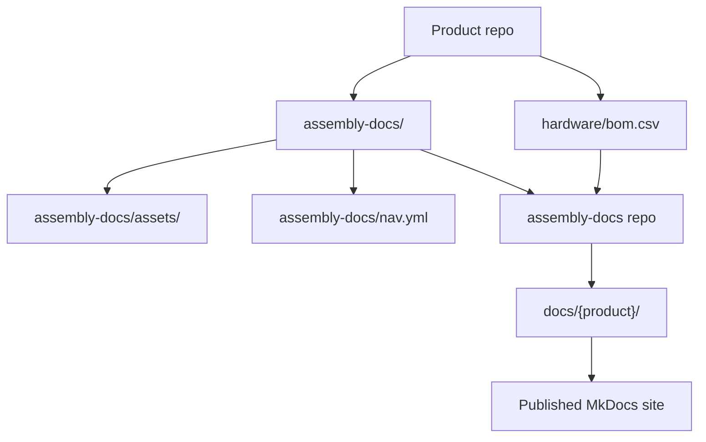
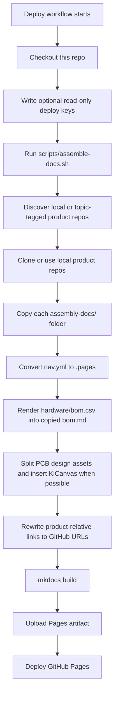
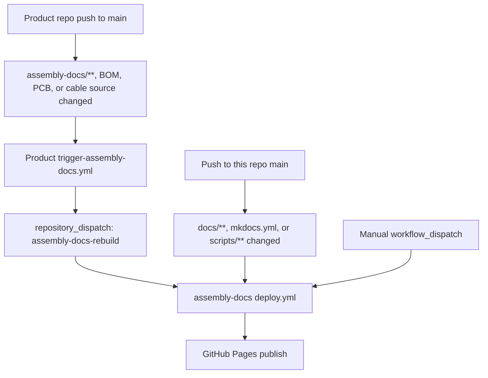
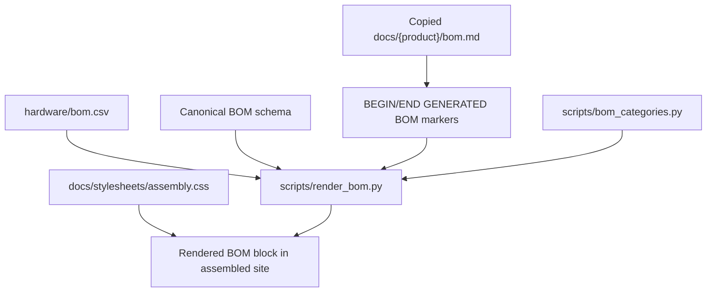
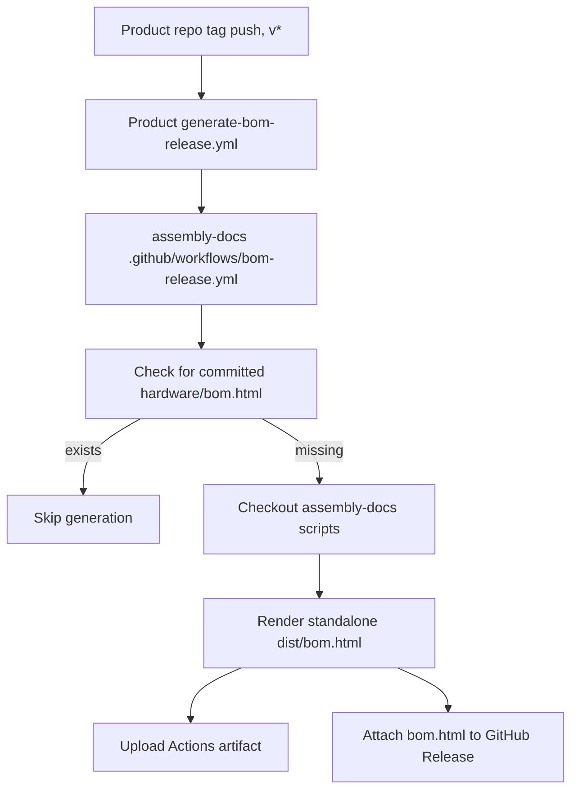

{/* Ported from MkDocs: how-this-site-works.md */}

<Warning title="Pipeline historique">
  Cette page conserve l’ancien pipeline d’assemblage MkDocs comme référence de migration. Fumadocs dans
  rad-app et la synchronisation bidirectionnelle vérifiée du contenu sont désormais responsables de la
  publication.
</Warning>

Ce site est un agrégateur. Les équipes produit gèrent la documentation d’assemblage dans
chaque dépôt de produit, et ce dépôt regroupe ces packages en un seul
site MkDocs Material.

La règle importante est que le contenu d’assemblage du produit appartient aux dépôts de
produits. Ce dépôt possède l’enveloppe du site, les scripts de build, le style partagé et
l’automatisation qui transforme la documentation des produits en site publié.

## Disposition des sources



Chaque dépôt de produit éligible pour Ohai fournit :

- `assembly-docs/` : pages Markdown du guide d’assemblage du produit.
- `assembly-docs/assets/` : images du produit et autres ressources de page.
- `assembly-docs/site.yml` : slug, titre, licence et ordre de navigation du produit.
- `assembly-docs/nav.yml` : ordre des pages du produit et titre de la section.
- `hardware/bom.csv` : données sources de la nomenclature gérées par les personnes.
- Répertoires de sources matérielles sous `hardware/cad/`, `hardware/pcb/` et
  `hardware/cables/`.
- Le topic GitHub `ohai-assembly-docs`, une fois les espaces réservés remplacés et
  les vérifications locales d’assemblage et de build réussies.

Ce dépôt fournit :

- `mkdocs.yml` : configuration MkDocs Material du site unifié.
- `docs/index.md` : page d’accueil du site.
- `docs/how-this-site-works.md` : documentation du site multi-produits.
- `scripts/assemble-docs.sh` : assembleur principal.
- `scripts/render_bom.py` : moteur de rendu de la nomenclature.
- `scripts/bom_categories.py` : libellés de catégories et palette de couleurs partagés de la nomenclature.
- `docs/stylesheets/assembly.css` : styles partagés du site d’assemblage.
- `.github/workflows/deploy.yml` : workflow d’assemblage, de build et de publication du site.
- `.github/workflows/bom-release.yml` : workflow réutilisable pour publier une nomenclature autonome.
- `templates/` : workflows copiés dans les dépôts de produits.

## Déroulement du build



L’assembleur prépare d’abord chaque produit, puis ne remplace `docs/{product}/` qu’après
la réussite de l’assemblage du produit. Ces dossiers de produits sont des sorties générées ;
évitez donc de les modifier manuellement. Modifiez plutôt la documentation dans le dépôt
source du produit.

En local, vous pouvez exécuter le même processus d’assemblage sur des clones voisins :

```bash
pip install -r requirements.txt
ASSEMBLE_LOCAL="$HOME/Github" ./scripts/assemble-docs.sh
mkdocs serve
```

Sans `ASSEMBLE_LOCAL`, l’assembleur découvre les dépôts non archivés
`researchanddesire/*` portant le topic `ohai-assembly-docs`. En CI, il utilise
`ASSEMBLE_GITHUB_TOKEN` pour la découverte et le clonage privés lorsqu’il est défini, privilégie
les clés de déploiement en lecture seule propres à chaque dépôt lorsqu’elles sont disponibles,
puis utilise le clonage HTTPS anonyme pour les dépôts publics.

## Déclencheurs CI

Le workflow de déploiement principal se trouve dans `.github/workflows/deploy.yml`.



Les dépôts de produits doivent copier `templates/trigger-assembly-docs.yml` vers
`.github/workflows/trigger-assembly-docs.yml` et remplacer `<PRODUCT_REPO>` par
le nom de leur dépôt. Ce workflow surveille `assembly-docs/**`, les CSV de nomenclature,
`hardware/pcb/**` et `hardware/cables/**`. Il nécessite un secret `DOCS_DISPATCH_TOKEN`
autorisé à envoyer un événement repository_dispatch à ce dépôt.

Le workflow de déploiement :

1. Extrait ce dépôt.
2. Écrit toutes les clés de déploiement en lecture seule configurées dans le répertoire temporaire du runner.
3. Exécute `scripts/assemble-docs.sh`, qui découvre les produits portant le topic et
   prépare chaque produit avant de remplacer la sortie publiée.
4. Installe les dépendances MkDocs à partir de `requirements.txt`.
5. Exécute `mkdocs build`.
6. Téléverse le répertoire `site/` généré comme artefact Pages.
7. Déploie l’artefact sur GitHub Pages.

## Rendu de la nomenclature

La source de vérité de la nomenclature est toujours `hardware/bom.csv` dans le dépôt du produit.
Le rendu de ce CSV est en lecture seule.



`scripts/render_bom.py` valide l’en-tête canonique de nomenclature à 12 colonnes avant de
le rendre. Il remplace uniquement le contenu entre ces marqueurs dans la page copiée :

```html
{/* BEGIN GENERATED BOM */} {/* END GENERATED BOM */}
```

Si la page `assembly-docs/bom.md` d’un produit ne contient pas ces marqueurs, elle
reste inchangée. Si `hardware/bom.csv` ne contient qu’une ligne d’en-tête et aucune ligne de données,
le moteur de rendu ignore le fichier au lieu de vider la page.

La nomenclature rendue appartient uniquement à ce site assembly-docs. La documentation développeur peut
décrire le workflow de nomenclature, mais ne doit pas intégrer la table rendue.

## Faisceaux de câbles

Les fichiers sources des faisceaux de câbles se trouvent dans `hardware/cables/` du dépôt du produit.
Les nomenclatures enfants générées par Wireviz sont des artefacts de release/build tels que les
fichiers `.bom.tsv`.

Au niveau du produit, `hardware/bom.csv` répertorie les faisceaux de câbles comme assemblages de premier niveau.
Lorsqu’un faisceau possède une source Wireviz, `Source` dans la nomenclature du produit doit pointer
vers le chemin source relatif à `hardware/`, par exemple
`cables/OSSM-Motor-Control-Harness.yml`. Les pages des faisceaux d’assemblage renvoient vers les
diagrammes générés et les artefacts des nomenclatures enfants au lieu de copier les lignes des
câbles enfants dans la nomenclature du produit.

## Artefacts de nomenclature des releases

Les releases taguées des produits peuvent également générer un artefact autonome `bom.html`.



Les dépôts de produits doivent copier `templates/generate-bom-release.yml` vers
`.github/workflows/generate-bom-release.yml` et définir le nom du produit, l’URL du dépôt
et la chaîne de licence. Le dépôt du produit est extrait par le workflow réutilisable ;
seuls les scripts de rendu de la nomenclature sont récupérés depuis ce dépôt.

## Bien contribuer

Utilisez cette règle générale : modifiez le contenu là où il appartient.

| Modification                                                                                                                    | Modifier ici                                                             |
| ------------------------------------------------------------------------------------------------------------------------------- | ------------------------------------------------------------------------ |
| Étapes d'assemblage du produit, images du produit, texte de la page de nomenclature du produit, aperçu des PCB, pages de câbles | Référentiel produit `assembly-docs/`                                     |
| Données de nomenclature de produit                                                                                              | Référentiel produit `hardware/bom.csv`                                   |
| Ordre de navigation de l'assemblage du produit                                                                                | Référentiel produit `assembly-docs/nav.yml`                              |
| Métadonnées du produit pour la découverte Ohai                                                                                  | Référentiel produit `assembly-docs/site.yml`                             |
| CAO, PCB, artefacts de source de câble                                                                                          | Référentiel produit `hardware/cad/`, `hardware/pcb/`, `hardware/cables/` |
| Page d'accueil du site ou documents du site multi-produits                                                                      | Ce dépôt `docs/` en dehors des dossiers de produits                      |
| Comportement du pipeline d'assemblage                                                                                           | Ce dépôt `scripts/`                                                      |
| Style de site partagé                                                                                                           | Ce dépôt `docs/stylesheets/assembly.css`                                 |
| Déploiement de GitHub Pages                                                                                                    | Ce dépôt `.github/workflows/deploy.yml`                                  |
| Modèle de déclencheur de reconstruction de produit                                                                              | Ce dépôt `templates/trigger-assembly-docs.yml`                           |
| Modèle de génération de nomenclature de release                                                                                 | Ce dépôt `templates/generate-bom-release.yml`                            |

À faire :

- Apportez d'abord des modifications au contenu du produit dans le dépôt du produit.
- Gardez `hardware/bom.csv` géré par des personnes et conforme au schéma.
- Incluez `{/* BEGIN GENERATED BOM */}` et `{/* END GENERATED BOM */}` dans la page produit
  `assembly-docs/bom.md` lorsqu’elle est prête pour le contenu généré.
- Gardez `assembly-docs/site.yml` réel et sans espace réservé avant d’ajouter le
  topic `ohai-assembly-docs`.
- Testez les modifications localement avec `ASSEMBLE_LOCAL="$HOME/Github" ./scripts/assemble-docs.sh`
  et `mkdocs serve`.
- Considérez `scripts/bom_categories.py` comme la source unique des libellés de catégories de
  nomenclature et de leurs couleurs.
- Gardez la sortie déterministe : ne générez aucun horodatage ni ordre instable dans la
  documentation générée.

À ne pas faire :

- Ne modifiez pas manuellement `docs/dtt/`, `docs/lockbox/`, `docs/radr/`, `docs/ossm/` ou d’autres
  dossiers de produits assemblés.
- N’ajoutez pas `ohai-assembly-docs` aux dépôts modèles ou aux dépôts contenant des espaces réservés
  `PRODUCT_*`.
- Ne réintégrez pas les blocs de nomenclature générés dans les dépôts de produits.
- Ne copiez pas les lignes des nomenclatures de câbles enfants Wireviz dans la nomenclature du produit.
- Ne modifiez pas le schéma de nomenclature dans ce dépôt.
- Ne dupliquez pas la palette de couleurs des catégories de nomenclature dans le CSS.
- N’ajoutez pas de tables de nomenclature d’assemblage rendues à la documentation développeur.
- Ne faites pas dépendre la documentation produit d’assets exclusivement locaux ou de chemins locaux absolus.

## Ajout d'un nouveau produit

1. Ajoutez un dossier `assembly-docs/` au dépôt du produit.
2. Ajoutez `assembly-docs/site.yml` avec un `slug`, un `title` et une `license` réels,
   ainsi qu’un `nav_order` entier.
3. Ajoutez `assembly-docs/nav.yml` avec `site_name` et l'ordre des pages standard.
4. Incluez `index.md`, `pcb-overview.md`, `cable-harnesses.md`, `bom.md` et
   `assembly-guide.md`.
5. Placez les images de page et les fichiers de support sous `assembly-docs/assets/`.
6. Ajoutez ou validez `hardware/bom.csv` par rapport au schéma canonique de nomenclature.
7. Veillez à ce que `hardware/cad/`, `hardware/pcb/` et `hardware/cables/` soient présents.
8. Copiez le modèle de workflow de déclenchement dans le dépôt du produit.
9. Vérifiez l’assemblage local et la réussite de `mkdocs build --strict`.
10. Ajoutez le topic `ohai-assembly-docs` pour rejoindre le site.

Pour les dépôts privés, configurez `ASSEMBLE_GITHUB_TOKEN` avec un accès en lecture aux
dépôts de produits. Les clés de déploiement en lecture seule par dépôt restent prises en charge pendant la
transition. Une fois les dépôts publics, le clonage HTTPS anonyme suffit.

## Dépannage

| Symptôme                                          | Vérifier                                                                                                                                 |
| ------------------------------------------------- | ---------------------------------------------------------------------------------------------------------------------------------------- |
| La page produit n’a pas été mise à jour           | Le dépôt source a-t-il changé sous `assembly-docs/**` et le workflow de déclenchement a-t-il envoyé l’événement de dispatch avec succès ? |
| La nomenclature n’a pas été rendue                | `assembly-docs/bom.md` contient-il les deux marqueurs générés ? `hardware/bom.csv` contient-il des lignes de données ?              |
| Le rendu de la nomenclature a échoué              | `hardware/bom.csv` correspond-il exactement à l’en-tête canonique à 12 colonnes ?                                                     |
| Des images sont manquantes                         | Les assets se trouvent-ils sous `assembly-docs/assets/` et les liens de page sont-ils relatifs au package de documentation produit ? |
| Les liens sources relatifs au produit sont rompus | Vérifiez `scripts/rewrite_product_links.py` et la configuration du dépôt/de la branche dans `scripts/assemble-docs.sh`.              |
| KiCanvas n’est pas apparu                         | Confirmez qu’un fichier `*.kicad_pcb` existe sous `hardware/pcb/` du dépôt du produit.                                               |
| Le produit a été ignoré lors de la découverte     | Confirmez le topic `ohai-assembly-docs`, le fichier `assembly-docs/site.yml` sans espace réservé et les chemins d’assemblage/matériel requis. |
