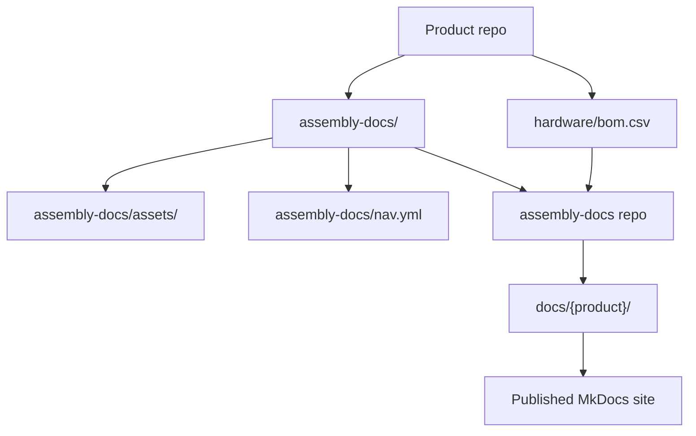
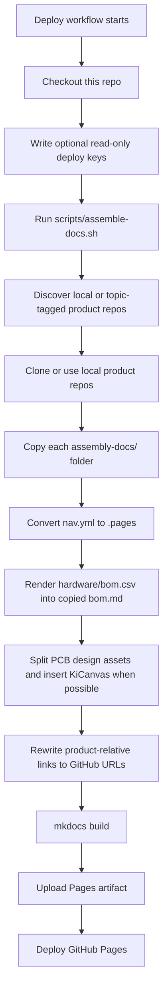
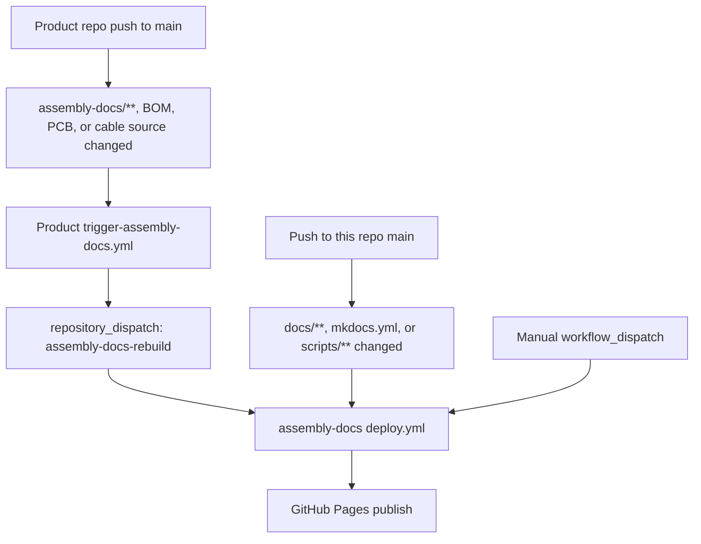
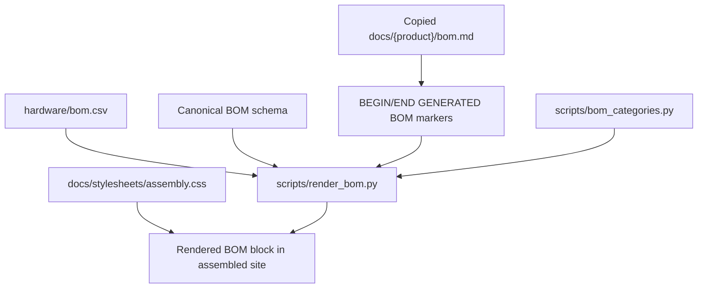
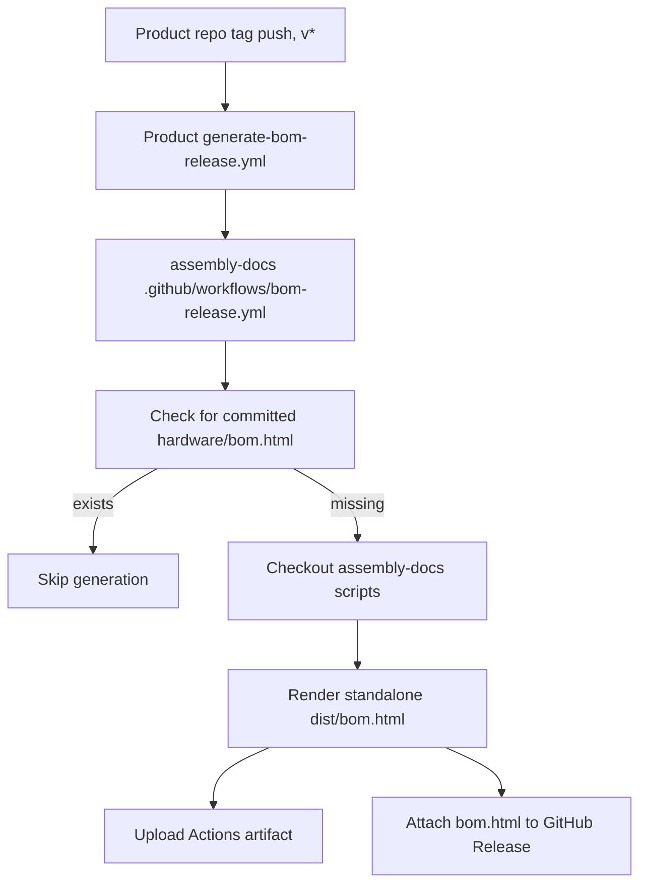

{/* Ported from MkDocs: how-this-site-works.md */}

<Warning title="Pipeline historique">
  Cette page conserve le pipeline d'assembly MkDocs précédent pour la migration
  référence. Fumadocs dans rad-app et le contenu bidirectionnel révisé se
  synchronisent maintenant propre publication.
</Warning>

Ce site est un agrégateur. Les équipes produit conservent la documentation d'assemblage dans
chaque référentiel de produits, et ce référentiel rassemble ces packages en un seul
Site de matériel MkDocs.

La règle importante est que le contenu de l'assemblage du produit appartient au produit.
repos. Ce dépôt possède le shell du site, les scripts de construction, le style partagé et le
automatisation qui transforme les documents produits en site publié.

## Disposition des sources



Chaque référentiel de produits éligibles à Ohai contribue :

- `assembly-docs/`: Pages Markdown pour le guide d'assemblage du produit.
- `assembly-docs/assets/`: images de produits et autres éléments de page.
- `assembly-docs/site.yml`: slug du produit, titre, licence et commande de navigation.
- `assembly-docs/nav.yml`: ordre des pages locales du produit et titre de la section.
- `hardware/bom.csv`: données sources de la nomenclature humaine.
- Dossiers sources matérielles sous `hardware/cad/`, `hardware/pcb/`et
  `hardware/cables/`.
- Sujet GitHub `ohai-assembly-docs` après le remplacement des espaces réservés et en local
  les contrôles d'assemblage/construction réussissent.

Ce référentiel contribue :

- `mkdocs.yml`: Configuration MkDocs Material pour le site unifié.
- `docs/index.md`: La page d'accueil du site.
- `docs/how-this-site-works.md`: Documentation site multi-produits.
- `scripts/assemble-docs.sh`: L'assembleur principal.
- `scripts/render_bom.py`: moteur de rendu de nomenclature.
- `scripts/bom_categories.py`: étiquette de catégorie de nomenclature partagée et carte de couleurs.
- `docs/stylesheets/assembly.css`: styles de site d'assemblage partagés.
- `.github/workflows/deploy.yml`: workflow d'assemblage, de création et de publication de sites.
- `.github/workflows/bom-release.yml`: workflow de publication de nomenclature autonome réutilisable.
- `templates/`: workflows copiés dans les dépôts de produits.

## Créer un flux



L'assembleur prépare d'abord chaque produit, puis remplace uniquement `docs/{product}/`
après ce produit s'assemble avec succès. Ces dossiers produits sont assemblés
sortie, évitez donc de les modifier manuellement. Modifier la documentation du produit dans le produit source
repo à la place.

Localement, vous pouvez exécuter le même processus d'assemblage sur les caisses à proximité :

```bash
pip install -r requirements.txt
ASSEMBLE_LOCAL="$HOME/Github" ./scripts/assemble-docs.sh
mkdocs serve
```

Sans `ASSEMBLE_LOCAL`, l'assembleur découvre les fichiers non archivés
Dépôts`researchanddesire/*` avec le sujet `ohai-assembly-docs` . En CI, il utilise
`ASSEMBLE_GITHUB_TOKEN` pour la découverte/le clonage privé lorsqu'il est défini, préfère par dépôt
Déployez les clés en lecture seule lorsqu'elles sont présentes, puis revenez au HTTPS anonyme pour
pensions publiques.

## Déclencheurs CI

Le flux de travail de déploiement principal réside chez `.github/workflows/deploy.yml`.



Les dépôts de produits doivent copier `templates/trigger-assembly-docs.yml` dans
`.github/workflows/trigger-assembly-docs.yml` et remplacez `<PRODUCT_REPO>` par
leur nom de référentiel. Ce flux de travail surveille `assembly-docs/**`, les CSV de nomenclature,
`hardware/pcb/**`et `hardware/cables/**`. Il a besoin d'un `DOCS_DISPATCH_TOKEN`
secret avec l'autorisation d'envoyer un envoi de référentiel à ce référentiel.

Le workflow de déploiement :

1. Vérifie ce dépôt.
2. Écrit toutes les clés de déploiement en lecture seule configurées dans le répertoire temporaire du coureur.
3. Exécute `scripts/assemble-docs.sh`, qui découvre les produits étiquetés par sujet et
   met en scène chaque produit avant de remplacer la sortie publiée.
4. Installe les dépendances MkDocs à partir de `requirements.txt`.
5. Exécute `mkdocs build`.
6. Télécharge le répertoire `site/` généré en tant qu'artefact Pages.
7. Déploie l'artefact sur les pages GitHub.

## Rendu de la nomenclature

La source de vérité de la nomenclature est toujours le `hardware/bom.csv`du référentiel de produits.
Le rendu est en lecture seule sur ce CSV.



`scripts/render_bom.py` valide l'en-tête canonique de nomenclature à 12 colonnes avant
rend. Il remplace uniquement le contenu entre ces marqueurs dans la page copiée :

```html
{/* BEGIN GENERATED BOM */} {/* END GENERATED BOM */}
```

Si le `assembly-docs/bom.md` d'un produit ne contient pas ces marqueurs, la page
est laissé intact. Si `hardware/bom.csv` n'a qu'une ligne d'en-tête et aucune ligne de données,
le moteur de rendu l'ignore plutôt que de vider la page.

La nomenclature rendue appartient uniquement à ce site assembly-docs. Les documents du développeur peuvent
documenter le flux de travail de nomenclature, mais ne doit pas intégrer la table de nomenclature rendue.

## Faisceaux de câbles

Les fichiers sources des faisceaux de câbles appartiennent au référentiel de produits `hardware/cables/`.
Les nomenclatures enfants générées par Wireviz appartiennent aux artefacts de version/construction tels que
Fichiers`.bom.tsv` .

Au niveau du produit, `hardware/bom.csv` répertorie les faisceaux de câbles comme assemblages de niveau supérieur.
Lorsqu'un faisceau a une source Wireviz, la nomenclature du produit `Source` doit pointer vers le
chemin source par rapport à `hardware/`, par exemple
`cables/OSSM-Motor-Control-Harness.yml`. Lien vers les pages de câbles d'assemblage générés
diagrammes et artefacts de nomenclature enfants au lieu de copier les lignes enfants de câbles dans le
Nomenclature au niveau du produit.

## Libérer les artefacts de nomenclature

Les versions de produits balisées peuvent également générer un artefact `bom.html` autonome.



Les dépôts de produits doivent copier `templates/generate-bom-release.yml` dans
`.github/workflows/generate-bom-release.yml` et définissez le nom du produit, l'URL du dépôt,
et la chaîne de licence. Le référentiel de produits est extrait par le workflow réutilisable ;
seuls les scripts de rendu de nomenclature sont extraits de ce dépôt.

## Contribuer correctement

Utilisez cette règle générale : modifiez le contenu là où il appartient.

| Changement                                                                                                                      | Modifier ici                                                             |
| ------------------------------------------------------------------------------------------------------------------------------- | ------------------------------------------------------------------------ |
| Étapes d'assemblage du produit, images du produit, texte de la page de nomenclature du produit, aperçu des PCB, pages de câbles | Référentiel produit `assembly-docs/`                                     |
| Données de nomenclature de produit                                                                                              | Référentiel produit `hardware/bom.csv`                                   |
| Commande de navigation pour l'assemblage du produit                                                                             | Référentiel produit `assembly-docs/nav.yml`                              |
| Métadonnées du produit pour la découverte Ohai                                                                                  | Référentiel produit `assembly-docs/site.yml`                             |
| CAO, PCB, artefacts de source de câble                                                                                          | Référentiel produit `hardware/cad/`, `hardware/pcb/`, `hardware/cables/` |
| Page d'accueil du site ou documents du site multi-produits                                                                      | Ce dépôt `docs/` en dehors des dossiers de produits                      |
| Comportement du pipeline d'assemblage                                                                                           | Ce dépôt `scripts/`                                                      |
| Style de site partagé                                                                                                           | Ce dépôt `docs/stylesheets/assembly.css`                                 |
| Déploiement des pages GitHub                                                                                                    | Ce dépôt `.github/workflows/deploy.yml`                                  |
| Modèle de déclencheur de reconstruction de produit                                                                              | Ce dépôt `templates/trigger-assembly-docs.yml`                           |
| Libérer le modèle de génération de nomenclature                                                                                 | Ce dépôt `templates/generate-bom-release.yml`                            |

Faire:

- Apportez d'abord des modifications au contenu du produit dans le référentiel de produits.
- Gardez `hardware/bom.csv` appartenant à l'humain et conforme au schéma.
- Incluez `{/* BEGIN GENERATED BOM */}` et `{/* END GENERATED BOM */}` dans un
  produit `assembly-docs/bom.md` lorsque cette page est prête pour le contenu généré.
- Gardez `assembly-docs/site.yml` réel et sans espace réservé avant d'ajouter le
  Sujet `ohai-assembly-docs` .
- Le site de test change localement avec `ASSEMBLE_LOCAL="$HOME/Github" ./scripts/assemble-docs.sh`
  et `mkdocs serve`.
- Traitez `scripts/bom_categories.py` comme source unique pour les étiquettes de catégorie de nomenclature
  et les couleurs.
- Gardez la sortie déterministe : aucun horodatage ni ordre instable généré
  documents.

Ne pas:

- Édition manuelle `docs/dtt/`, `docs/lockbox/`, `docs/radr/`, `docs/ossm/`ou autre assemblage
  dossiers de produits.
- Ajoutez `ohai-assembly-docs` aux dépôts de modèles ou aux dépôts avec `PRODUCT_*`
  espaces réservés.
- Validez les blocs de nomenclature générés dans les dépôts de produits.
- Copiez les lignes de la nomenclature des câbles enfants Wireviz dans la nomenclature au niveau du produit.
- Modifiez le schéma BOM dans ce dépôt.
- Dupliquez la carte des couleurs de la catégorie BOM en CSS.
- Ajoutez des tables de nomenclature d'assemblage rendues aux documents du développeur.
- Dépendez d'actifs locaux uniquement ou de chemins locaux absolus dans la documentation du produit.

## Ajout d'un nouveau produit

1. Ajoutez un dossier `assembly-docs/` au référentiel du produit.
2. Ajoutez `assembly-docs/site.yml` avec les vrais `slug`, `title`, `license`et
   entier `nav_order`.
3. Ajoutez `assembly-docs/nav.yml` avec `site_name` et l'ordre des pages standard.
4. Inclut `index.md`, `pcb-overview.md`, `cable-harnesses.md`, `bom.md`et
   `assembly-guide.md`.
5. Placez les images de page et les fichiers de support sous `assembly-docs/assets/`.
6. Ajoutez ou validez `hardware/bom.csv` par rapport au schéma canonique de nomenclature.
7. Gardez `hardware/cad/`, `hardware/pcb/`et `hardware/cables/` présents.
8. Copiez le modèle de workflow de déclenchement dans le référentiel du produit.
9. Confirmez l'assemblage local et le passage `mkdocs build --strict` .
10. Ajoutez le sujet `ohai-assembly-docs` pour vous inscrire au site.

Pour les dépôts privés, configurez `ASSEMBLE_GITHUB_TOKEN` avec un accès en lecture au
dépôts de produits. Les clés de déploiement en lecture seule par dépôt restent prises en charge pendant
transition. Une fois les dépôts publics, le clonage HTTPS anonyme suffit.

## Dépannage

| Symptôme                                          | Vérifier                                                                                                                                 |
| ------------------------------------------------- | ---------------------------------------------------------------------------------------------------------------------------------------- |
| La page produit n'a pas été mise à jour           | Le référentiel du produit source a-t-il changé sous `assembly-docs/**`et le workflow de déclenchement a-t-il été distribué avec succès ? |
| La nomenclature n'a pas été rendue                | `assembly-docs/bom.md` contient-il les deux marqueurs de nomenclature générés ? `hardware/bom.csv` a-t-il des lignes de données ?        |
| Échec du rendu de la nomenclature                 | `hardware/bom.csv` correspond-il exactement à l'en-tête canonique à 12 colonnes ?                                                        |
| Il manque des images                              | Les actifs sont-ils sous `assembly-docs/assets/`et les liens vers des pages sont-ils relatifs au package de documentation du produit ?   |
| Les liens sources relatifs au produit sont rompus | Vérifiez `scripts/rewrite_product_links.py` et la configuration du référentiel/branche de produit dans `scripts/assemble-docs.sh`.       |
| KiCanvas n'est pas apparu                         | Confirmez qu'un fichier `*.kicad_pcb` existe sous `hardware/pcb/`du référentiel de produit.                                              |
| Le produit a été ignoré par Discovery             | Confirmez le sujet `ohai-assembly-docs` , le `assembly-docs/site.yml`sans espace réservé et les chemins d'assemblage/matériel requis.    |
