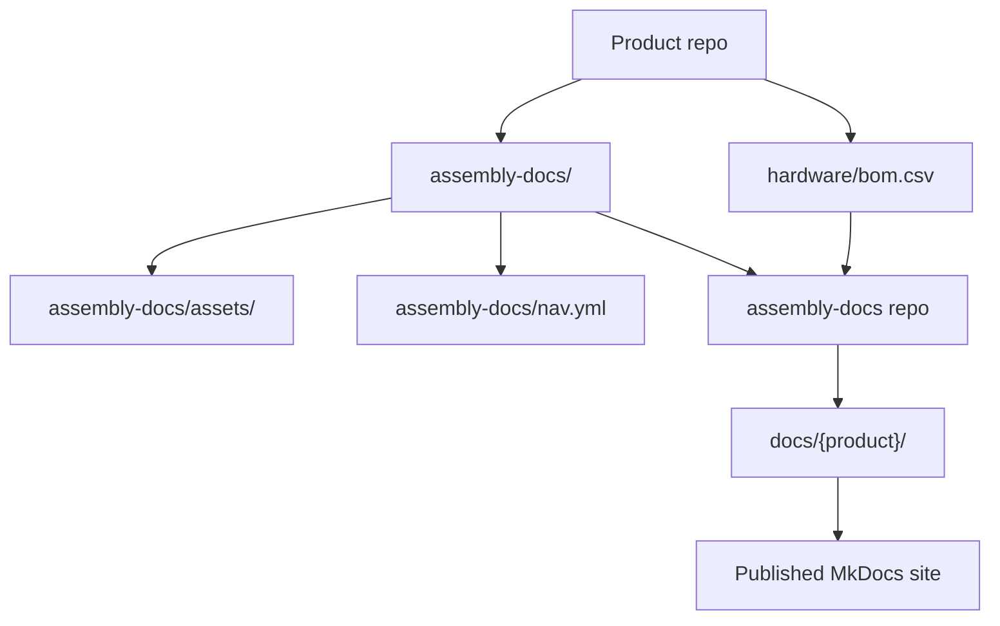
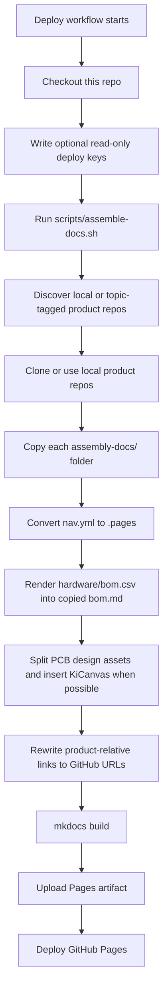
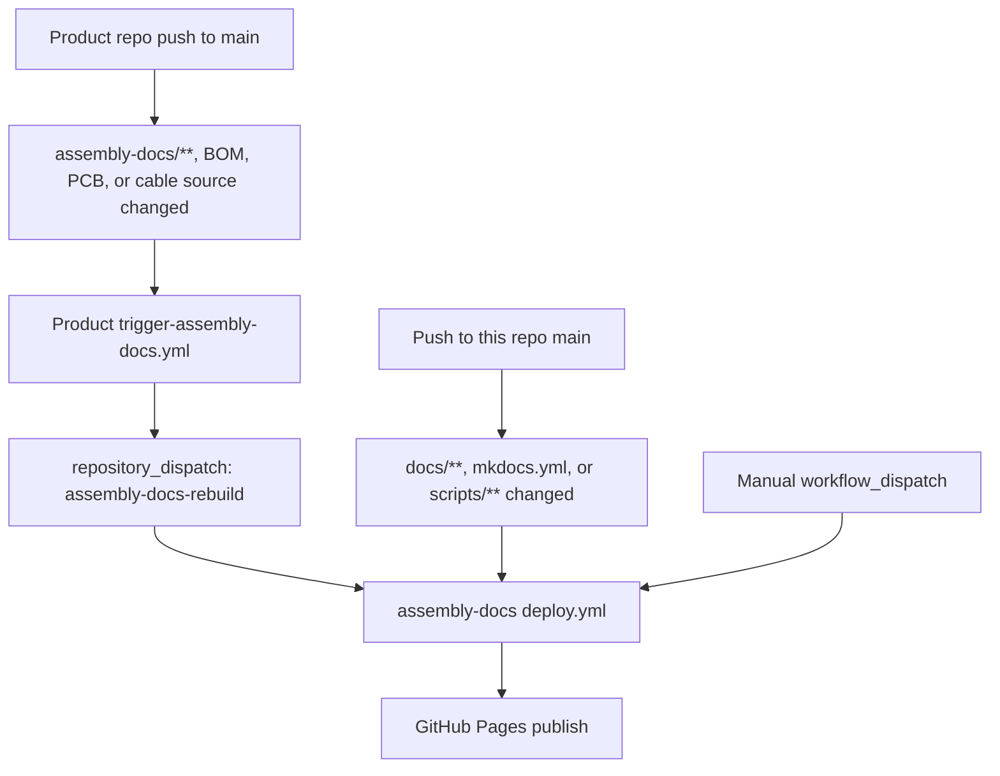
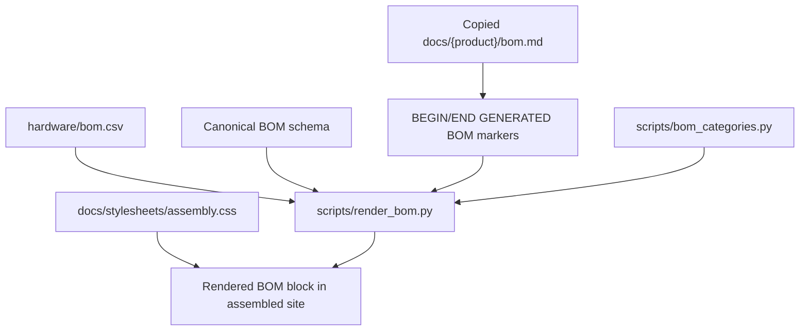
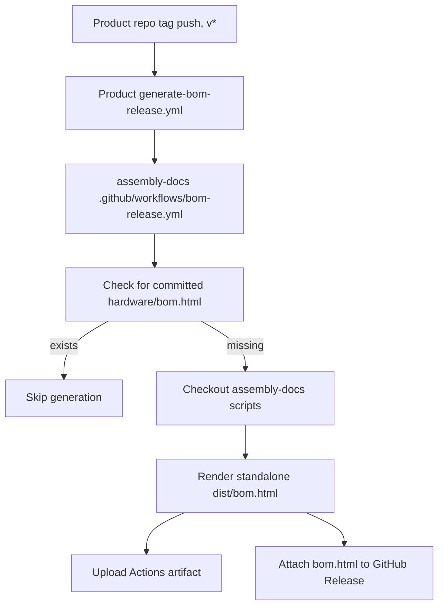

{/* Ported from MkDocs: how-this-site-works.md */}

<Warning title="Historische pijplijn">
  Op deze pagina wordt de vorige MkDocs-assemblagepijplijn bewaard voor migratie
  referentie. Fumadocs in rad-app en de beoordeelde bidirectionele inhoud worden
  nu gesynchroniseerd eigen publicatie.
</Warning>

Deze site is een aggregator. Productteams houden de assemblagedocumentatie bij
elke productrepository, en deze repository voegt deze pakketten samen tot één
MkDocs Materiaalsite.

De belangrijke regel is dat de inhoud van de productassemblage eigendom is van het product
repository's. Deze opslagplaats is eigenaar van de siteshell, de build-scripts, de gedeelde stijl en de
automatisering die productdocumenten omzet in de gepubliceerde site.

## Bronindeling



Elke voor Ohai in aanmerking komende productrepository draagt ​​bij aan:

- `assembly-docs/`: prijspagina's voor de productmontagehandleiding.
- `assembly-docs/assets/`: productafbeeldingen en andere pagina-items.
- `assembly-docs/site.yml`: productslug, titel, licentie en navigatievolgorde.
- `assembly-docs/nav.yml`: Product-lokale paginavolgorde en sectietitel.
- `hardware/bom.csv`: de brongegevens van de materiaallijst van mensen.
- Hardwarebronmappen onder `hardware/cad/`, `hardware/pcb/`en
  `hardware/cables/`.
- GitHub-onderwerp `ohai-assembly-docs` nadat tijdelijke aanduidingen zijn vervangen en lokaal
  montage/bouwcontroles zijn geslaagd.

Deze repository draagt ​​bij aan:

- `mkdocs.yml`: MkDocs-materiaalconfiguratie voor de verenigde site.
- `docs/index.md`: de startpagina van de site.
- `docs/how-this-site-works.md`: documentatie over meerdere producten.
- `scripts/assemble-docs.sh`: de hoofdassembler.
- `scripts/render_bom.py`: BOM-renderer.
- `scripts/bom_categories.py`: gedeeld stuklijstcategorielabel en kleurenkaart.
- `docs/stylesheets/assembly.css`: stijlen voor gedeelde montageplaatsen.
- `.github/workflows/deploy.yml`: workflow voor site-assemblage, bouwen en publiceren.
- `.github/workflows/bom-release.yml`: Herbruikbare, zelfstandige workflow voor het vrijgeven van stuklijsten.
- `templates/`: workflows gekopieerd naar productopslagplaatsen.

## Bouw stroom op



De assembler faseert elk product eerst en vervangt vervolgens alleen `docs/{product}/`
daarna wordt het product met succes gemonteerd. Deze productmappen worden samengesteld
uitvoer, dus vermijd handmatige bewerking. Wijzig de productdocumentatie in het bronproduct
repository in plaats daarvan.

Lokaal kunt u hetzelfde assemblageproces uitvoeren voor kassa's in de buurt:

```bash
pip install -r requirements.txt
ASSEMBLE_LOCAL="$HOME/Github" ./scripts/assemble-docs.sh
mkdocs serve
```

Zonder `ASSEMBLE_LOCAL`ontdekt de assembler niet-gearchiveerde bestanden
`researchanddesire/*` -opslagplaatsen met het `ohai-assembly-docs` -onderwerp. In CI gebruikt het
`ASSEMBLE_GITHUB_TOKEN` voor privédetectie/klonen indien ingesteld, geeft de voorkeur aan per repository
alleen-lezen implementatiesleutels indien aanwezig, en valt vervolgens terug op anonieme HTTPS
openbare repository's.

## CI-triggers

De belangrijkste implementatieworkflow bevindt zich op `.github/workflows/deploy.yml`.



Productopslagplaatsen moeten `templates/trigger-assembly-docs.yml` kopiëren naar
`.github/workflows/trigger-assembly-docs.yml` en vervang `<PRODUCT_REPO>` door
hun repositorynaam. Die workflow kijkt naar `assembly-docs/**`, BOM CSV's,
`hardware/pcb/**`en `hardware/cables/**`. Het heeft een `DOCS_DISPATCH_TOKEN`nodig
geheim met toestemming om een repositoryverzending naar deze repository te sturen.

De implementatieworkflow:

1. Bekijk deze repository.
2. Schrijft alle geconfigureerde alleen-lezen implementatiesleutels naar de runner temp-directory.
3. Voert `scripts/assemble-docs.sh`uit, dat producten met een onderwerptag ontdekt en
   faseert elk product voordat het de gepubliceerde output vervangt.
4. Installeert de MkDocs-afhankelijkheden van `requirements.txt`.
5. Voert `mkdocs build`uit.
6. Uploadt de gegenereerde `site/` -directory als een Pages-artefact.
7. Implementeert het artefact op GitHub-pagina's.

## Stuklijstweergave

De BOM-bron van waarheid is altijd de `hardware/bom.csv`van de productrepository.
Rendering is alleen-lezen op dat CSV.



`scripts/render_bom.py` valideert de canonieke stuklijstkop met 12 kolommen ervoor
geeft weer. Het vervangt alleen de inhoud tussen deze markeringen op de gekopieerde pagina:

```html
{/* BEGIN GENERATED BOM */} {/* END GENERATED BOM */}
```

Als de `assembly-docs/bom.md` van een product deze markeringen niet bevat, wordt de pagina
wordt onaangeroerd gelaten. Als `hardware/bom.csv` alleen een koprij en geen gegevensrijen heeft,
de renderer slaat dit over in plaats van de pagina leeg te maken.

De gerenderde stuklijst hoort alleen thuis op deze site met assemblagedocumenten. Ontwikkelaarsdocumentatie mogelijk
documenteer de stuklijstworkflow, maar mag de gerenderde stuklijsttabel niet insluiten.

## Kabelbomen

Bronbestanden voor kabelbomen behoren tot de productrepository `hardware/cables/`.
Door Wireviz gegenereerde onderliggende stuklijsten behoren tot release/build-artefacten zoals
`.bom.tsv` -bestanden.

`hardware/bom.csv` op productniveau vermeldt kabelbomen als assemblages op het hoogste niveau.
Wanneer een harnas een Wireviz-bron heeft, moet de productstuklijst `Source` naar de
bronpad relatief ten opzichte van bijvoorbeeld `hardware/`
`cables/OSSM-Motor-Control-Harness.yml`. Assemblagekabelpagina's linken naar gegenereerde
diagrammen en onderliggende stuklijstartefacten in plaats van onderliggende kabelrijen naar de
stuklijst op productniveau.

## Stuklijstartefacten vrijgeven

Getagde productreleases kunnen ook een zelfstandig `bom.html` -artefact genereren.



Productopslagplaatsen moeten `templates/generate-bom-release.yml` kopiëren naar
`.github/workflows/generate-bom-release.yml` en stel de productnaam, repo-URL,
en licentiereeks. De productrepository wordt uitgecheckt via de herbruikbare workflow;
alleen de stuklijstrenderingscripts worden uit deze opslagplaats gehaald.

## Een goede bijdrage leveren

Gebruik deze vuistregel: bewerk inhoud waar deze eigendom is.

| Wijzig                                                                                                | Bewerk hier                                                              |
| ----------------------------------------------------------------------------------------------------- | ------------------------------------------------------------------------ |
| Productmontagestappen, productafbeeldingen, productstuklijstpaginatekst, PCB-overzicht, kabelpagina's | Productopslagplaats `assembly-docs/`                                     |
| Productstuklijstgegevens                                                                              | Productopslagplaats `hardware/bom.csv`                                   |
| Productmontage navigatievolgorde                                                                      | Productopslagplaats `assembly-docs/nav.yml`                              |
| Productmetagegevens voor Ohai-ontdekking                                                              | Productopslagplaats `assembly-docs/site.yml`                             |
| CAD-, PCB-, kabelbronartefacten                                                                       | Productopslagplaats `hardware/cad/`, `hardware/pcb/`, `hardware/cables/` |
| Sitestartpagina of sitedocumenten voor meerdere producten                                             | Deze repo `docs/` buiten productmappen                                   |
| Gedrag van assemblagepijplijn                                                                         | Deze opslagplaats `scripts/`                                             |
| Styling van gedeelde sites                                                                            | Deze opslagplaats `docs/stylesheets/assembly.css`                        |
| Implementatie van GitHub-pagina's                                                                     | Deze opslagplaats `.github/workflows/deploy.yml`                         |
| Triggersjabloon voor het opnieuw opbouwen van producten                                               | Deze opslagplaats `templates/trigger-assembly-docs.yml`                  |
| Sjabloon voor het genereren van een stuklijst vrijgeven                                               | Deze opslagplaats `templates/generate-bom-release.yml`                   |

Doen:

- Breng eerst wijzigingen in de productinhoud aan in de productrepository.
- Zorg ervoor dat `hardware/bom.csv` eigendom is van mensen en voldoet aan het schema.
- Neem `{/* BEGIN GENERATED BOM */}` en `{/* END GENERATED BOM */}` op in een
  product `assembly-docs/bom.md` wanneer die pagina gereed is voor gegenereerde inhoud.
- Houd `assembly-docs/site.yml` reëel en vrij van tijdelijke aanduidingen voordat u de
  `ohai-assembly-docs` -onderwerp.
- Test locatiewijzigingen lokaal met `ASSEMBLE_LOCAL="$HOME/Github" ./scripts/assemble-docs.sh`
  en `mkdocs serve`.
- Behandel `scripts/bom_categories.py` als de enige bron voor stuklijstcategorielabels
  en kleuren.
- Houd de uitvoerdeterministisch: er worden geen tijdstempels of onstabiele volgorde gegenereerd
  documenten.

Niet doen:

- Handmatig bewerken van `docs/dtt/`, `docs/lockbox/`, `docs/radr/`, `docs/ossm/`of andere geassembleerde
  productmappen.
- Voeg `ohai-assembly-docs` toe aan sjabloonrepo's of repo's met `PRODUCT_*`
  tijdelijke aanduidingen.
- Zet gegenereerde stuklijstblokken terug naar productopslagplaatsen.
- Kopieer de stuklijstrijen van Wireviz-kinderkabels naar de stuklijst op productniveau.
- Wijzig het stuklijstschema in deze opslagplaats.
- Dupliceer de kleurenkaart van de stuklijstcategorie in CSS.
- Voeg gerenderde assemblagestuklijsttabellen toe aan ontwikkelaarsdocumenten.
- Afhankelijk van alleen lokale assets of absolute lokale paden in productdocumenten.

## Een nieuw product toevoegen

1. Voeg een `assembly-docs/` -map toe aan de productrepository.
2. Voeg `assembly-docs/site.yml` toe met echte `slug`, `title`, `license`en
   geheel getal `nav_order`.
3. Voeg `assembly-docs/nav.yml` toe met `site_name` en de standaardpaginavolgorde.
4. Inclusief `index.md`, `pcb-overview.md`, `cable-harnesses.md`, `bom.md`en
   `assembly-guide.md`.
5. Plaats pagina-afbeeldingen en ondersteunende bestanden onder `assembly-docs/assets/`.
6. Voeg `hardware/bom.csv` toe of valideer deze op basis van het canonieke BOM-schema.
7. Houd `hardware/cad/`, `hardware/pcb/`en `hardware/cables/` aanwezig.
8. Kopieer de triggerworkflowsjabloon naar de productopslagplaats.
9. Bevestig de lokale montage en de `mkdocs build --strict` -pas.
10. Voeg het onderwerp `ohai-assembly-docs` toe om u aan te melden voor de site.

Voor privéopslagplaatsen configureert u `ASSEMBLE_GITHUB_TOKEN` met leestoegang tot de
productopslagplaatsen. Alleen-lezen implementatiesleutels per repo blijven ondersteund tijdens
overgang. Zodra repositories openbaar zijn, is anoniem HTTPS-klonen voldoende.

## Problemen oplossen

| Symptoom                                   | Controleer                                                                                                                       |
| ------------------------------------------ | -------------------------------------------------------------------------------------------------------------------------------- |
| Productpagina is niet bijgewerkt           | Is de opslagplaats van het bronproduct gewijzigd onder `assembly-docs/**`, en is de triggerworkflow succesvol verzonden?         |
| BOM is niet weergegeven                    | Bevat `assembly-docs/bom.md` beide gegenereerde stuklijstmarkeringen? Heeft `hardware/bom.csv` gegevensrijen?                    |
| Stuklijstweergave mislukt                  | Komt `hardware/bom.csv` exact overeen met de canonieke koptekst met 12 kolommen?                                                 |
| Afbeeldingen ontbreken                     | Staan assets onder `assembly-docs/assets/`en zijn paginalinks gerelateerd aan het productdocumentatiepakket?                     |
| Product-relatieve bronlinks zijn verbroken | Controleer `scripts/rewrite_product_links.py` en de productrepository/filiaalconfiguratie in `scripts/assemble-docs.sh`.         |
| KiCanvas is niet verschenen                | Bevestig dat er een `*.kicad_pcb` -bestand bestaat onder de `hardware/pcb/`van de productrepository.                             |
| Product is overgeslagen door ontdekking    | Bevestig het `ohai-assembly-docs` -onderwerp, de niet-placeholder `assembly-docs/site.yml`en de vereiste montage-/hardwarepaden. |
