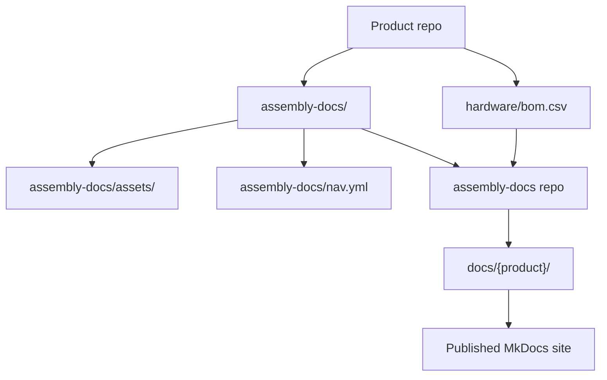
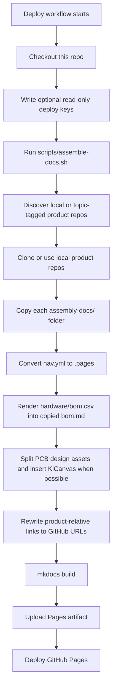
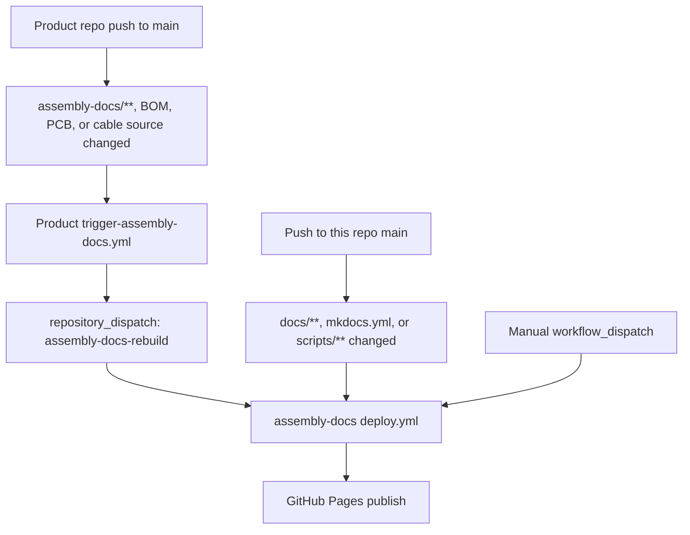
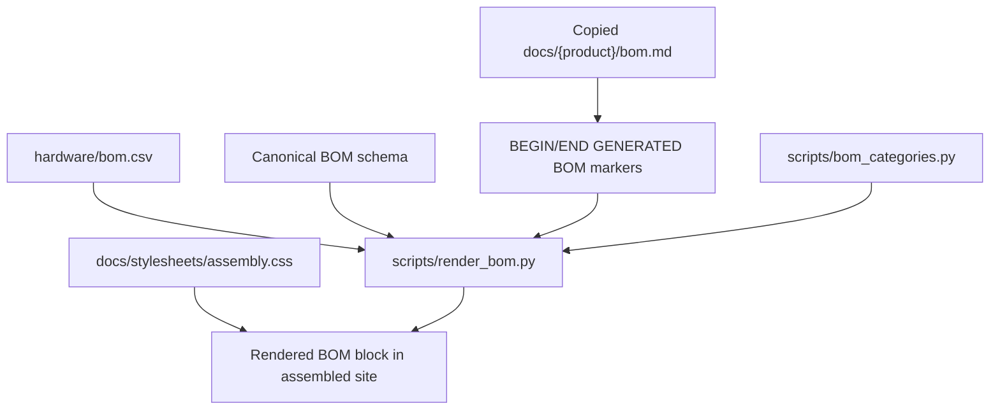
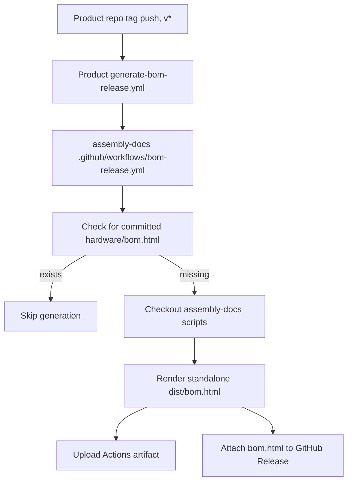

{/* Ported from MkDocs: how-this-site-works.md */}

<Warning title="Historische pijplijn">
  Deze pagina bewaart de eerdere MkDocs-assemblagepijplijn als referentie voor de migratie. Fumadocs in
  rad-app en de gecontroleerde bidirectionele contentsynchronisatie zijn nu verantwoordelijk voor de
  publicatie.
</Warning>

Deze site is een aggregator. Productteams onderhouden de assemblagedocumentatie in
de afzonderlijke productrepository's, en deze repository voegt die pakketten samen tot één
MkDocs Material-site.

De belangrijkste regel is dat assemblage-inhoud eigendom is van de product-
repository's. Deze repository beheert de siteshell, buildscripts, gedeelde styling en de
automatisering die productdocumentatie omzet in de gepubliceerde site.

## Bronindeling



Elke productrepository die voor Ohai in aanmerking komt, draagt het volgende bij:

- `assembly-docs/`: Markdownpagina's voor de productmontagehandleiding.
- `assembly-docs/assets/`: productafbeeldingen en andere pagina-assets.
- `assembly-docs/site.yml`: productslug, titel, licentie en navigatievolgorde.
- `assembly-docs/nav.yml`: lokale paginavolgorde van het product en sectietitel.
- `hardware/bom.csv`: door mensen beheerde brongegevens van de stuklijst.
- Hardwarebronmappen onder `hardware/cad/`, `hardware/pcb/` en
  `hardware/cables/`.
- GitHub-topic `ohai-assembly-docs` nadat tijdelijke aanduidingen zijn vervangen en lokale
  montage-/bouwcontroles zijn geslaagd.

Deze repository levert:

- `mkdocs.yml`: MkDocs Material-configuratie voor de verenigde site.
- `docs/index.md`: de startpagina van de site.
- `docs/how-this-site-works.md`: documentatie over meerdere producten.
- `scripts/assemble-docs.sh`: de hoofdassembler.
- `scripts/render_bom.py`: stuklijstrenderer.
- `scripts/bom_categories.py`: gedeeld stuklijstcategorielabel en kleurenkaart.
- `docs/stylesheets/assembly.css`: gedeelde stijlen voor de assemblagesite.
- `.github/workflows/deploy.yml`: workflow voor site-assemblage, bouwen en publiceren.
- `.github/workflows/bom-release.yml`: Herbruikbare, zelfstandige workflow voor het vrijgeven van stuklijsten.
- `templates/`: workflows die naar productrepository's worden gekopieerd.

## Bouwverloop



De assembler prepareert elk product eerst en vervangt pas daarna `docs/{product}/`
nadat het product succesvol is geassembleerd. Deze productmappen zijn geassembleerde
uitvoer; bewerk ze daarom niet handmatig. Wijzig de productdocumentatie in de bron-
repository van het product.

Lokaal kunt u hetzelfde assemblageproces uitvoeren met lokale of nabijgelegen checkouts:

```bash
pip install -r requirements.txt
ASSEMBLE_LOCAL="$HOME/Github" ./scripts/assemble-docs.sh
mkdocs serve
```

Zonder `ASSEMBLE_LOCAL` ontdekt de assembler niet-gearchiveerde
`researchanddesire/*`-repository's met het topic `ohai-assembly-docs`. In CI gebruikt deze
`ASSEMBLE_GITHUB_TOKEN` voor private ontdekking en het klonen, indien ingesteld, geeft de voorkeur aan
per repository aanwezige alleen-lezen deploysleutels en valt daarna voor openbare repository's terug op
anonieme HTTPS.

## CI-triggers

De belangrijkste uitrolworkflow bevindt zich op `.github/workflows/deploy.yml`.



Productrepository's moeten `templates/trigger-assembly-docs.yml` kopiëren naar
`.github/workflows/trigger-assembly-docs.yml` en `<PRODUCT_REPO>` vervangen door
hun repositorynaam. Deze workflow bewaakt `assembly-docs/**`, BOM-CSV's,
`hardware/pcb/**` en `hardware/cables/**`. Hiervoor is een `DOCS_DISPATCH_TOKEN`-
secret nodig met toestemming om een repository_dispatch naar deze repository te sturen.

De uitrolworkflow:

1. Checkt deze repository uit.
2. Schrijft alle geconfigureerde alleen-lezen deploysleutels naar de tijdelijke runnerdirectory.
3. Voert `scripts/assemble-docs.sh` uit, dat producten met een onderwerptag ontdekt en
   elk product voorbereidt voordat de gepubliceerde uitvoer wordt vervangen.
4. Installeert de MkDocs-afhankelijkheden uit `requirements.txt`.
5. Voert `mkdocs build` uit.
6. Uploadt de gegenereerde `site/`-directory als een Pages-artefact.
7. Rolt het artefact uit op GitHub Pages.

## Stuklijstrendering

De bron van waarheid voor de BOM is altijd `hardware/bom.csv` in de
productrepository. Rendering is alleen-lezen op basis van dat CSV-bestand.



`scripts/render_bom.py` valideert de canonieke BOM-koptekst met 12 kolommen voordat het de BOM
rendert. Het vervangt alleen de inhoud tussen deze markeringen op de gekopieerde pagina:

```html
{/* BEGIN GENERATED BOM */} {/* END GENERATED BOM */}
```

Als `assembly-docs/bom.md` van een product deze markeringen niet bevat, blijft de pagina
ongewijzigd. Als `hardware/bom.csv` alleen een koprij en geen gegevensrijen heeft,
slaat de renderer dit over in plaats van de pagina leeg te maken.

De gerenderde BOM hoort alleen thuis op deze assembly-docs-site. Ontwikkelaarsdocumentatie kan
de BOM-workflow beschrijven, maar mag de gerenderde BOM-tabel niet insluiten.

## Kabelbomen

Bronbestanden voor kabelbomen horen in `hardware/cables/` van de productrepository.
Door Wireviz gegenereerde onderliggende BOM's zijn release-/buildartefacten, zoals
`.bom.tsv`-bestanden.

De `hardware/bom.csv` op productniveau vermeldt kabelbomen als assemblages op het hoogste niveau.
Wanneer een kabelboom een Wireviz-bron heeft, moet `Source` in de product-BOM verwijzen naar
het bronpad relatief ten opzichte van `hardware/`, bijvoorbeeld
`cables/OSSM-Motor-Control-Harness.yml`. Kabelboompagina's voor assemblage verwijzen naar
gegenereerde diagrammen en onderliggende BOM-artefacten in plaats van rijen van de onderliggende
kabelboom naar de BOM op productniveau te kopiëren.

## Release-BOM-artefacten

Getagde productreleases kunnen ook een zelfstandig `bom.html`-artefact genereren.



Productrepository's moeten `templates/generate-bom-release.yml` kopiëren naar
`.github/workflows/generate-bom-release.yml` en de productnaam, repository-URL
en licentiestring instellen. De productrepository wordt door de herbruikbare workflow
uitgecheckt; alleen de BOM-renderscripts worden uit deze repository opgehaald.

## Een goede bijdrage leveren

Gebruik deze vuistregel: bewerk inhoud waar die wordt beheerd.

| Wijziging                                                                                             | Bewerk hier                                                              |
| ----------------------------------------------------------------------------------------------------- | ------------------------------------------------------------------------ |
| Productmontagestappen, productafbeeldingen, tekst van de productstuklijstpagina, PCB-overzicht, kabelpagina's | Productrepository `assembly-docs/`                                       |
| Productstuklijstgegevens                                                                              | Productrepository `hardware/bom.csv`                                     |
| Navigatievolgorde voor productassemblage                                                              | Productrepository `assembly-docs/nav.yml`                                |
| Productmetagegevens voor Ohai-ontdekking                                                              | Productrepository `assembly-docs/site.yml`                               |
| CAD-, PCB- en kabelbronartefacten                                                                      | Productrepository `hardware/cad/`, `hardware/pcb/`, `hardware/cables/`    |
| Sitestartpagina of sitedocumenten voor meerdere producten                                             | Deze repo `docs/` buiten productmappen                                   |
| Gedrag van assemblagepijplijn                                                                         | Deze repository `scripts/`                                               |
| Gedeelde sitestyling                                                                                  | Deze repository `docs/stylesheets/assembly.css`                           |
| Implementatie van GitHub Pages                                                                       | Deze repository `.github/workflows/deploy.yml`                            |
| Triggersjabloon voor het opnieuw opbouwen van producten                                               | Deze repository `templates/trigger-assembly-docs.yml`                     |
| Sjabloon voor het genereren van release-BOM's                                                        | Deze repository `templates/generate-bom-release.yml`                      |

Doen:

- Breng productinhoudelijke wijzigingen eerst aan in de productrepository.
- Zorg ervoor dat `hardware/bom.csv` door mensen wordt beheerd en aan het schema voldoet.
- Neem `{/* BEGIN GENERATED BOM */}` en `{/* END GENERATED BOM */}` op in een
  product `assembly-docs/bom.md` wanneer die pagina gereed is voor gegenereerde inhoud.
- Houd `assembly-docs/site.yml` echt en vrij van tijdelijke aanduidingen voordat u het
  topic `ohai-assembly-docs` toevoegt.
- Test wijzigingen lokaal met `ASSEMBLE_LOCAL="$HOME/Github" ./scripts/assemble-docs.sh`
  en `mkdocs serve`.
- Beschouw `scripts/bom_categories.py` als de enige bron voor BOM-categorielabels
  en -kleuren.
- Houd de uitvoer deterministisch: genereer geen tijdstempels of instabiele volgordes in
  gegenereerde documentatie.

Niet doen:

- Bewerk `docs/dtt/`, `docs/lockbox/`, `docs/radr/`, `docs/ossm/` of andere geassembleerde
  productmappen handmatig.
- Voeg `ohai-assembly-docs` toe aan sjabloonrepository's of repository's met `PRODUCT_*`
  als tijdelijke aanduidingen.
- Commit gegenereerde BOM-blokken terug naar productrepository's.
- Kopieer Wireviz-rijen van onderliggende kabelbomen naar de BOM op productniveau.
- Wijzig het BOM-schema in deze repository.
- Dupliceer de BOM-categoriekleurenkaart in CSS.
- Voeg gerenderde assemblage-BOM-tabellen toe aan ontwikkelaarsdocumentatie.
- Vertrouw in productdocumentatie niet op assets die alleen lokaal beschikbaar zijn of op absolute lokale paden.

## Een nieuw product toevoegen

1. Voeg een map `assembly-docs/` toe aan de productrepository.
2. Voeg `assembly-docs/site.yml` toe met echte `slug`, `title`, `license` en
   een geheel getal als `nav_order`.
3. Voeg `assembly-docs/nav.yml` toe met `site_name` en de standaardpaginavolgorde.
4. Neem `index.md`, `pcb-overview.md`, `cable-harnesses.md`, `bom.md` en
   `assembly-guide.md` op.
5. Plaats pagina-afbeeldingen en ondersteunende bestanden onder `assembly-docs/assets/`.
6. Voeg `hardware/bom.csv` toe of valideer deze op basis van het canonieke BOM-schema.
7. Zorg dat `hardware/cad/`, `hardware/pcb/` en `hardware/cables/` aanwezig zijn.
8. Kopieer de triggerworkflowsjabloon naar de productrepository.
9. Controleer de lokale assemblage en laat `mkdocs build --strict` slagen.
10. Voeg het topic `ohai-assembly-docs` toe om het product voor de site aan te melden.

Configureer voor private repository's `ASSEMBLE_GITHUB_TOKEN` met leestoegang tot de
productrepository's. Alleen-lezen deploysleutels per repository blijven tijdens de
overgang ondersteund. Zodra repository's openbaar zijn, volstaat anoniem klonen via HTTPS.

## Problemen oplossen

| Symptoom                                   | Controleer                                                                                                                       |
| ------------------------------------------ | -------------------------------------------------------------------------------------------------------------------------------- |
| Productpagina is niet bijgewerkt           | Is de bronrepository gewijzigd onder `assembly-docs/**` en heeft de triggerworkflow succesvol een dispatch verzonden?             |
| BOM is niet weergegeven                    | Bevat `assembly-docs/bom.md` beide gegenereerde BOM-markeringen? Heeft `hardware/bom.csv` gegevensrijen?                        |
| BOM-rendering is mislukt                   | Komt `hardware/bom.csv` exact overeen met de canonieke koptekst met 12 kolommen?                                                 |
| Afbeeldingen ontbreken                     | Staan assets onder `assembly-docs/assets/` en verwijzen paginalinks relatief naar het productdocumentatiepakket?                 |
| Productrelatieve bronlinks zijn verbroken  | Controleer `scripts/rewrite_product_links.py` en de repository-/branchconfiguratie in `scripts/assemble-docs.sh`.              |
| KiCanvas is niet verschenen                | Controleer of er een `*.kicad_pcb`-bestand onder `hardware/pcb/` van de productrepository staat.                                |
| Product is overgeslagen bij ontdekking     | Controleer het topic `ohai-assembly-docs`, `assembly-docs/site.yml` zonder tijdelijke aanduidingen en de vereiste assemblage-/hardwarepaden. |
