{/* Ported from MkDocs: assembly-guide.md */}

## Purpose

This work instruction documents the current Lockbox assembly process from printed parts through final mechanical assembly.

Use these instructions with the active PCB and CAD release for the build.

## Required parts and consumables

1. Gather the required parts before starting assembly.

   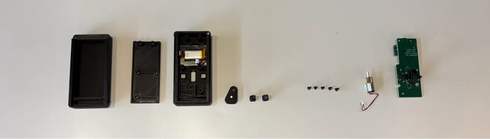

   _Required Lockbox assembly parts._

2. Confirm the assembly set includes:
   - `top-housing`
   - `bottom-housing`
   - `pcb-backing`
   - `locking-latch`
   - `enter-button`
   - `back-button`
   - `encoder-wheel`
   - `encoder`
   - `motor`
   - `screen`
   - `battery`
   - 7x `torx-screw`
   - 4x `4mm-magnet`
   - 4x `rubber-foot`
   - `VHB-double-sided-tape`
   - `hot-glue`
   - `SA-glue`

3. If all required parts are present, continue onward.

## Tools

- Electric screwdriver or hand driver with T7 Torx bit
- `flat-jaw-pliers`
- `tweezers`
- `paperclip`
- `isopropyl-alcohol`
- `microfibre-cloth`

## Prepare plastic components

1. Work on a soft cloth. The front face scratches easily.

2. Check each printed part in good lighting before assembly. Look for curled corners, squished layers, large plastic blobs, blocked magnet inserts, and blocked screw holes.

3. Use a smooth PEI print bed for front-facing cosmetic parts and a textured PEI print bed for internal parts.

4. Inspect each printed part before installing electronics.
5. Confirm the plastic components are clean, correctly printed, and free of obstructions before continuing.

### Part reference photos

Use these photos while inspecting printed parts.

#### `top-housing`

<PhotoGrid>
  <Photo caption="Top housing.">
    
  </Photo>
  <Photo caption="Top housing side view.">
    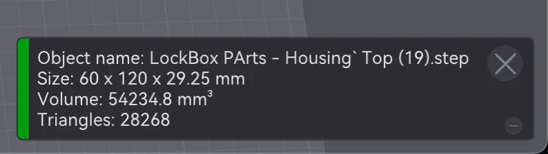
  </Photo>
</PhotoGrid>

#### `bottom-housing`

<PhotoGrid>
  <Photo caption="Bottom housing.">
    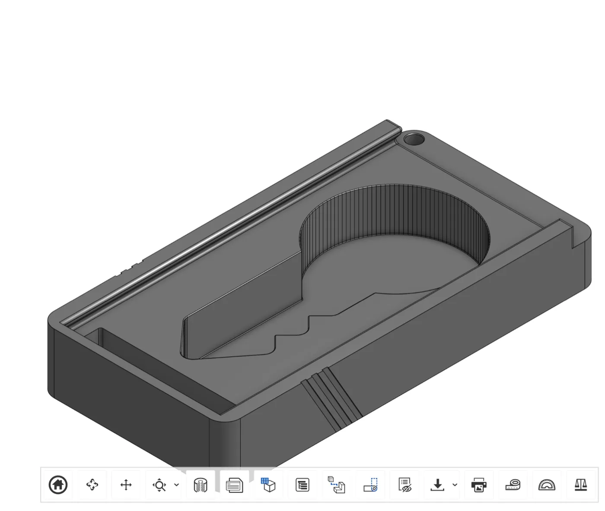
  </Photo>
  <Photo caption="Bottom housing side view.">
    
  </Photo>
</PhotoGrid>

#### `motor-clamp`

<PhotoGrid>
  <Photo caption="Motor clamp.">
    
  </Photo>
  <Photo caption="Motor clamp side view.">
    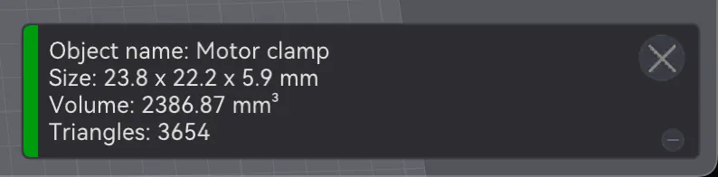
  </Photo>
</PhotoGrid>

#### `pcb-cover`

<PhotoGrid>
  <Photo caption="PCB cover.">
    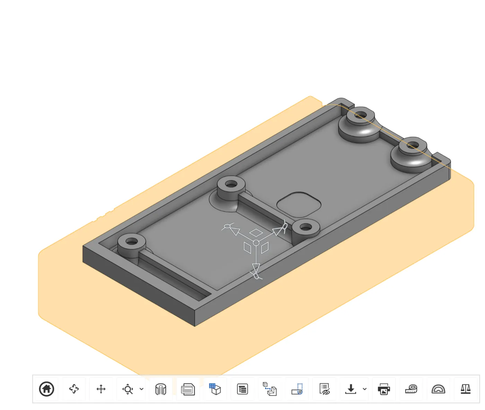
  </Photo>
  <Photo caption="PCB cover side view.">
    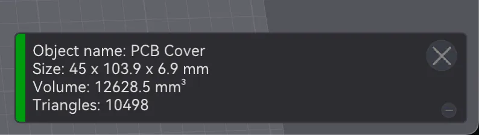
  </Photo>
</PhotoGrid>

#### `encoder-wheel`

<PhotoGrid>
  <Photo caption="Encoder wheel.">
    
  </Photo>
  <Photo caption="Encoder wheel side view.">
    
  </Photo>
</PhotoGrid>

#### `locking-latch`

<PhotoGrid>
  <Photo caption="Locking latch.">
    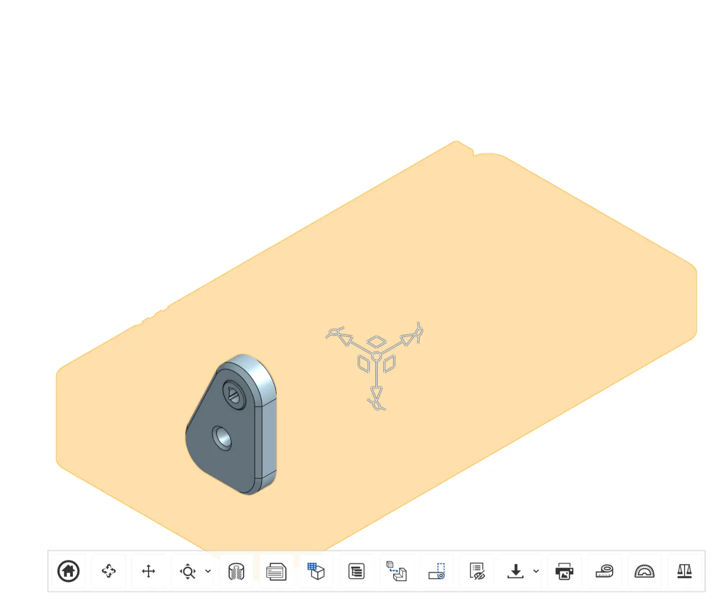
  </Photo>
  <Photo caption="Locking latch side view.">
    
  </Photo>
</PhotoGrid>

#### `enter-button`

<PhotoGrid>
  <Photo caption="Enter button.">
    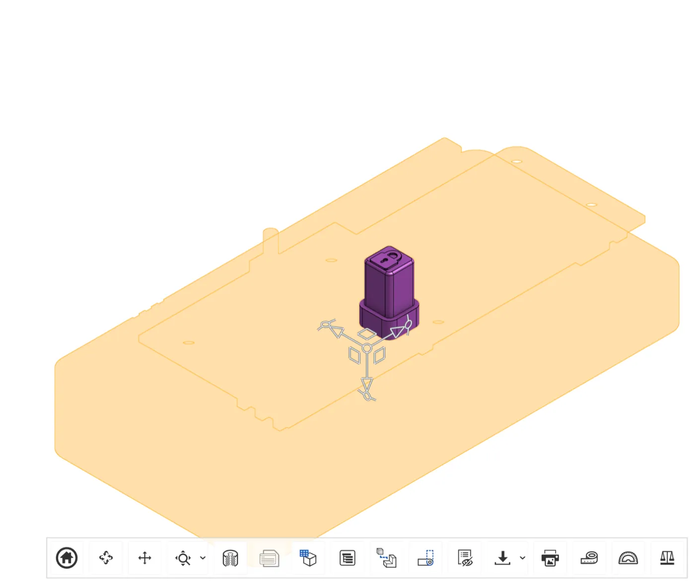
  </Photo>
  <Photo caption="Enter button side view.">
    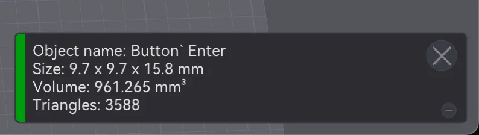
  </Photo>
</PhotoGrid>

#### `back-button`

<PhotoGrid>
  <Photo caption="Back button.">
    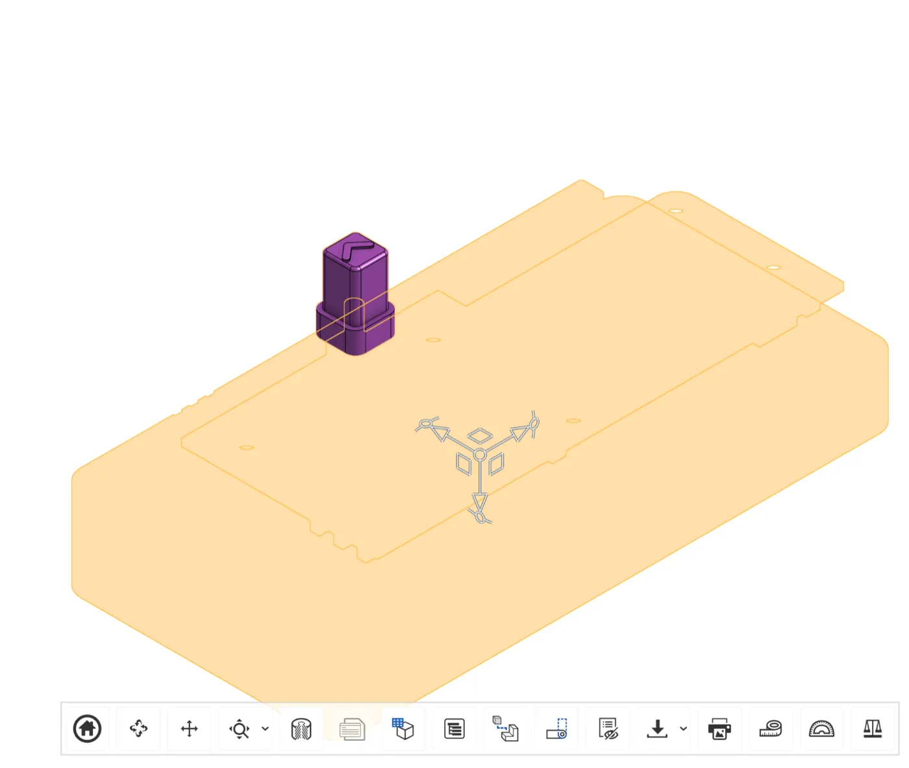
  </Photo>
  <Photo caption="Back button side view.">
    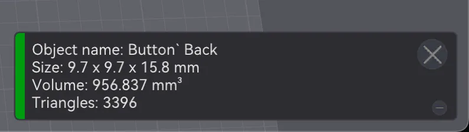
  </Photo>
</PhotoGrid>

## Install magnets

1. Install four magnets: one in the `locking-latch`, one in the `top-housing`, and two in the `bottom-housing`.

2. Use a `paperclip` to lightly coat the inside of each magnet insert with `SA-glue`.

   

   _Apply a light coat of glue inside the magnet insert._

3. Check magnet polarity before pressing each magnet into place:
   - `locking-latch`: north pole up
   - `top-housing` front magnet: south side up
   - `bottom-housing` front magnet: north side up
   - `bottom-housing` back magnet: south side up

   <PhotoGrid>
     <Photo caption="Top housing front magnet polarity.">
       
     </Photo>
     <Photo caption="Bottom housing front magnet polarity.">
       
     </Photo>
     <Photo caption="Bottom housing back magnet polarity.">
       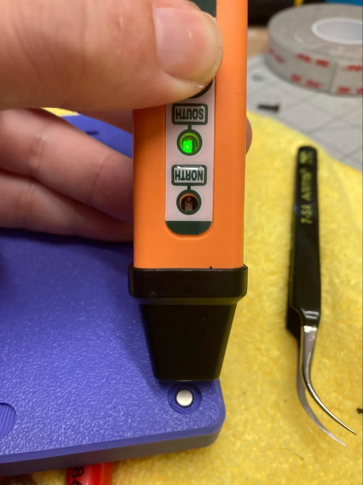
     </Photo>
   </PhotoGrid>

4. Use `flat-jaw-pliers` to press magnets into their inserts. Place a folded `microfibre-cloth` between the pliers and the Lockbox body to protect the printed surface.

   <PhotoGrid>
     <Photo caption="Protect the housing while pressing magnets.">
       
     </Photo>
     <Photo caption="Press the lock arm magnet into place.">
       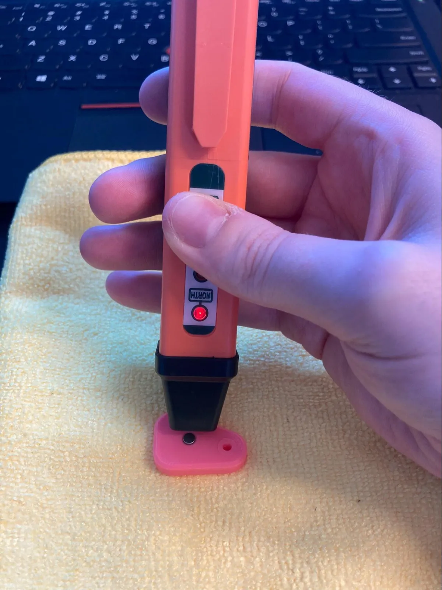
     </Photo>
   </PhotoGrid>

5. Confirm each magnet is seated flush or deep enough for its insert.

   <PhotoGrid>
     <Photo caption="Top housing magnet installed.">
       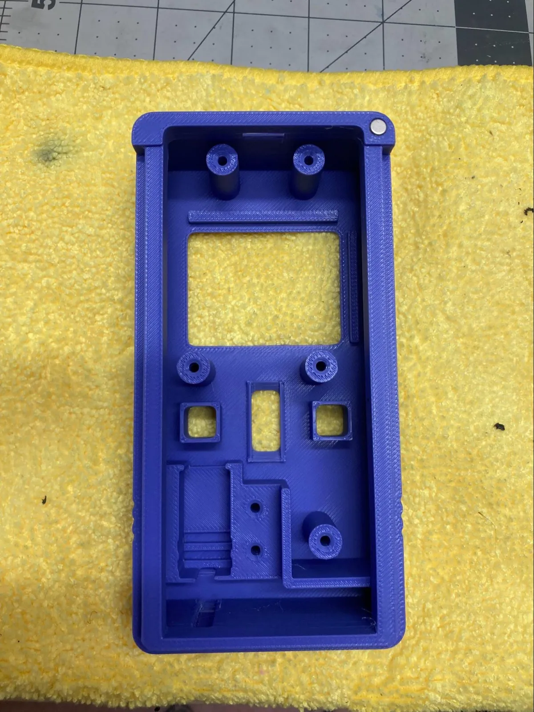
     </Photo>
     <Photo caption="Bottom housing back magnet installed.">
       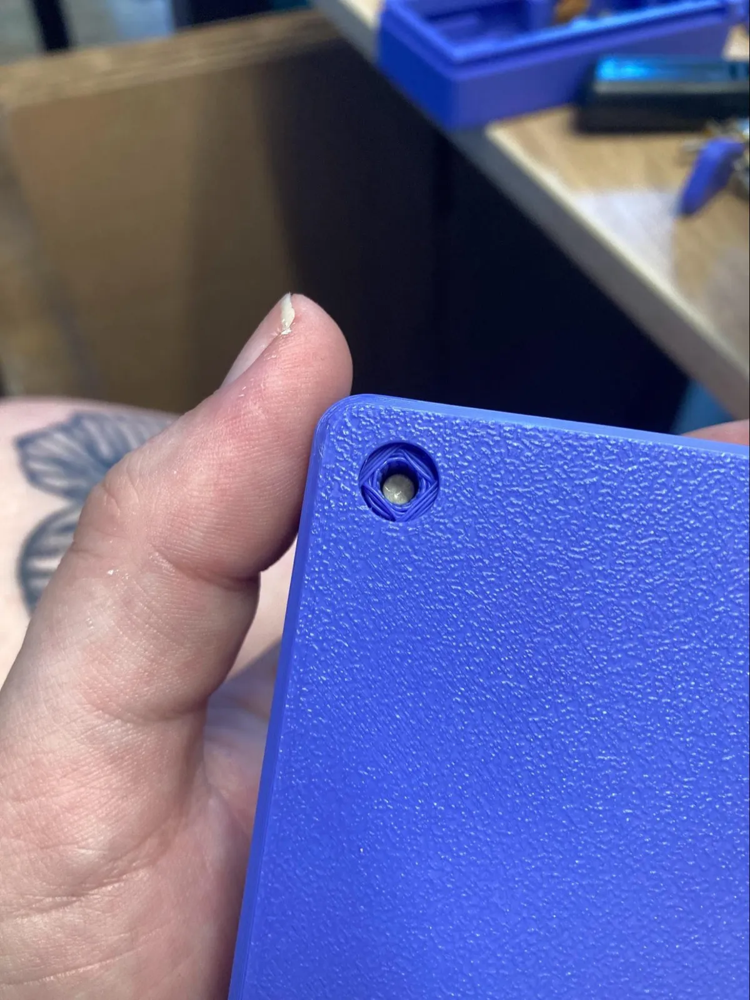
     </Photo>
     <Photo caption="Locking latch magnet installed.">
       
     </Photo>
   </PhotoGrid>

6. Confirm the magnets are fully seated and glued before continuing.

## Install screen and battery

1. Remove the protective film from the `screen`.

2. Align the `screen` with the top and right ledges of the `top-housing`.

3. Hold the screen in place and set it with `hot-glue` at the corners and remaining edges.

4. Wipe the rear of the `screen` and the side of the `battery` with writing using `isopropyl-alcohol`.

5. Apply a 3/4 inch square piece of `VHB-double-sided-tape` to the writing side of the `battery`.

   

   _VHB tape applied to the battery._

6. Place the `battery` face down on the back of the `screen` with the cables exiting toward the lower right. Set with `hot-glue` as needed.

   <PhotoGrid>
     <Photo caption="Screen and battery installed in the top housing.">
       
     </Photo>
     <Photo caption="Screen, battery, and motor layout reference.">
       
     </Photo>
   </PhotoGrid>

7. Confirm the screen and battery are secure and that wires remain accessible.

## Install encoder

1. Test-fit the `encoder-wheel` before soldering or gluing.

2. Apply `SA-glue` to the flat face of the encoder shaft.

3. Line up the flat of the encoder shaft with the flat face inside the `encoder-wheel`, then install the wheel.

4. Solder the `encoder` onto the PCB. Make sure the encoder is fully seated so the wheel stays straight.

   <PhotoGrid>
     <Photo caption="Encoder installed on PCB.">
       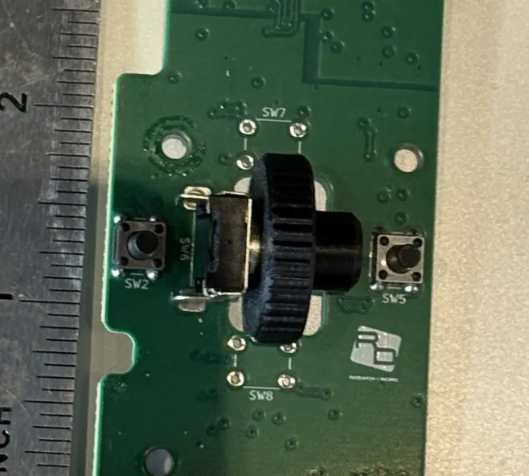
     </Photo>
     <Photo caption="Encoder wheel installed.">
       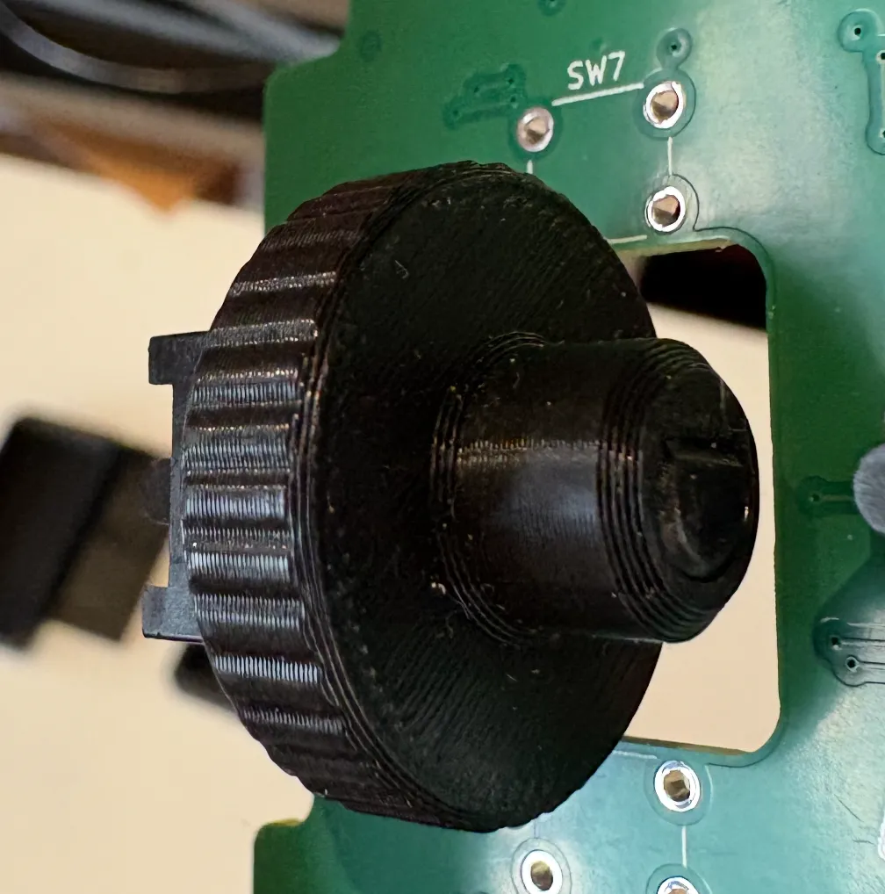
     </Photo>
   </PhotoGrid>

5. Confirm the encoder wheel rotates freely before continuing.

## Install motor

1. Check motor polarity before installing the motor assembly.

2. If soldering the motor lead during this build, cut the motor connector lead length to 7 cm before final routing.

3. Place the `locking-latch` on the `motor`. Do not glue the latch to the motor.

   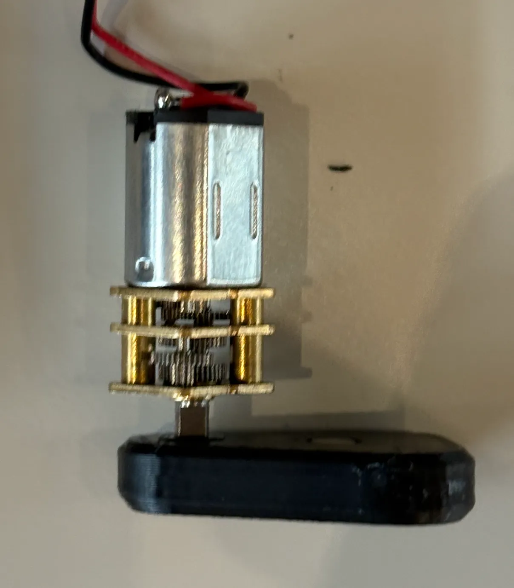

   _Locking latch placed on the motor._

4. Slide the latch onto the motor assembly about halfway, then place the `motor` in the `top-housing`.

   <PhotoGrid>
     <Photo caption="Latch installed about halfway on motor.">
       
     </Photo>
     <Photo caption="Motor placed in housing.">
       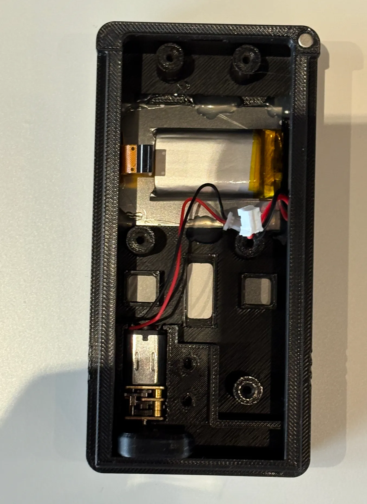
     </Photo>
   </PhotoGrid>

5. Place the `motor-clamp` over the motor and secure it with 2x `torx-screw`.

   

   _Motor clamp installed._

6. Confirm the motor is seated and the latch can move without obstruction.

## Install buttons and PCB

1. Place the `enter-button` and `back-button` into the button holes.

   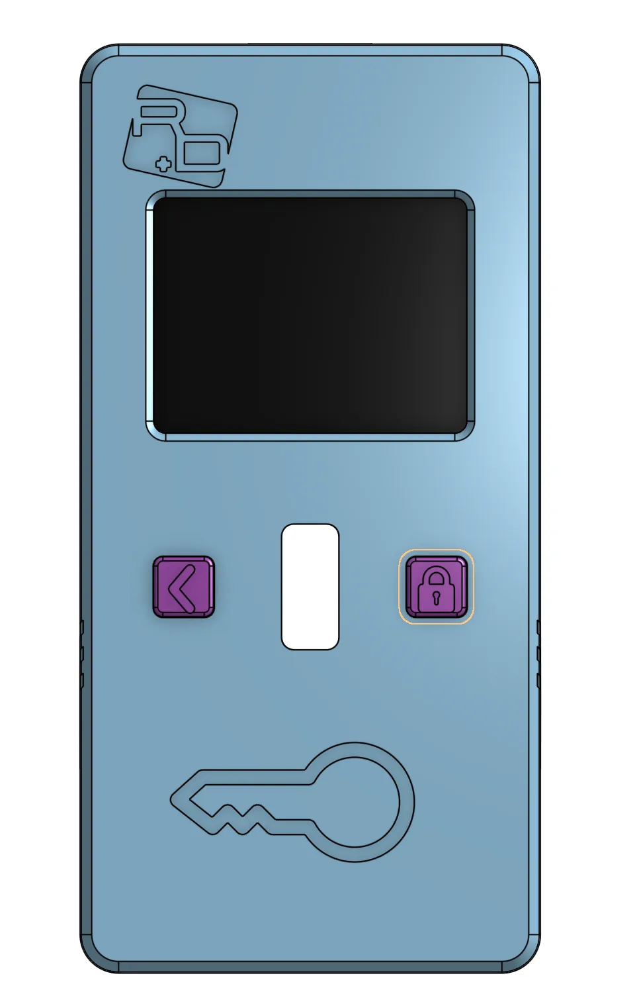

   _Buttons placed in housing._

2. Place the `back-button` on the left and the lock/enter button on the right.

3. If the buttons are not already populated, solder the buttons onto the bottom of the PCB, the side with no other components.

4. Place the PCB onto the buttons so the `encoder-wheel` passes through the front hole.

   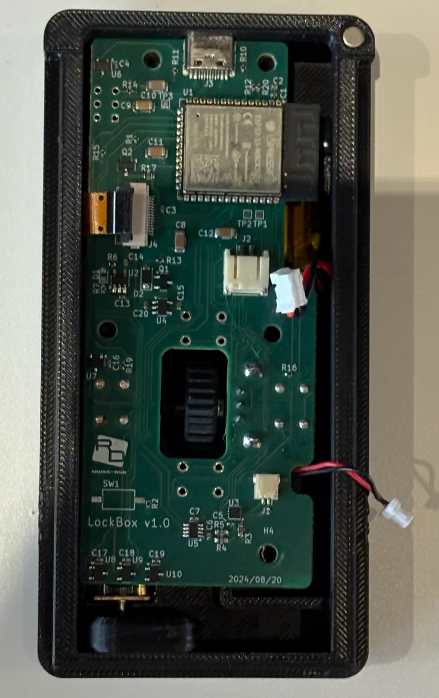

   _PCB placement over buttons._

5. Do not cover the `screen-ribbon-wire`, `battery-wire`, or `motor-wire`.

   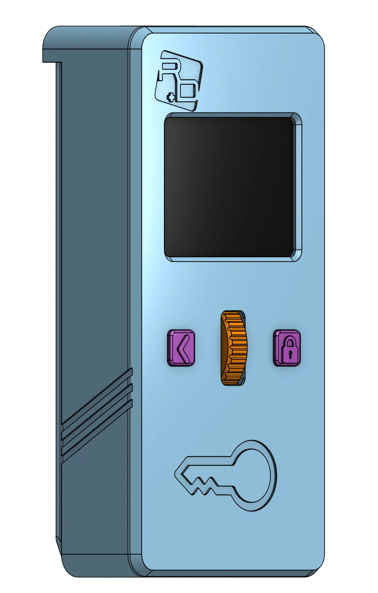

   _PCB seated in housing._

6. Confirm the buttons actuate correctly and the encoder wheel is centered in the opening.

## Connect cables

1. Open the screen ribbon connector latch.

2. Insert the `screen-ribbon-wire`, then close the latch. The lower white bar should not be visible after the latch is closed.

3. Plug the `battery-wire` and `motor-wire` into the PCB.

4. Route the motor wires left and over the PCB.

5. Keep the battery cable away from the mounting hole below it so the cable does not get pinched by the cover.

   <PhotoGrid>
     <Photo caption="Screen, battery, and motor cables connected.">
       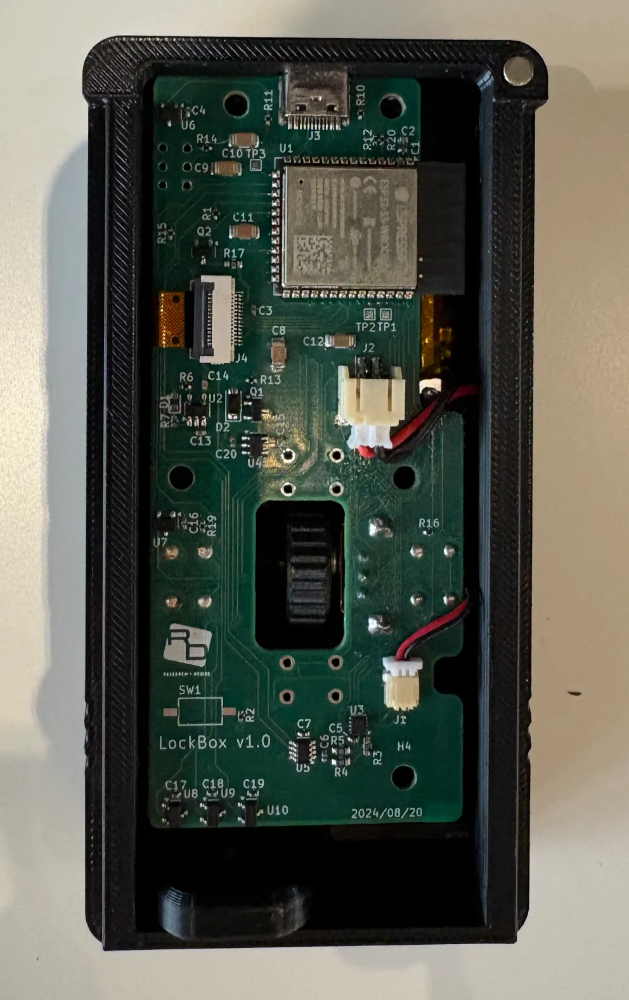
     </Photo>
     <Photo caption="PCB cable routing reference.">
       
     </Photo>
   </PhotoGrid>

6. Confirm each cable is fully seated before continuing.

## Install PCB cover

1. Place the `pcb-cover` over the PCB.

   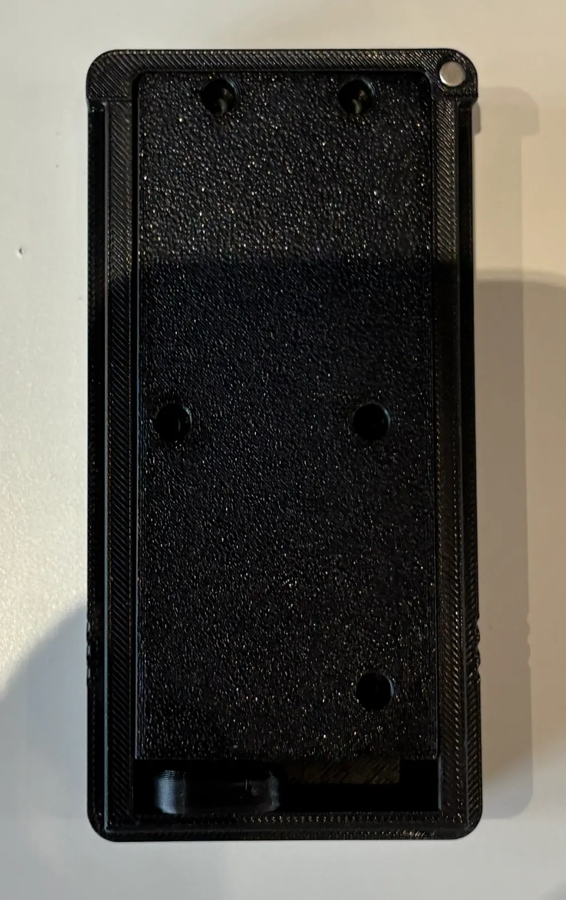

   _PCB cover placement._

2. Secure the cover with 5x `torx-screw`.

   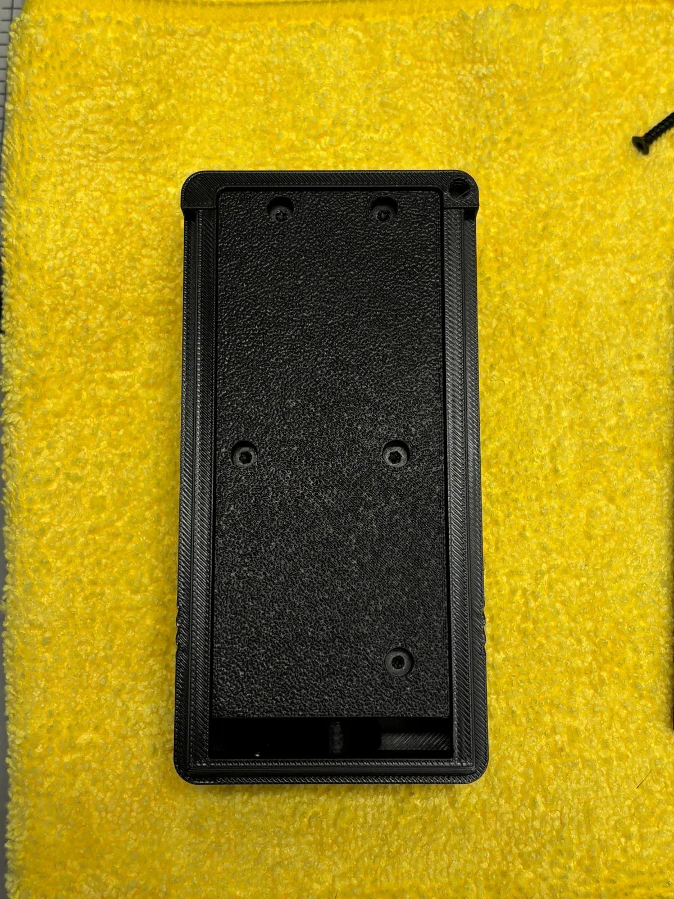

   _PCB cover installed._

3. Confirm no wires are pinched under the cover.

## Install rubber feet

1. Glue 4x `rubber-foot` onto the backplate.

   <PhotoGrid>
     <Photo caption="Rubber foot closeup.">
       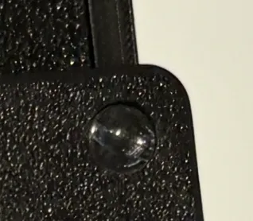
     </Photo>
     <Photo caption="Rubber feet installed on backplate.">
       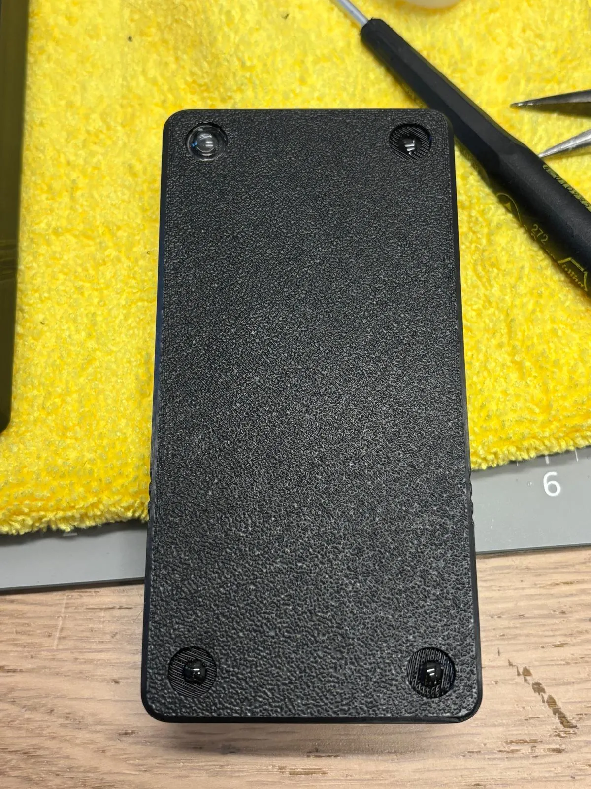
     </Photo>
   </PhotoGrid>

2. Confirm all four feet are present and secure.

## Final assembly

1. Slide the backplate onto the main housing.

   <PhotoGrid>
     <Photo caption="Backplate sliding onto housing.">
       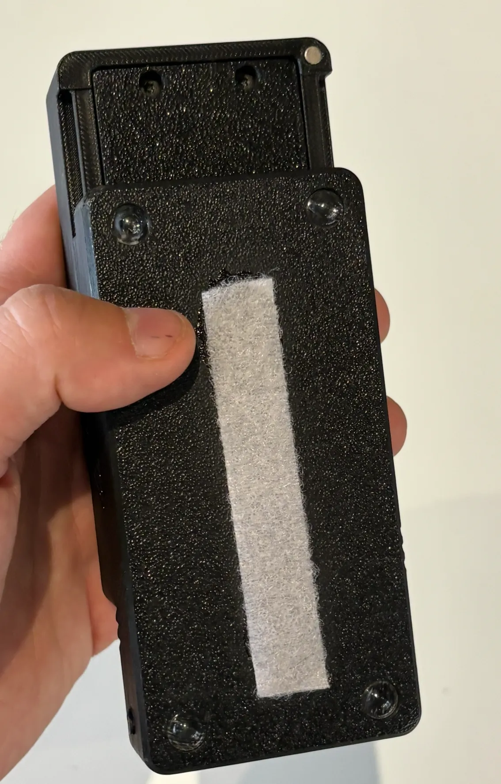
     </Photo>
     <Photo caption="Final Lockbox assembly.">
       
     </Photo>
   </PhotoGrid>

2. Assembly is complete. Continue to functional testing.

## QC checklist

- Confirm all required parts were present before assembly.
- Confirm printed parts are free of curled corners, squished layers, large blobs, blocked magnet inserts, and blocked screw holes.
- Confirm magnets are installed in the `top-housing`, `bottom-housing`, and `locking-latch`.
- Confirm all 4 magnets are installed with the documented polarity.
- Confirm the `screen` and `battery` are secured with `hot-glue`.
- Confirm the `screen-ribbon-wire` is latched and the lower white bar is not visible.
- Confirm the `encoder` is soldered and the `encoder-wheel` rotates freely.
- Confirm the `locking-latch` is placed on the `motor` without glue.
- Confirm motor polarity and, if built by hand, the 7 cm motor connector lead length.
- Confirm the `motor-clamp` is secured with 2x `torx-screw`.
- Confirm the motor clamp is straight.
- Confirm the PCB is seated without covering the `screen-ribbon-wire`, `battery-wire`, or `motor-wire`.
- Confirm the `screen-ribbon-wire`, `battery-wire`, and `motor-wire` are connected.
- Confirm the buttons click cleanly.
- Confirm the encoder wheel is aligned in the front cutout and spins freely.
- Confirm the `pcb-cover` is secured with 5x `torx-screw`.
- Confirm 4x `rubber-foot` are installed on the backplate.
- Confirm the backplate slides onto the main housing.
