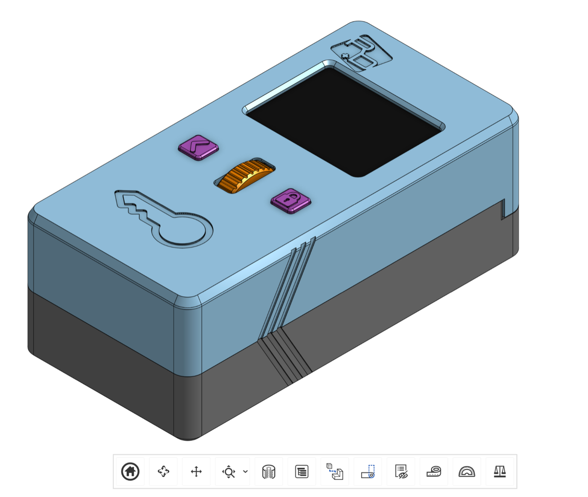

## Purpose

These docs collect the Lockbox hardware assembly information in a self-contained folder for future aggregation into `ohai.researchanddesire.com`. They are written as open hardware assembly instructions for OSS builders and manufacturing collaborators.

## Lockbox overview

Lockbox is a small-scale consumer electronics product built around a custom PCB, ESP32-S3 firmware, a motorized latch, magnetic sensors, TFT display, rotary encoder, battery, and 3D-printed plastic housing.

| Property | Value |
| -------- | ----- |
| Dimensions | 57 mm x 43 mm x 134 mm |
| Plastic volume | 156,408.422 mm^3 |
| Current housing material | 3D-printed PLA plastic |
| Embedded magnets | Three to four magnets in the plastic housing |

## Assembly package

- [PCB Overview](/lockbox/pcb-overview)
- [Bill of Materials](/lockbox/bom)
- [Assembly Guide](/lockbox/assembly-guide)
