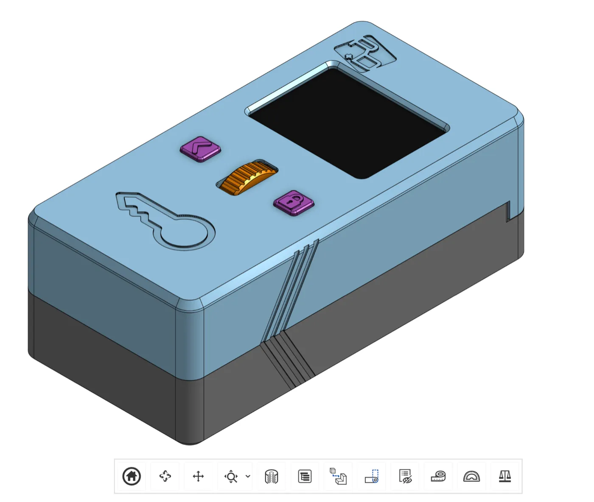

{/* Ported from MkDocs: index.md */}

## Purpose

These docs collect the Lockbox hardware assembly information for OSS builders
and manufacturing collaborators.

## Lockbox overview

Lockbox is a small-scale consumer electronics product built around a custom PCB, ESP32-S3 firmware, a motorized latch, magnetic sensors, TFT display, rotary encoder, battery, and 3D-printed plastic housing.

| Property                 | Value                                        |
| ------------------------ | -------------------------------------------- |
| Dimensions               | 57 mm x 43 mm x 134 mm                       |
| Plastic volume           | 156,408.422 mm^3                             |
| Current housing material | 3D-printed PLA plastic                       |
| Embedded magnets         | Three to four magnets in the plastic housing |

## Assembly package

<CardGroup cols={2}>
  <Card title="Assembly Guide" href="/lockbox/assembly-guide">
    Follow the mechanical build, electronics routing, and final QC sequence.
  </Card>
  <Card title="Bill of Materials" href="/lockbox/bill-of-materials">
    Review parts, suppliers, and hardware source references.
  </Card>
  <Card title="Cable Harnesses" href="/lockbox/cable-harnesses">
    Find cable and harness ownership notes for the build.
  </Card>
  <Card title="PCB Overview" href="/lockbox/pcb-overview">
    Inspect the control board, KiCanvas preview, and production files.
  </Card>
</CardGroup>
