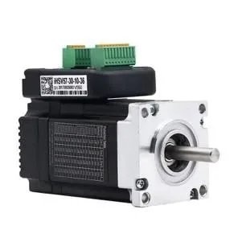

{/* Migrated from: https://docs.researchanddesire.com/ossm/guides/getting-started/build-guide/step-1.1_purchasing-parts */}

## Gekochte onderdelen

Deze lijst geldt voor de officiële standaardconfiguratie die in deze handleiding wordt beschreven.

| Onderdeel | Standaardspecificatie | Hoeveelheid |
| --- | --- | ---: |
| Geïntegreerde servomotor | NEMA 23, 57AIM30-klasse, 100 W | 1 |
| OSSM-besturingskaart | Officiële 24 V OSSM-printplaat | 1 |
| Controller | Officiële bedrade afstandsbediening of RADR | 1 |
| Tandriempoelie | GT2, 20 tanden, boring van 8 mm, voor een 10 mm brede riem | 1 |
| Tandriem | GT2, 10 mm breed, minimaal 500 mm lang | 1 |
| Lagers | MR115, 5 × 11 × 4 mm | 6 |
| Voeding | Veiligheidsgecertificeerd, volledig gesloten, 24 V DC, 5 A | 1 |
| Lineaire rail | Rail van 350 mm met slede | 1 |
| Metrische hardware | M3- en M5-bouten, moeren en ringen die per fase zijn vermeld | 1 set |
| Motorbedrading | Officiële voedingskabels en vierpolige datakabels | 1 set |

<Frame caption="Geïntegreerde NEMA 23-servomotor van 100 W voor de standaardbouw">
  
</Frame>

<Warning>
  Gebruik een veiligheidsgecertificeerde voeding die geschikt is voor uw regio. De voeding moet volledig omsloten zijn; laat de netklemmen niet bloot liggen.
</Warning>

Voor de grenswaarden van de connectoren en details van de printplaat gebruikt u de [OSSM-ontwikkelaarsreferentie](https://dev.researchanddesire.com/ossm/hardware/pcb/introduction).

<Check>
  Controleer de motor, de besturingskaart, de voeding, de poelieboring, de riembreedte en de raillengte voordat u de gedrukte onderdelen opent of monteert.
</Check>

[← Gereedschappen en onderdelen](/ossm/build/tools-and-parts) · [Volgende: Gedrukte onderdelen →](/ossm/build/printed-parts)
