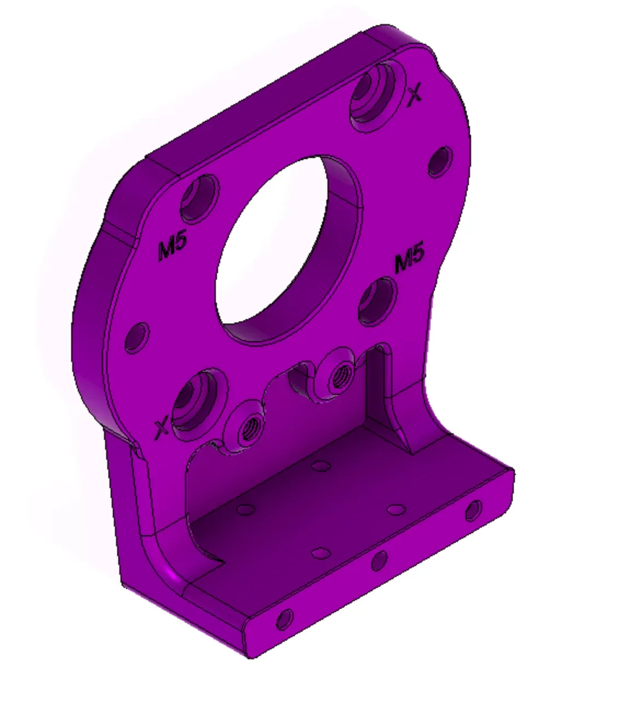

{/* Migrated from: https://docs.researchanddesire.com/ossm/guides/getting-started/build-guide/step-1.2_3d-printing-parts */}

## Print settings

Use PETG or ABS, a 0.2–0.28 mm layer height, 4–5 perimeters, and 40–60% infill. Use a 0.4–0.6 mm nozzle. Orient load-bearing parts so layer lines run across the expected force.

## Standard parts checklist

Print one of each unless a different quantity is shown:

- Body base
- Body middle — standard version
- Motorhead cover
- PCB mount box and lid
- Belt clamp: tensioner end
- Belt clamp: top
- Belt clamp: bottom
- PitClamp 57AIM ring, lower standard, upper and handle, hex dogbone, and round dogbone
- Rail-to-24 mm thread toy mount
- 24 mm jam nut
- Vac-u-lock adapter
- Wired remote body and top cover
- Wired remote knobs ×2

<Frame caption="Standard body components">
  
</Frame>

## Inspect every print

Remove supports and loose material. Reject a part with cracks, layer separation, distorted fastener holes, or poor fit at a load-bearing surface. Dry-fit the PCB enclosure and check that the jam nut threads smoothly onto the 24 mm adapter.

<Check>
  Continue only when every standard part is present, clean, undamaged, and matches the hardware listed for this build.
</Check>

[← Bill of materials](/ossm/build/bill-of-materials) · [Next: Rear tensioner →](/ossm/build/rear-tensioner)
