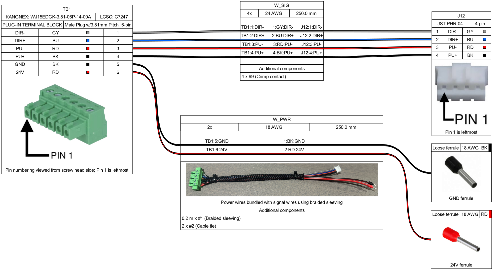

## Motor Control Harness

This harness connects the six-position TB1 terminal block to the four-position
J12 connector, with separate ground and 24V power leads. TB1 pins 1–4 carry the
DIR−, DIR+, PU−, and PU+ control signals to the matching pins on J12. Pins 5 and
6 connect to the black ground ferrule and red 24V ferrule.

[View source on GitHub](https://github.com/researchanddesire/OSSM/blob/main/hardware/cables/OSSM-Motor-Control-Harness.yml)

Read TB1 from the screw-head side, with the wires exiting away from you: pin 1
is on the left. The connector photos in the diagram mark pin 1 on both TB1 and
J12 so you can check their orientation before wiring.

The signal wires are 24 AWG and the power wires are 18 AWG, all 250 mm long.
Braided sleeving holds the middle of the harness together, leaving the J12
connector and power ferrules on separate branches.
