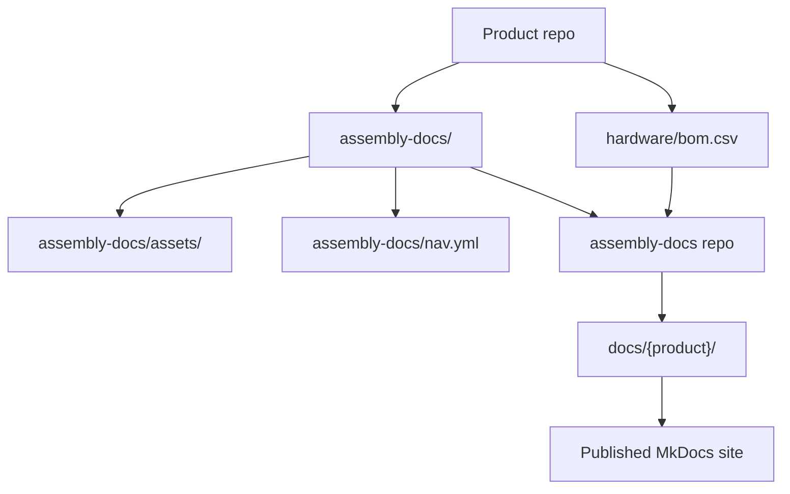
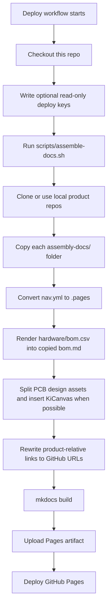
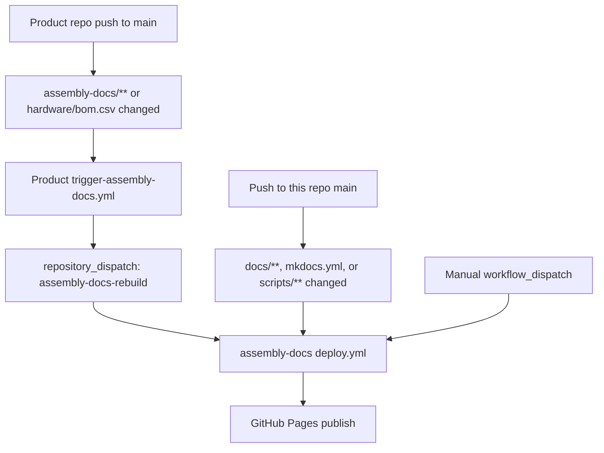
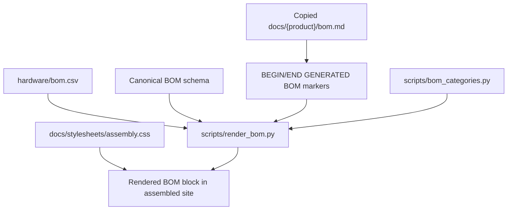
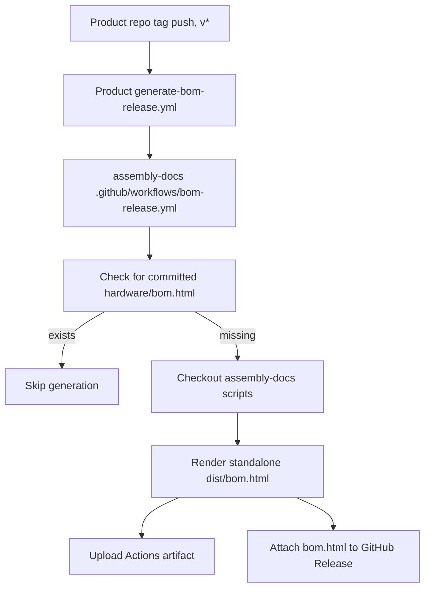

# How This Site Works

This site is an aggregator. Product teams maintain assembly documentation in
each product repository, and this repository assembles those packages into one
MkDocs Material site.

The important rule is that product assembly content is owned by the product
repos. This repo owns the site shell, the build scripts, shared styling, and the
automation that turns product docs into the published site.

## Source layout



Each product repository contributes:

- `assembly-docs/`: Markdown pages for the product assembly guide.
- `assembly-docs/assets/`: Product images and other page assets.
- `assembly-docs/nav.yml`: Product-local page order and section title.
- `hardware/bom.csv`: The human-owned bill of materials source data.
- Optional PCB source files under `hardware/pcb/`.

This repository contributes:

- `mkdocs.yml`: MkDocs Material configuration for the unified site.
- `docs/index.md`: The site homepage.
- `docs/how-this-site-works.md`: Cross-product site documentation.
- `scripts/assemble-docs.sh`: The main assembler.
- `scripts/render_bom.py`: BOM renderer.
- `scripts/bom_categories.py`: Shared BOM category label and color map.
- `docs/stylesheets/assembly.css`: Shared assembly-site styles.
- `.github/workflows/deploy.yml`: Site assembly, build, and publish workflow.
- `.github/workflows/bom-release.yml`: Reusable standalone BOM release workflow.
- `templates/`: Workflows copied into product repos.

## Build flow



The assembler writes into `docs/{product}/` during the build. Those product
folders are assembled output, so avoid hand-editing them. Change product docs in
the source product repo instead.

Locally, you can run the same assembly process against nearby checkouts:

```bash
pip install -r requirements.txt
ASSEMBLE_LOCAL="$HOME/Github" ./scripts/assemble-docs.sh
mkdocs serve
```

Without `ASSEMBLE_LOCAL`, the assembler clones the configured repos. In CI it
prefers per-repo read-only deploy keys when present, then token-based cloning,
then anonymous HTTPS for public repos.

## CI triggers

The main deploy workflow lives at `.github/workflows/deploy.yml`.



Product repos should copy `templates/trigger-assembly-docs.yml` to
`.github/workflows/trigger-assembly-docs.yml` and replace `<PRODUCT_REPO>` with
their repository name. That workflow needs a `DOCS_DISPATCH_TOKEN` secret with
permission to send a repository dispatch to this repo.

The deploy workflow:

1. Checks out this repo.
2. Writes any configured read-only deploy keys into the runner temp directory.
3. Runs `scripts/assemble-docs.sh`.
4. Installs the MkDocs dependencies from `requirements.txt`.
5. Runs `mkdocs build`.
6. Uploads the generated `site/` directory as a Pages artifact.
7. Deploys the artifact to GitHub Pages.

## BOM rendering

The BOM source of truth is always the product repo's `hardware/bom.csv`.
Rendering is read-only on that CSV.



`scripts/render_bom.py` validates the canonical 12-column BOM header before it
renders. It replaces only the content between these markers in the copied page:

```html
<!-- BEGIN GENERATED BOM -->
<!-- END GENERATED BOM -->
```

If a product's `assembly-docs/bom.md` does not contain those markers, the page
is left untouched. If `hardware/bom.csv` has only a header row and no data rows,
the renderer skips it rather than blanking the page.

The rendered BOM belongs only on this assembly-docs site. Developer docs may
document the BOM workflow, but should not embed the rendered BOM table.

## Release BOM artifacts

Tagged product releases can also generate a standalone `bom.html` artifact.



Product repos should copy `templates/generate-bom-release.yml` to
`.github/workflows/generate-bom-release.yml` and set the product name, repo URL,
and license string. The product repo is checked out by the reusable workflow;
only the BOM rendering scripts are pulled from this repo.

## Contributing properly

Use this rule of thumb: edit content where it is owned.

| Change | Edit here |
| --- | --- |
| Product assembly steps, product images, product BOM page text | Product repo `assembly-docs/` |
| Product BOM data | Product repo `hardware/bom.csv` |
| Product assembly nav order | Product repo `assembly-docs/nav.yml` |
| Site homepage or cross-product site docs | This repo `docs/` outside product folders |
| Assembly pipeline behavior | This repo `scripts/` |
| Shared site styling | This repo `docs/stylesheets/assembly.css` |
| GitHub Pages deployment | This repo `.github/workflows/deploy.yml` |
| Product rebuild trigger template | This repo `templates/trigger-assembly-docs.yml` |
| Release BOM generation template | This repo `templates/generate-bom-release.yml` |

Do:

- Make product content changes in the product repo first.
- Keep `hardware/bom.csv` human-owned and schema-compliant.
- Include `<!-- BEGIN GENERATED BOM -->` and `<!-- END GENERATED BOM -->` in a
  product `assembly-docs/bom.md` when that page is ready for generated content.
- Test site changes locally with `ASSEMBLE_LOCAL="$HOME/Github" ./scripts/assemble-docs.sh`
  and `mkdocs serve`.
- Treat `scripts/bom_categories.py` as the single source for BOM category labels
  and colors.
- Keep output deterministic: no timestamps or unstable ordering in generated
  docs.

Do not:

- Hand-edit `docs/dtt/`, `docs/lockbox/`, `docs/radr/`, `docs/ossm/`, or other assembled
  product folders.
- Commit generated BOM blocks back to product repos.
- Change the BOM schema in this repo.
- Duplicate the BOM category color map in CSS.
- Add rendered assembly BOM tables to developer docs.
- Depend on local-only assets or absolute local paths in product docs.

## Adding a new product

1. Add an `assembly-docs/` folder to the product repo.
2. Add `assembly-docs/nav.yml` with the product title and page order.
3. Put page images and supporting files under `assembly-docs/assets/`.
4. Add a BOM page with the generated BOM markers if the product has a BOM.
5. Add or validate `hardware/bom.csv` against the canonical BOM schema.
6. Copy the trigger workflow template into the product repo.
7. Add the product repo, branch, and destination path to `scripts/assemble-docs.sh`.
8. Confirm `mkdocs build` passes after assembly.

For private repos, add a read-only deploy key secret to this repo and teach the
deploy workflow to write that key for the product. Once repos are public,
anonymous HTTPS cloning is enough.

## Troubleshooting

| Symptom | Check |
| --- | --- |
| Product page did not update | Did the source product repo change under `assembly-docs/**`, and did the trigger workflow dispatch successfully? |
| BOM did not render | Does `assembly-docs/bom.md` contain both generated BOM markers? Does `hardware/bom.csv` have data rows? |
| BOM render failed | Does `hardware/bom.csv` match the canonical 12-column header exactly? |
| Images are missing | Are assets under `assembly-docs/assets/`, and are page links relative to the product docs package? |
| Product-relative source links are broken | Check `scripts/rewrite_product_links.py` and the product repo/branch configuration in `scripts/assemble-docs.sh`. |
| KiCanvas did not appear | Confirm a `*.kicad_pcb` file exists under the product repo's `hardware/pcb/`. |
