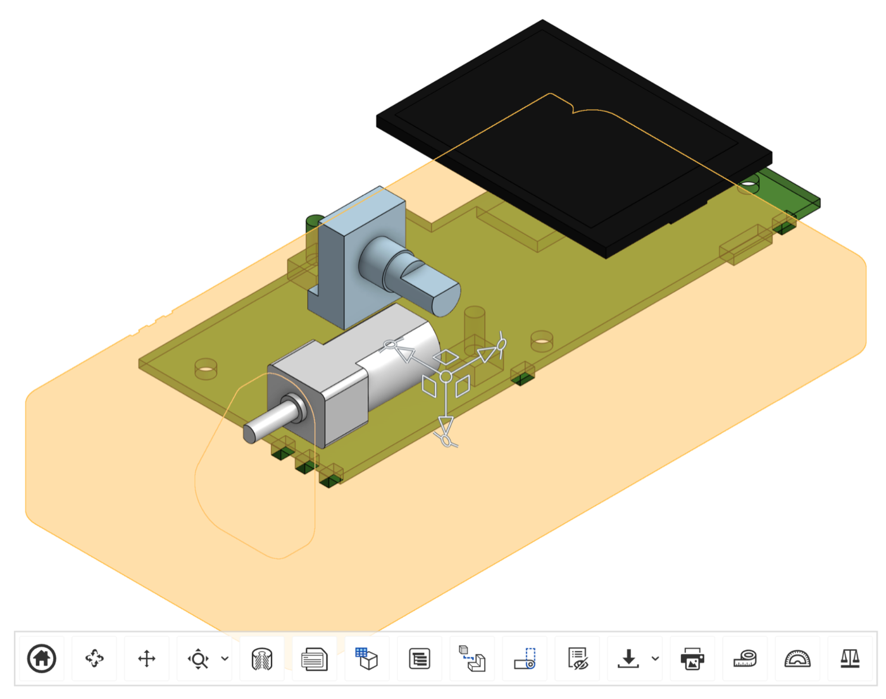

---
hide:
  - toc
---
# Bill of Materials

The Lockbox uses a custom printed PCB with additional off-board components including a display, battery, motor, encoder, buttons, and magnets.

## Parts

This parts list is generated from [`hardware/bom.csv`](https://github.com/researchanddesire/Lockbox-OSS/blob/main/hardware/bom.csv) during the assembly-docs build — do not edit the table below by hand. Update the CSV instead. Parts are referenced throughout the [Assembly Guide](assembly-guide.md).

<!-- BEGIN GENERATED BOM -->
<section class="bom" markdown="0">
<dl class="bom-meta">
  <dt>Repository</dt><dd><a href="https://github.com/researchanddesire/Lockbox-OSS" target="_blank" rel="noopener noreferrer">Lockbox-OSS</a></dd>
  <dt>Source commit</dt><dd><a href="https://github.com/researchanddesire/Lockbox-OSS/commit/43fffcdb1f4bee82c7d74d9f610a12e9035b9553" target="_blank" rel="noopener noreferrer">43fffcd</a> (43fffcdb1f4bee82c7d74d9f610a12e9035b9553)</dd>
</dl>

<strong>Not a tagged release.</strong> This BOM is rendered from the current <code>main</code> and is preview / reference material, not a production release snapshot.

  <table class="bom-table">
    <thead>
    <tr>
      <th class="bom-col-line_item" scope="col">#</th>
      <th class="bom-col-part_name" scope="col">Part Name</th>
      <th class="bom-col-category" scope="col">Category</th>
      <th class="bom-col-description" scope="col">Description</th>
      <th class="bom-col-qty" scope="col">Qty</th>
      <th class="bom-col-unit_of_measure" scope="col">UOM</th>
      <th class="bom-col-manufacturer" scope="col">Manufacturer</th>
      <th class="bom-col-mfg_part_number" scope="col">MFG PN</th>
      <th class="bom-col-vendor" scope="col">Vendor</th>
      <th class="bom-col-vendor_part_number" scope="col">Vendor PN</th>
      <th class="bom-col-source" scope="col">Source</th>
      <th class="bom-col-notes" scope="col">Notes</th>
    </tr>
    </thead>
    <tbody>
    <tr>
      <td class="bom-col-line_item bom-num">1</td>
      <td class="bom-col-part_name">
Top housing
</td>
      <td class="bom-col-category">FDM</td>
      <td class="bom-col-description">
FDM-printed top enclosure housing
</td>
      <td class="bom-col-qty bom-num">1</td>
      <td class="bom-col-unit_of_measure bom-num">each</td>
      <td class="bom-col-manufacturer">
–
</td>
      <td class="bom-col-mfg_part_number">
–
</td>
      <td class="bom-col-vendor">
–
</td>
      <td class="bom-col-vendor_part_number">
–
</td>
      <td class="bom-col-source">
<a href="https://github.com/researchanddesire/Lockbox-OSS/blob/43fffcdb1f4bee82c7d74d9f610a12e9035b9553/hardware/cad/top-housing.step" target="_blank" rel="noopener noreferrer">cad/top-housing.step</a>
</td>
      <td class="bom-col-notes">
–
</td>
    </tr>
    <tr>
      <td class="bom-col-line_item bom-num">2</td>
      <td class="bom-col-part_name">
Bottom housing
</td>
      <td class="bom-col-category">FDM</td>
      <td class="bom-col-description">
FDM-printed bottom enclosure housing
</td>
      <td class="bom-col-qty bom-num">1</td>
      <td class="bom-col-unit_of_measure bom-num">each</td>
      <td class="bom-col-manufacturer">
–
</td>
      <td class="bom-col-mfg_part_number">
–
</td>
      <td class="bom-col-vendor">
–
</td>
      <td class="bom-col-vendor_part_number">
–
</td>
      <td class="bom-col-source">
<a href="https://github.com/researchanddesire/Lockbox-OSS/blob/43fffcdb1f4bee82c7d74d9f610a12e9035b9553/hardware/cad/bottom-housing.step" target="_blank" rel="noopener noreferrer">cad/bottom-housing.step</a>
</td>
      <td class="bom-col-notes">
–
</td>
    </tr>
    <tr>
      <td class="bom-col-line_item bom-num">3</td>
      <td class="bom-col-part_name">
PCB cover
</td>
      <td class="bom-col-category">FDM</td>
      <td class="bom-col-description">
FDM-printed PCB cover
</td>
      <td class="bom-col-qty bom-num">1</td>
      <td class="bom-col-unit_of_measure bom-num">each</td>
      <td class="bom-col-manufacturer">
–
</td>
      <td class="bom-col-mfg_part_number">
–
</td>
      <td class="bom-col-vendor">
–
</td>
      <td class="bom-col-vendor_part_number">
–
</td>
      <td class="bom-col-source">
<a href="https://github.com/researchanddesire/Lockbox-OSS/blob/43fffcdb1f4bee82c7d74d9f610a12e9035b9553/hardware/cad/pcb-cover.step" target="_blank" rel="noopener noreferrer">cad/pcb-cover.step</a>
</td>
      <td class="bom-col-notes">
Secures over the populated PCB.
</td>
    </tr>
    <tr>
      <td class="bom-col-line_item bom-num">4</td>
      <td class="bom-col-part_name">
Back button
</td>
      <td class="bom-col-category">FDM</td>
      <td class="bom-col-description">
FDM-printed back/arrow button cap
</td>
      <td class="bom-col-qty bom-num">1</td>
      <td class="bom-col-unit_of_measure bom-num">each</td>
      <td class="bom-col-manufacturer">
–
</td>
      <td class="bom-col-mfg_part_number">
–
</td>
      <td class="bom-col-vendor">
–
</td>
      <td class="bom-col-vendor_part_number">
–
</td>
      <td class="bom-col-source">
<a href="https://github.com/researchanddesire/Lockbox-OSS/blob/43fffcdb1f4bee82c7d74d9f610a12e9035b9553/hardware/cad/back-button.step" target="_blank" rel="noopener noreferrer">cad/back-button.step</a>
</td>
      <td class="bom-col-notes">
–
</td>
    </tr>
    <tr>
      <td class="bom-col-line_item bom-num">5</td>
      <td class="bom-col-part_name">
Enter button
</td>
      <td class="bom-col-category">FDM</td>
      <td class="bom-col-description">
FDM-printed lock/enter button cap
</td>
      <td class="bom-col-qty bom-num">1</td>
      <td class="bom-col-unit_of_measure bom-num">each</td>
      <td class="bom-col-manufacturer">
–
</td>
      <td class="bom-col-mfg_part_number">
–
</td>
      <td class="bom-col-vendor">
–
</td>
      <td class="bom-col-vendor_part_number">
–
</td>
      <td class="bom-col-source">
<a href="https://github.com/researchanddesire/Lockbox-OSS/blob/43fffcdb1f4bee82c7d74d9f610a12e9035b9553/hardware/cad/enter-button.step" target="_blank" rel="noopener noreferrer">cad/enter-button.step</a>
</td>
      <td class="bom-col-notes">
–
</td>
    </tr>
    <tr>
      <td class="bom-col-line_item bom-num">6</td>
      <td class="bom-col-part_name">
Locking latch
</td>
      <td class="bom-col-category">FDM</td>
      <td class="bom-col-description">
FDM-printed locking latch
</td>
      <td class="bom-col-qty bom-num">1</td>
      <td class="bom-col-unit_of_measure bom-num">each</td>
      <td class="bom-col-manufacturer">
–
</td>
      <td class="bom-col-mfg_part_number">
–
</td>
      <td class="bom-col-vendor">
–
</td>
      <td class="bom-col-vendor_part_number">
–
</td>
      <td class="bom-col-source">
<a href="https://github.com/researchanddesire/Lockbox-OSS/blob/43fffcdb1f4bee82c7d74d9f610a12e9035b9553/hardware/cad/locking-latch.step" target="_blank" rel="noopener noreferrer">cad/locking-latch.step</a>
</td>
      <td class="bom-col-notes">
Installs onto motor shaft.
</td>
    </tr>
    <tr>
      <td class="bom-col-line_item bom-num">7</td>
      <td class="bom-col-part_name">
Encoder wheel
</td>
      <td class="bom-col-category">FDM</td>
      <td class="bom-col-description">
FDM-printed rotary encoder wheel
</td>
      <td class="bom-col-qty bom-num">1</td>
      <td class="bom-col-unit_of_measure bom-num">each</td>
      <td class="bom-col-manufacturer">
–
</td>
      <td class="bom-col-mfg_part_number">
–
</td>
      <td class="bom-col-vendor">
–
</td>
      <td class="bom-col-vendor_part_number">
–
</td>
      <td class="bom-col-source">
<a href="https://github.com/researchanddesire/Lockbox-OSS/blob/43fffcdb1f4bee82c7d74d9f610a12e9035b9553/hardware/cad/encoder-wheel.step" target="_blank" rel="noopener noreferrer">cad/encoder-wheel.step</a>
</td>
      <td class="bom-col-notes">
Installs onto rotary encoder shaft.
</td>
    </tr>
    <tr>
      <td class="bom-col-line_item bom-num">8</td>
      <td class="bom-col-part_name">
Motor clamp
</td>
      <td class="bom-col-category">FDM</td>
      <td class="bom-col-description">
FDM-printed motor clamp
</td>
      <td class="bom-col-qty bom-num">1</td>
      <td class="bom-col-unit_of_measure bom-num">each</td>
      <td class="bom-col-manufacturer">
–
</td>
      <td class="bom-col-mfg_part_number">
–
</td>
      <td class="bom-col-vendor">
–
</td>
      <td class="bom-col-vendor_part_number">
–
</td>
      <td class="bom-col-source">
<a href="https://github.com/researchanddesire/Lockbox-OSS/blob/43fffcdb1f4bee82c7d74d9f610a12e9035b9553/hardware/cad/motor-clamp.step" target="_blank" rel="noopener noreferrer">cad/motor-clamp.step</a>
</td>
      <td class="bom-col-notes">
–
</td>
    </tr>
    <tr>
      <td class="bom-col-line_item bom-num">9</td>
      <td class="bom-col-part_name">
Lockbox PCBA
</td>
      <td class="bom-col-category">PCA</td>
      <td class="bom-col-description">
Populated Lockbox PCB assembly
</td>
      <td class="bom-col-qty bom-num">1</td>
      <td class="bom-col-unit_of_measure bom-num">each</td>
      <td class="bom-col-manufacturer">
JLCPCB
</td>
      <td class="bom-col-mfg_part_number">
–
</td>
      <td class="bom-col-vendor">
JLCPCB
</td>
      <td class="bom-col-vendor_part_number">
–
</td>
      <td class="bom-col-source">
<a href="https://github.com/researchanddesire/Lockbox-OSS/blob/43fffcdb1f4bee82c7d74d9f610a12e9035b9553/hardware/pcb/production/v1.4/bom_v1.4.csv" target="_blank" rel="noopener noreferrer">pcb/production/v1.4/bom_v1.4.csv</a>
</td>
      <td class="bom-col-notes">
Top-level PCB assembly line item; populated component EBOM is tracked in git at source path.
</td>
    </tr>
    <tr>
      <td class="bom-col-line_item bom-num">10</td>
      <td class="bom-col-part_name">
PCB button switch
</td>
      <td class="bom-col-category">SWI</td>
      <td class="bom-col-description">
Tactile switch for PCB buttons
</td>
      <td class="bom-col-qty bom-num">2</td>
      <td class="bom-col-unit_of_measure bom-num">each</td>
      <td class="bom-col-manufacturer">
Same Sky
</td>
      <td class="bom-col-mfg_part_number">
TS02-66-100-BK-260-SCR-D
</td>
      <td class="bom-col-vendor">
Mouser
</td>
      <td class="bom-col-vendor_part_number">
179-TS0266100BK260SC
</td>
      <td class="bom-col-source">
<a href="https://github.com/researchanddesire/Lockbox-OSS/blob/43fffcdb1f4bee82c7d74d9f610a12e9035b9553/hardware/pcb/production/v1.4/bom_v1.4.csv" target="_blank" rel="noopener noreferrer">pcb/production/v1.4/bom_v1.4.csv</a>
</td>
      <td class="bom-col-notes">
Vendor link: <a href="https://www.mouser.ca/ProductDetail/179-TS0266100BK260SC" target="_blank" rel="noopener noreferrer">https://www.mouser.ca/ProductDetail/179-TS0266100BK260SC</a>
</td>
    </tr>
    <tr>
      <td class="bom-col-line_item bom-num">11</td>
      <td class="bom-col-part_name">
Rotary encoder
</td>
      <td class="bom-col-category">SWI</td>
      <td class="bom-col-description">
Rotary encoder
</td>
      <td class="bom-col-qty bom-num">1</td>
      <td class="bom-col-unit_of_measure bom-num">each</td>
      <td class="bom-col-manufacturer">
Bourns
</td>
      <td class="bom-col-mfg_part_number">
PEC12R-2120F-N0012
</td>
      <td class="bom-col-vendor">
Mouser
</td>
      <td class="bom-col-vendor_part_number">
652-PEC12R-2120F-N12
</td>
      <td class="bom-col-source">
<a href="https://github.com/researchanddesire/Lockbox-OSS/blob/43fffcdb1f4bee82c7d74d9f610a12e9035b9553/hardware/cad/encoder.step" target="_blank" rel="noopener noreferrer">cad/encoder.step</a>
</td>
      <td class="bom-col-notes">
Vendor link: <a href="https://www.mouser.ca/ProductDetail/652-PEC12R-2120F-N12" target="_blank" rel="noopener noreferrer">https://www.mouser.ca/ProductDetail/652-PEC12R-2120F-N12</a>
</td>
    </tr>
    <tr>
      <td class="bom-col-line_item bom-num">12</td>
      <td class="bom-col-part_name">
4 mm magnet
</td>
      <td class="bom-col-category">FBO</td>
      <td class="bom-col-description">
N52 neodymium magnet, 4 mm x 5 mm
</td>
      <td class="bom-col-qty bom-num">4</td>
      <td class="bom-col-unit_of_measure bom-num">each</td>
      <td class="bom-col-manufacturer">
Generic Factory
</td>
      <td class="bom-col-mfg_part_number">
–
</td>
      <td class="bom-col-vendor">
TBD
</td>
      <td class="bom-col-vendor_part_number">
–
</td>
      <td class="bom-col-source">
–
</td>
      <td class="bom-col-notes">
One in locking-latch, one in top-housing, and two in bottom-housing. Source costing sheet marks supplier as LOOKING FOR NEW SUPPLIER.
</td>
    </tr>
    <tr>
      <td class="bom-col-line_item bom-num">13</td>
      <td class="bom-col-part_name">
Rubber foot
</td>
      <td class="bom-col-category">FBO</td>
      <td class="bom-col-description">
Polyurethane bumper foot, 0.312 in diameter, clear
</td>
      <td class="bom-col-qty bom-num">4</td>
      <td class="bom-col-unit_of_measure bom-num">each</td>
      <td class="bom-col-manufacturer">
3M
</td>
      <td class="bom-col-mfg_part_number">
SJ5302
</td>
      <td class="bom-col-vendor">
Digi-Key
</td>
      <td class="bom-col-vendor_part_number">
SJ5302-7-ND
</td>
      <td class="bom-col-source">
<a href="https://www.digikey.ca/en/products/detail/3m/SJ5302/2345107" target="_blank" rel="noopener noreferrer">https://www.digikey.ca/en/products/detail/3m/SJ5302/2345107</a>
</td>
      <td class="bom-col-notes">
Glued onto backplate.
</td>
    </tr>
    <tr>
      <td class="bom-col-line_item bom-num">14</td>
      <td class="bom-col-part_name">
Motor
</td>
      <td class="bom-col-category">MTR</td>
      <td class="bom-col-description">
DC micro gear motor, 12 V, 60 RPM
</td>
      <td class="bom-col-qty bom-num">1</td>
      <td class="bom-col-unit_of_measure bom-num">each</td>
      <td class="bom-col-manufacturer">
Generic Factory
</td>
      <td class="bom-col-mfg_part_number">
–
</td>
      <td class="bom-col-vendor">
AliExpress
</td>
      <td class="bom-col-vendor_part_number">
33022320164
</td>
      <td class="bom-col-source">
<a href="https://github.com/researchanddesire/Lockbox-OSS/blob/43fffcdb1f4bee82c7d74d9f610a12e9035b9553/hardware/cad/motor.step" target="_blank" rel="noopener noreferrer">cad/motor.step</a>
</td>
      <td class="bom-col-notes">
Drives locking latch. Vendor link: <a href="https://www.aliexpress.com/item/33022320164.html" target="_blank" rel="noopener noreferrer">https://www.aliexpress.com/item/33022320164.html</a>
</td>
    </tr>
    <tr>
      <td class="bom-col-line_item bom-num">15</td>
      <td class="bom-col-part_name">
Motor wire
</td>
      <td class="bom-col-category">CHA</td>
      <td class="bom-col-description">
Motor wire harness, 1 mm pitch female connector, 2P, 100 mm, single head
</td>
      <td class="bom-col-qty bom-num">1</td>
      <td class="bom-col-unit_of_measure bom-num">each</td>
      <td class="bom-col-manufacturer">
Generic Factory
</td>
      <td class="bom-col-mfg_part_number">
–
</td>
      <td class="bom-col-vendor">
AliExpress
</td>
      <td class="bom-col-vendor_part_number">
1005007218127653
</td>
      <td class="bom-col-source">
<a href="https://www.aliexpress.com/item/1005007218127653.html" target="_blank" rel="noopener noreferrer">https://www.aliexpress.com/item/1005007218127653.html</a>
</td>
      <td class="bom-col-notes">
Connects motor to PCB.
</td>
    </tr>
    <tr>
      <td class="bom-col-line_item bom-num">16</td>
      <td class="bom-col-part_name">
Battery
</td>
      <td class="bom-col-category">BTY</td>
      <td class="bom-col-description">
3.7 V 500 mAh lithium polymer battery with custom 2-pin JST and 5 cm black/red cable
</td>
      <td class="bom-col-qty bom-num">1</td>
      <td class="bom-col-unit_of_measure bom-num">each</td>
      <td class="bom-col-manufacturer">
Generic Factory
</td>
      <td class="bom-col-mfg_part_number">
–
</td>
      <td class="bom-col-vendor">
AliExpress
</td>
      <td class="bom-col-vendor_part_number">
1005009279419327
</td>
      <td class="bom-col-source">
<a href="https://github.com/researchanddesire/Lockbox-OSS/blob/43fffcdb1f4bee82c7d74d9f610a12e9035b9553/hardware/cad/battery.step" target="_blank" rel="noopener noreferrer">cad/battery.step</a>
</td>
      <td class="bom-col-notes">
Installed into top-housing. Vendor link: <a href="https://www.aliexpress.com/item/1005009279419327.html" target="_blank" rel="noopener noreferrer">https://www.aliexpress.com/item/1005009279419327.html</a>
</td>
    </tr>
    <tr>
      <td class="bom-col-line_item bom-num">17</td>
      <td class="bom-col-part_name">
Screen
</td>
      <td class="bom-col-category">ASM</td>
      <td class="bom-col-description">
PS 2.0 inch 14-pin SPI TFT LCD module
</td>
      <td class="bom-col-qty bom-num">1</td>
      <td class="bom-col-unit_of_measure bom-num">each</td>
      <td class="bom-col-manufacturer">
Generic Factory
</td>
      <td class="bom-col-mfg_part_number">
–
</td>
      <td class="bom-col-vendor">
AliExpress
</td>
      <td class="bom-col-vendor_part_number">
1005005865407299
</td>
      <td class="bom-col-source">
<a href="https://github.com/researchanddesire/Lockbox-OSS/blob/43fffcdb1f4bee82c7d74d9f610a12e9035b9553/hardware/cad/screen.step" target="_blank" rel="noopener noreferrer">cad/screen.step</a>
</td>
      <td class="bom-col-notes">
Installed into top-housing. Vendor link: <a href="https://www.aliexpress.com/item/1005005865407299.html" target="_blank" rel="noopener noreferrer">https://www.aliexpress.com/item/1005005865407299.html</a>
</td>
    </tr>
    <tr>
      <td class="bom-col-line_item bom-num">18</td>
      <td class="bom-col-part_name">
Torx screw
</td>
      <td class="bom-col-category">FST</td>
      <td class="bom-col-description">
#4-20 x 1/2 in 6-lobe flat Plastite alternative 48-2 screw, black oxide
</td>
      <td class="bom-col-qty bom-num">7</td>
      <td class="bom-col-unit_of_measure bom-num">each</td>
      <td class="bom-col-manufacturer">
Shorpioen
</td>
      <td class="bom-col-mfg_part_number">
0408LTFB
</td>
      <td class="bom-col-vendor">
Shorpioen
</td>
      <td class="bom-col-vendor_part_number">
BC-0408LTFB
</td>
      <td class="bom-col-source">
<a href="https://shorpioen.com/4-20x1-2-6-lobe-flat-plastite-alternative-48-2-fully-threaded-black-oxide-and-wax-box-qty-10000-bc-0408ltfb/" target="_blank" rel="noopener noreferrer">https://shorpioen.com/4-20x1-2-6-lobe-flat-plastite-alternative-48-2-fully-threaded-black-oxide-and-wax-box-qty-10000-bc-0408ltfb/</a>
</td>
      <td class="bom-col-notes">
2x for motor-clamp, 5x for pcb-cover; installed with T7 Torx driver.
</td>
    </tr>
    <tr>
      <td class="bom-col-line_item bom-num">19</td>
      <td class="bom-col-part_name">
USB-C cable
</td>
      <td class="bom-col-category">CBL</td>
      <td class="bom-col-description">
USB-A to USB-C cable, 4 ft braided
</td>
      <td class="bom-col-qty bom-num">1</td>
      <td class="bom-col-unit_of_measure bom-num">each</td>
      <td class="bom-col-manufacturer">
Generic Factory
</td>
      <td class="bom-col-mfg_part_number">
–
</td>
      <td class="bom-col-vendor">
Amazon
</td>
      <td class="bom-col-vendor_part_number">
B0CRYMGXMX
</td>
      <td class="bom-col-source">
<a href="https://www.amazon.ca/dp/B0CRYMGXMX" target="_blank" rel="noopener noreferrer">https://www.amazon.ca/dp/B0CRYMGXMX</a>
</td>
      <td class="bom-col-notes">
–
</td>
    </tr>
    <tr>
      <td class="bom-col-line_item bom-num">20</td>
      <td class="bom-col-part_name">
Resealable bag
</td>
      <td class="bom-col-category">PKG</td>
      <td class="bom-col-description">
6 x 8 in resealable bag
</td>
      <td class="bom-col-qty bom-num">1</td>
      <td class="bom-col-unit_of_measure bom-num">each</td>
      <td class="bom-col-manufacturer">
Uline
</td>
      <td class="bom-col-mfg_part_number">
S-5065
</td>
      <td class="bom-col-vendor">
Uline
</td>
      <td class="bom-col-vendor_part_number">
S-5065
</td>
      <td class="bom-col-source">
<a href="https://www.uline.ca/Product/Detail/S-5065/Resealable-Bags/6-x-8-15-Mil-Resealable-Bags" target="_blank" rel="noopener noreferrer">https://www.uline.ca/Product/Detail/S-5065/Resealable-Bags/6-x-8-15-Mil-Resealable-Bags</a>
</td>
      <td class="bom-col-notes">
–
</td>
    </tr>
    </tbody>
  </table>

<footer class="bom-footer">
  
Bill of Materials generated from <code>hardware/bom.csv</code> by Research and Desire BOM tooling.

  
License: CERN-OHL-S v2 (hardware) / MPL-2.0 (firmware).

  
Source: <a href="https://github.com/researchanddesire/Lockbox-OSS" target="_blank" rel="noopener noreferrer">Lockbox-OSS on GitHub</a>.

  
&copy; Research and Desire.

</footer>
</section>
<!-- END GENERATED BOM -->

## Assembly tools and shop supplies

| Item | Use |
| ---- | --- |
| T7 Torx driver | Installing `torx-screw` fasteners |
| `flat-jaw-pliers` | Pressing magnets into plastic inserts |
| `tweezers` | Handling ribbon cable and small parts |
| `paperclip` | Applying a light coat of `SA-glue` inside magnet inserts |
| `isopropyl-alcohol` | Cleaning the rear of the screen and battery before tape |
| `microfibre-cloth` | Protecting the front face and printed parts during assembly |
